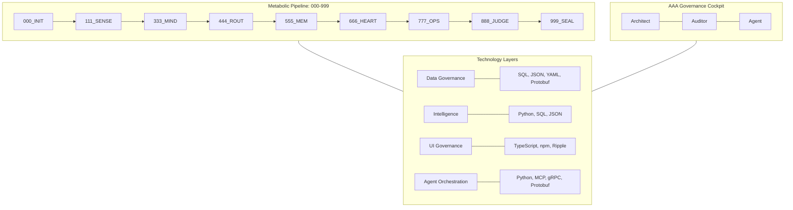

# Canonical Diagram and Technology Mapping for arifOS: SQL, Python, JSON, TypeScript, npm, and Beyond

---

## Introduction

The arifOS architecture represents a pioneering approach to governed AI execution, integrating a constitutional kernel with a 9-stage metabolic pipeline (000→999) and a robust AAA Governance Cockpit. This system is designed to ensure that every AI action is auditable, reversible, and aligned with explicit safety and governance constraints. Within this architecture, a diverse set of technologies—including SQL, Python, JSON, TypeScript, and npm—play crucial roles across different layers, from data governance and intelligence processing to UI governance and agent orchestration.

---

## arifOS Architecture Overview

arifOS is structured around two primary constructs:

1. **The Metabolic Pipeline (000→999):** A 9-stage constitutional execution path:
   - 000_INIT: Session Anchor
   - 111_SENSE: Reality Grounding
   - 333_MIND: Reasoning
   - 444_ROUT: Tool Routing
   - 555_MEM: Memory
   - 666_HEART: Safety Critique
   - 777_OPS: Thermo/Resource Est.
   - 888_JUDGE: Verdict
   - 999_SEAL: Vault/Audit Log
2. **The AAA Governance Cockpit:** A governance interface and protocol for Architect, Auditor, and Agent.

---

## Canonical Diagram: Technology Mapping in arifOS

---

### Technology-to-Layer Mapping Table

| Layer/Function           | Core Technologies         | Role in arifOS                                                                                 |
|------------------------- |--------------------------|------------------------------------------------------------------------------------------------|
| **Data Governance**      | SQL, JSON, YAML, Protobuf| Structured storage, SSCT registry, schema management, data interchange                           |
| **Intelligence Processing** | Python, SQL, JSON     | LLM core, tool invocation, Text2SQL, vector DBs (Qdrant)                                       |
| **UI Governance**        | TypeScript, npm, Ripple  | Frontend components, dashboard widgets, typed interfaces, governance cockpit UI                  |
| **Agent Orchestration**  | Python, MCP, gRPC, Protobuf | Multi-agent workflows, tool routing, inter-service communication                               |
| **Package Management**   | npm, pip, uv             | Dependency management for frontend (npm) and backend (pip/uv)                                  |
| **Schema Management**    | JSON Schema, YAML, Protobuf | Schema validation, contract enforcement, versioning                                            |
| **Security & Vaults**    | Ed25519, VAULT999        | Cryptographic signing, immutable audit logs                                                    |
| **Deployment & Runtime** | docker-compose, Traefik  | Container orchestration, service routing, runtime management                                   |

---

## Component Role Explanations

- **SQL:** Stores truth. Grounding for LLMs and ACID-compliant audit logs.
- **Python:** The metabolic engine. Transforms data into reasoning and insights.
- **JSON:** The lingua franca. Used for tool schemas (MCP) and data interchange.
- **TypeScript:** The shield. Compile-time governance for UI and dashboards.
- **npm:** The supply chain. Provides frameworks (Ripple, React) and build tools.
- **YAML:** Infrastructure Constitution. Config for Docker, agents, and CI/CD.
- **Protobuf/gRPC:** Machine Synapse. High-performance, typed communication for federated agents.

---
**⬡ DITEMPA BUKAN DIBERI — CANONICAL STACK SEALED ⬡**
