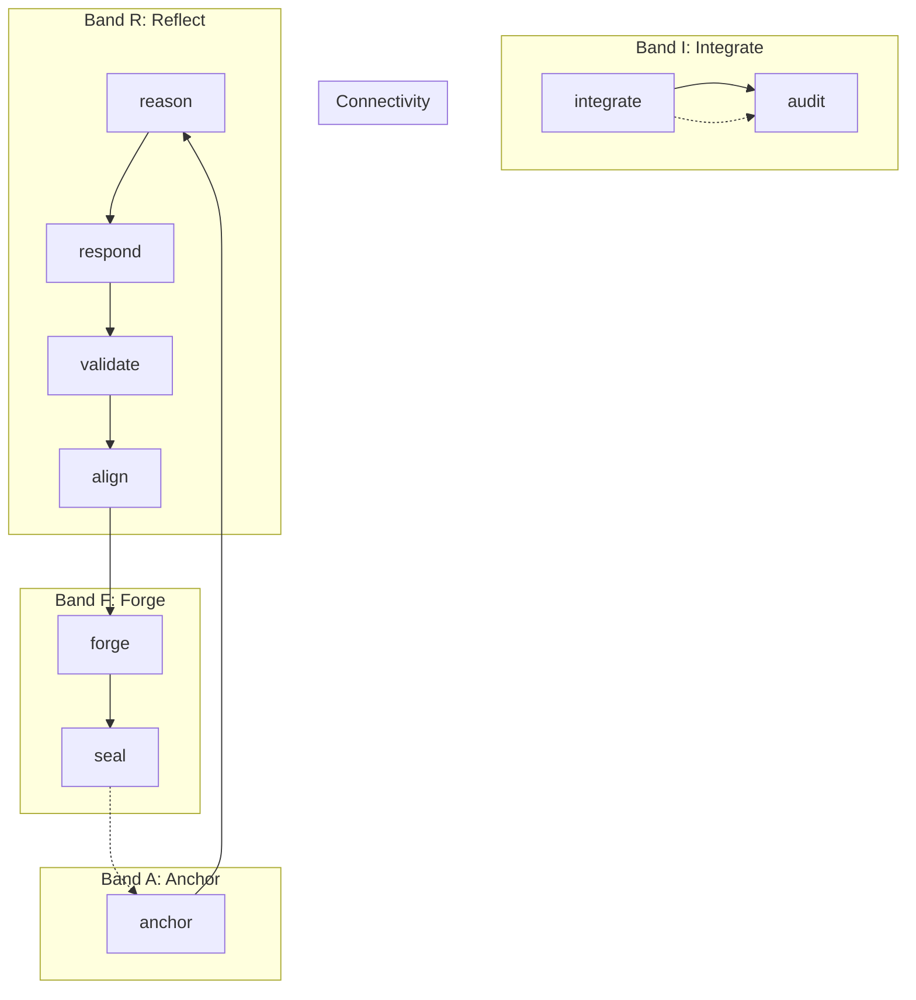

# WORKFLOWS — The 9 Metabolic Sequences (v60.1-ARIF)

Level 3 | 9 Recipes | ΔS ≤ 0

> *Ditempa Bukan Diberi* — Forged, Not Given

---

## 🔄 The 9-Step Metabolic Loop

The arifOS agent loop follows 9 discrete functional verbs, organized into 4 ARIF cognitive bands:

---

## 📋 The 9-Verb ARIF Index

| Verb | Band | File | Stage | Purpose |
|:---|:---:|:---|:---:|:---|
| **anchor** | **A** | `anchor-WORKFLOW.md` | 000 | Session ignition, intent grounding, lane classification. |
| **reason** | **R** | `reason-WORKFLOW.md` | 222 | Logical inference, hypotheses, truth scoring. |
| **integrate** | **I** | `integrate-WORKFLOW.md`| 333 | Context atlas, discovery, dependency mapping. |
| **respond** | **R** | `respond-WORKFLOW.md` | 444 | Draft evidence-based response, tone alignment. |
| **validate** | **R** | `validate-WORKFLOW.md` | 555 | Stakeholder mapping, empathy (κᵣ), reversibility. |
| **align** | **R** | `align-WORKFLOW.md` | 666 | Ethical pass, Anti-Hantu (F9) scan. |
| **forge** | **F** | `forge-WORKFLOW.md` | 777 | Implementation execution, Genius (G) synthesis. |
| **audit** | **I** | `audit-WORKFLOW.md` | 888 | Full F1-F13 review, Tri-Witness, final verdict. |
| **seal** | **F** | `seal-WORKFLOW.md` | 999 | Vault999 commitment, Phoenix-72, loop closure. |

---

## 🛡️ Floor Coverage Mapping

| Workflow | Band | F11 | F12 | F2 | F4 | F7 | F8 | F5 | F6 | F9 | F10 | F1 | F3 | F13 |
|---|:---:|:---:|:---:|:---:|:---:|:---:|:---:|:---:|:---:|:---:|:---:|:---:|:---:|:---:|
| anchor | **A** | ✓ | ✓ | | | | | | | | | | | ✓ |
| reason | **R** | | | ✓ | ✓ | ✓ | ✓ | | | | | | | |
| integrate | **I** | | | ✓ | ✓ | ✓ | | | | | ✓ | | | |
| respond | **R** | | | | ✓ | | | ✓ | ✓ | | | | | |
| validate | **R** | | | | | | | ✓ | ✓ | | | ✓ | | |
| align | **R** | | | | | | | ✓ | ✓ | ✓ | | | | |
| forge | **F** | | | ✓ | ✓ | | ✓ | | | | ✓ | ✓ | | |
| audit | **I** | ✓ | ✓ | ✓ | ✓ | ✓ | ✓ | ✓ | ✓ | ✓ | ✓ | ✓ | ✓ | ✓ |
| seal | **F** | ✓ | | | | | | | | | | ✓ | ✓ | |

---

## Architecture Logic
- **Band A** must run first to establish permission.
- **Band R** performs read-only cognitive work.
- **Band I** integrates findings into the 888 audit verdict.
- **Band F** synthesizes the final action and commits to the ledger.

---

**Sovereign:** Muhammad Arif bin Fazil  
**Version:** v60.1-FORGE-ARIF  
**Entropy:** ΔS = -0.60
