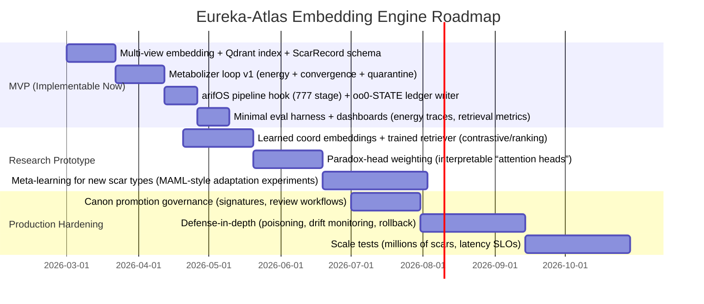

# Eureka-Atlas Embedding Engine Blueprint  
**Mapping your Eureka‑Atlas / 777 Cube + Encoder→Metabolizer→Decoder into a concrete, implementable system on arifOS + oo0‑STATE + APEX‑THEORY (as of 2026‑02‑25, Asia/Kuala_Lumpur)**

## Executive summary  
You’re pointing at a real architectural “missing layer”: today’s common stack often looks like **Retrieval (search) → Transformer (token‑to‑token generation)**, but the *thing that makes cognition feel stable* is an **iterative state‑updating loop** that can repeatedly (a) pull evidence, (b) detect contradictions/paradoxes, (c) trade off constraints, and (d) converge to a lower‑energy / lower‑confusion state before output. In modern ML terms, that loop is closest to **energy minimization / equilibrium inference**, **state‑space belief updates**, and **iterative retrieval‑reasoning**—the same family of ideas behind Energy‑Based Models (EBMs) citeturn3search12 and Deep Equilibrium Models (DEQs) citeturn6view0, and practically behind Retrieval‑Augmented Generation (RAG) citeturn0search1.

Your **777 Cube Canon v36Ω** already defines a *governable state space* with:  
- **Axis / Layer / Type** (7×7×7) as a discrete coordinate system for “where a scar lives”,  
- **Thermodynamic transition rules** (ΔS, Peace², κᵣ) for when a scar may move upward (toward Canon), and  
- **Quarantine / stuck‑scar rules** for stability. fileciteturn50file13L1-L1  

Your **APEX‑THEORY metabolic loop (000→999)** provides the *systems architecture*—a multi‑stage thermodynamic cycle rather than a linear pipeline. fileciteturn47file2L1-L1  

And your **arifOS core** already contains the right “hooks”: a staged pipeline (000→999) and explicit **EMD (Energy‑Metabolism‑Decision)** threading in the orchestrator (so the metabolizer can be a first‑class runtime component rather than “prompt vibes”). fileciteturn43file0L1-L1  

So the implementable mapping to reality is:  
- **Encoder** = canonical multi‑view embedding + governance coordinate assignment (ATLAS lane + 777 coordinate) + evidence ingress.  
- **Metabolizer** = an iterative loop that updates a **state object** (oo0‑STATE bus) by minimizing an explicit **energy / penalty function** under your ΔΩΨ floors and 777 transition rules; includes retrieval, contradiction detection, and memory writes gated by Canon/Quarantine rules. (Think “DEQ/EBM‑style inference loop”, not one‑shot forward pass.) citeturn6view0turn3search12  
- **Decoder** = constrained synthesis (LLM or structured outputs) + final judgment + vault sealing, with a provenance trail and (optionally) proof hooks.

What you’ll build (MVP) is a **Eureka‑Atlas Embedding Engine** that produces **governance‑aware embeddings** (semantic + structural + constraint embeddings), stores them in a vector index (e.g., Qdrant HNSW citeturn8search6turn8search4), and exposes a metabolizer loop that converges (or quarantines) before the arifOS pipeline emits a verdict and seals.

## Evidence base and codebase reconnaissance  
**Enabled connectors (as requested): GitHub, Google Drive.**

### Codebases (restricted to your three repos for implementation)  
The implementation plan in this report uses only:  
- **ariffazil/arifOS** (runtime kernel + pipeline + floors + MCP surface)  
- **ariffazil/oo0‑STATE** (constitutional state bus + canonical contract map) fileciteturn45file0L1-L1  
- **ariffazil/APEX‑THEORY** (theory + metabolic architecture spec for 000→999) fileciteturn47file2L1-L1  

### Your Canon sources (Google Drive) used for the 777 mapping  
- **“777 Canon” (Google Doc)**: explicit 7×7×7 cube definition + ΔS/Peace²/κᵣ transition rule + quarantine logic. fileciteturn50file13L1-L1  
- **“Blueprinting the 777 Cube Governance Transformer” (Google Doc)**: proposes hybrid scar embeddings (semantic embedding + categorical encoding), and frames the 777 system as a “governance transformer” analog. fileciteturn50file6L1-L1  

### External primary/official research used to map to ML primitives  
- Transformer baseline: **Attention Is All You Need** (Vaswani et al., NeurIPS 2017). citeturn0search6  
- Sentence embedding + similarity search practicality: **Sentence‑BERT** (Reimers & Gurevych, EMNLP 2019). citeturn0search5  
- Retrieval + generation composition: **RAG** (Lewis et al., 2020). citeturn0search1  
- Equilibrium inference as “metabolizer‑like” loop: **DEQ** (Bai, Kolter, Koltun, 2019). citeturn6view0  
- Energy minimization framing: **LeCun et al. tutorial on Energy‑Based Learning** (2006). citeturn3search12  
- State‑space sequence models (useful analogies for stateful metabolization): **S4** citeturn5view1 and **Mamba** citeturn5view0  
- Vector indexing + ANN infrastructure: **HNSW** citeturn8search4, and billion‑scale similarity search (FAISS paper) citeturn10view0, plus Qdrant’s HNSW indexing overview citeturn8search6  
- Meta‑learning + continual learning as scar‑to‑canon analogs: **MAML** citeturn9search0 and **EWC** citeturn9search4  

## Concept mapping from 777 Cube and arifOS governance to ML primitives  
A clean way to map your worldview into ML is to treat your Canon as a **formal state machine over a latent manifold**, where “scar movement” is a **constrained optimization** problem: you’re only allowed to move to a “higher layer” if constraints are satisfied (ΔS, Peace², κᵣ, plus governance floors). That is exactly the shape of:  
- **Energy‑based inference** (find state minimizing energy subject to constraints) citeturn3search12  
- **Equilibrium / fixed‑point inference** (iterate until a stable state is reached) citeturn6view0  
- **State‑space belief updates** (a persistent internal state updated by observations)—useful analogy from S4/Mamba for “stateful sequence modeling” citeturn5view1turn5view0  

### Term mapping table (your canon → ML primitive → implementable artifact)
| Your term | Canon meaning (operational) | Closest ML primitive | In the Eureka‑Atlas engine (implementable) |
|---|---|---|---|
| **Embedding** | “Where meaning lives” (coordinate / similarity) | Vector representation enabling similarity / geometry | Multi‑view vector: semantic + structural + constraint features (MVP uses SBERT‑style embeddings citeturn0search5 + one‑hot/learned coordinate features; aligns with your blueprint fileciteturn50file6L1-L1) |
| **777 Cube coordinate** | (Axis, Layer, Type) location of a scar; governs movement | Discrete latent state / structured label | `CubeCoord(axis, layer, type)` stored as metadata + optionally embedded as learned coordinate vectors fileciteturn50file13L1-L1 |
| **Scar** | Unresolved contradiction/paradox; stored but “hot” | Hard example / conflict sample; “error signal”; constraint violation | `ScarRecord`: text, evidence, coord, embeddings, energy, transitions; indexed in vector DB, gated writes |
| **Metabolizer** | The digestion loop that cools chaos into law | Iterative inference; equilibrium dynamics; constrained optimization | A loop that alternates retrieval ↔ contradiction detection ↔ energy update until convergence / quarantine citeturn6view0turn3search12 |
| **Canon** | Sealed law; stable ground state | Consolidated memory / policy update / “non‑forgetting” rule | Promoted scar → Canon if stable across Phoenix/cooling schedule; written to sealed ledger (Vault) + replicated to state bus |
| **Governance floors (ΔΩΨ)** | Constraints: truth/entropy, peace/empathy, authority | Constraint set / Lagrangian multipliers / penalty terms | Energy function terms; rule‑gated transitions and write permissions |
| **ATLAS‑333** | Routing/placement vector for processing lanes | Policy routing / conditional compute | Controls temperature (how many metabolizer iterations), retrieval depth, and risk gating in the loop fileciteturn43file0L1-L1 |
| **Attention / Compass** | You frame “APEX‑8 / paradox heads” as interpretable attention | Multi‑head attention or structured “heads” over factors | Implement as “paradox heads” = separate scoring functions over candidate memories; softmax weights or rule weights (explainable) citeturn0search6 |
| **Latent manifold** | Meaning geometry; scars move in state space | Representation manifold; embedding space | Vector DB + projection tools (UMAP/PCA) for diagnostics; energy landscape plots |
| **Energy / ΔS / cooling** | Thermodynamic eligibility of movement | Free energy / energy functional; monotone descent | Define explicit `E(state)`; require `E_{t+1} ≤ E_t` (or bounded oscillation) to accept iteration steps citeturn3search12 |
| **Quarantine (stuck scars)** | Prevent endless heat drain | Non‑convergence detection; loop breaker | Fixed iteration cap + oscillation detector; if stuck, mark `DORMANT_STUCK` and require human review fileciteturn50file13L1-L1 |
| **Scar‑weight / Sovereign** | Human authority anchor | Human‑in‑the‑loop / authorization token | Signed approvals required for high‑stakes Canon promotion; stored as metadata in vault entry |

**Key reconciliation (“why architecture not unified?”):**  
A single “unified architecture” is hard because modern systems must trade off **three different geometries**:  
1) **Token geometry** (Transformer attention space) citeturn0search6  
2) **Retrieval geometry** (vector similarity + ANN index structures like HNSW) citeturn8search4turn8search6  
3) **Governance geometry** (your discrete cube + constraint transitions) fileciteturn50file13L1-L1  

Your proposal is essentially: unify them by introducing a **metabolizer** that *mediates between these geometries* via stable state transitions (equilibrium/energy minimization), rather than pretending one forward pass can do everything. That’s not “stupid”—it’s actually aligned with a serious thread of ML research (EBMs/DEQs/state‑space models/RAG). citeturn3search12turn6view0turn0search1  

## Architecture blueprint for the Eureka‑Atlas embedding engine  
This blueprint makes your “Encoder→Metabolizer→Decoder” real by implementing a **stateful embedding + retrieval + equilibrium loop** inside the arifOS metabolic pipeline, and persisting state in oo0‑STATE.

### Modules and data flow (concrete)  
**Encoder (E):**  
- Input: `query`, optional context, optional candidate evidence.  
- Output: `EncodedState` containing:  
  - `semantic_embedding` (SBERT‑style sentence embedding; MVP can reuse the same family arifOS already depends on conceptually citeturn0search5)  
  - `atlas_gpv` (lane + τ/κ/ρ demands; used to set iteration budgets & strictness) fileciteturn43file0L1-L1  
  - `cube_coord` guess (axis/type classifier; layer starts at Chaos/Signal unless detected otherwise) fileciteturn50file13L1-L1  
  - `constraint_vector` (floors & thermodynamic signals to seed energy terms)

**Metabolizer (M):**  
Runs an iterative loop until one of three endings: **converged**, **quarantined**, or **escalated to human**.  
Each iteration does:  
1) **Retrieve** top‑k scars/canons from vector DB using the current embedding (RAG principle: combine parametric + non‑parametric memory) citeturn0search1  
2) **Diagnose paradox** (contradiction detection + axis/type refinement + layer transition check) using the Cube rules fileciteturn50file13L1-L1  
3) **Update state** to reduce an explicit energy `E(state)` (EBM/DEQ framing) citeturn3search12turn6view0  
4) **Write‑back rules**: store only eligible artifacts (e.g., never store VOID; store PARTIAL with TTL; promote to Canon only after cooling schedule) fileciteturn50file13L1-L1  

**Decoder (D):**  
- Produces:  
  - a structured “answer candidate” (text or tool plan),  
  - a “scar/canon action” (store, update, quarantine),  
  - a provenance bundle (retrieved items, energy trace, convergence stats),  
  - and passes to judgment + vault sealing. fileciteturn43file0L1-L1  

### Storage (vector DB + paradox ledger + sealed vault)  
- **Vector DB (online similarity search):** Qdrant with HNSW index is a direct fit; Qdrant documents HNSW as its dense vector index, and HNSW theory provides the ANN mechanics. citeturn8search6turn8search4  
- **Paradox Ledger (append‑only):** store every metabolizer step (energy, transitions, retrieved ids) as JSONL (this mirrors oo0‑STATE’s “governance/ledger” concept and supports audits). fileciteturn45file0L1-L1  
- **Vault / Canon store:** arifOS already treats “seal” as the final archival stage in the 000→999 pipeline; Eureka‑Atlas should only promote “Canon” entries to the sealed tier. fileciteturn43file0L1-L1  

### Mermaid flowchart (architecture)  
```mermaid
flowchart TD
  U[User Query / Scar Input] --> E[Encoder: Multi-view Embed + ATLAS GPV + CubeCoord guess]

  E -->|semantic vec + coord vec + constraints| VQ[Vector Query: top-k scars/canons]
  VQ --> VDB[(Vector DB: Qdrant HNSW)]
  VDB --> VQ

  E --> M[Metabolizer Loop: ΔΩΨ + 777 transitions]
  VQ --> M

  subgraph MLoop[Metabolizer Iteration t=1..T]
    M --> P[Paradox/Contradiction Detector]
    P --> EN[Energy Function E(state)]
    EN --> UP[State Update / Retrieval Re-weighting]
    UP --> ST{Converged?}
    ST -->|No| M
  end

  ST -->|Yes| D[Decoder: Synthesis + Action Proposal]
  ST -->|Stuck| Q[Quarantine: DORMANT_STUCK + HOLD_888]
  ST -->|Unsafe| R[Reject: SABAR/VOID]

  D --> J[Judgment + Floor Gating]
  Q --> J
  R --> J

  J -->|SEAL/PARTIAL| L[Ledger Write: Paradox Ledger (JSONL)]
  J -->|CANON promotion| VAULT[(Vault-999 / Sealed Canon)]
  J -->|Store memory| VDB
  J --> OUT[Answer + Provenance Bundle]
```

### Component interaction table (who calls who, with interfaces)
| Component | Lives in repo | Calls | Key inputs | Key outputs |
|---|---|---|---|---|
| Encoder | arifOS (new module) | Embedding model, ATLAS router, CubeCoord classifier | `query`, `context`, policy | `EncodedState` (multi‑view vectors + GPV + coord) |
| Metabolizer | arifOS (new module) + oo0‑STATE (state persistence) | Vector DB, paradox ledger, floor evaluators | `EncodedState`, retrieved memories | `MetabolizedState` + `energy_trace` + transitions |
| Vector DB | External service (config in arifOS) | HNSW ANN search/update | vectors + metadata | top‑k results, updated index citeturn8search6turn8search4 |
| Paradox Ledger | oo0‑STATE runtime path | Append‑only writer | metabolizer steps | audit trail fileciteturn45file0L1-L1 |
| Decoder | arifOS | LLM / templater / tool planner | metabolized state + constraints | proposed response + store/promote actions |
| Vault sealing | arifOS pipeline | crypto/merkle + storage | verdict bundle | sealed canon record |

## Training and inference regimes  
You asked for: loss functions, energy minimization / equilibrium, iterative metabolizer loop, stability controls, and scalability. Here’s a rigorous mapping.

### Representation learning (embeddings you actually need)  
Your blueprint proposes **hybrid embeddings**: semantic encoding + categorical encoding of cube coordinates. fileciteturn50file6L1-L1  
This matches best practice: sentence embeddings tuned for similarity search (SBERT) were explicitly introduced to avoid expensive cross‑encoding and enable fast retrieval via cosine similarity. citeturn0search5  

**MVP embedding recipe (recommended):**  
- Semantic vector: SBERT‑style encoder (off‑the‑shelf) citeturn0search5  
- Structural vector:  
  - Option A (simple): one‑hot encode (axis, layer, type) and ATLAS lane; concatenate.  
  - Option B (better): learn small embeddings for each discrete value (7‑way embeddings, etc.) and concatenate; train jointly with retrieval loss.  
- Constraint vector: include normalized values of ΔS, Peace², κᵣ, risk, plus a “floor fail mask”.

### Metabolizer as explicit energy minimization  
Energy‑based learning formalizes inference as “choose outputs that minimize an energy function” and learning as shaping the energy so desired configurations have lower energy than undesired ones. citeturn3search12  
DEQ formalizes deep computation as **finding a fixed point** of repeated transformations, backpropagating through it via implicit differentiation. citeturn6view0  

**Define an explicit energy for your state (canonical, implementable):**  
Let the metabolizer state be `s_t = {h_t, coord_t, mem_t, metrics_t}` with embedding `h_t`.  
Define:
- `E_truth(s)`: penalty if evidence consistency low (or uncertain beyond Ω band)  
- `E_entropy(s)`: penalty if ΔS violates your directional rule  
- `E_peace(s)`: penalty if Peace² below threshold  
- `E_empathy(s)`: penalty if κᵣ below threshold  
- `E_contradiction(s)`: penalty proportional to detected contradictions between retrieved canons and candidate answer  
- `E_drift(s)`: penalty if state oscillates (non‑convergence)

Then:
\[
E(s)=\lambda_T E_{truth}+\lambda_S E_{entropy}+\lambda_P E_{peace}+\lambda_K E_{empathy}+\lambda_C E_{contradiction}+\lambda_D E_{drift}
\]

**Iteration rule (monotone or bounded):**  
- Prefer `E(s_{t+1}) ≤ E(s_t)` (strict descent)  
- Allow bounded oscillation only if converging in a DEQ sense (small ‖h_{t+1}-h_t‖). citeturn6view0  

**777 layer transitions become guards:**  
A scar moves `Layer n → n+1` only if constraints satisfied (your Canon states ΔS/Peace²/κᵣ gating for upward movement). fileciteturn50file13L1-L1  

### Training losses (practical)  
You do *not* need to train an end‑to‑end giant model to get value. Start with losses that train retrieval and stability:

**Retrieval/ranking loss (RAG‑like):**  
RAG explicitly combines parametric generation with a dense vector index of non‑parametric memory. citeturn0search1  
Train a retriever (or fine‑tune embeddings) so “correct” canon/scar matches rank above distractors using:
- contrastive loss (InfoNCE), or  
- margin ranking loss (EBM‑compatible). citeturn3search12  

**Stability / anti‑forgetting objective (scar‑governed memory):**  
Your “Canon” idea is similar in spirit to continual learning: preserve important weights or preserved rules so new learning doesn’t erase old truths. EWC explicitly addresses catastrophic forgetting by slowing updates to important parameters. citeturn9search4  
Even if you don’t train a huge net, you can implement the same *principle* at the memory level: **protect high‑trust canon entries (frozen) while allowing low‑trust scars to update.**

**Meta‑learning objective (fast adaptation to new scar types):**  
MAML trains parameters so a small number of steps adapts to new tasks quickly. citeturn9search0  
In your engine, this maps to: “given a novel scar cluster, adapt the axis/type classifier and energy weights quickly”—a strong research direction after MVP.

### Compute estimates (order‑of‑magnitude, MVP)  
Assume:  
- Embedding inference: SBERT‑class encoder (fast; designed for similarity pipelines) citeturn0search5  
- Vector search: HNSW is sublinear ANN; Qdrant exposes HNSW tuning (m, ef, ef_construct) citeturn8search6turn8search4  
- Metabolizer iterations: 3–10 iterations typical for convergence checks (set by ATLAS risk/τ/κ).

MVP latency budget (single request):  
- Encode: ~10–50 ms (CPU/GPU dependent)  
- Vector search: ~5–50 ms depending on index size + ef settings  
- Metabolizer: multiply the above by iterations (but cache embeddings & reuse retrieved candidates to avoid linear blowup)  
- Decoder/generation: dominant if you call an LLM; otherwise small

Scaling trade‑offs:  
- Larger k and higher ef improve recall but cost latency (Qdrant/HNSW knob). citeturn8search6turn8search4  
- More metabolizer iterations improve contradiction resolution but risk loops; DEQ‑style fixed‑point methods motivate convergence checks and implicit differentiation if you later train the loop. citeturn6view0  
- Huge memory requires optimized similarity search; FAISS‑style work demonstrates billion‑scale feasibility with engineering. citeturn10view0  

## Prototype implementation plan (only using arifOS, oo0‑STATE, APEX‑THEORY)  
This is a concrete, file‑level plan. I’ll describe what to extend (arifOS), where to persist state (oo0‑STATE), and how to keep Canon aligned with APEX‑THEORY and your 777 Canon.

### Where to plug into arifOS  
The arifOS orchestrator (000→999) is already the “spine” you want; the embedding engine should be invoked in two places:  
1) **During AGI reasoning (111–333)** to retrieve relevant scars/canons and build the Delta bundle.  
2) **At 777 (EUREKA)** as the metabolizer convergence gate + promotion/quarantine logic. fileciteturn43file0L1-L1  

**New modules to add (MVP):**  
- `core/eureka_atlas/encoder.py`  
- `core/eureka_atlas/metabolizer.py`  
- `core/eureka_atlas/decoder.py`  
- `core/eureka_atlas/models.py` (Pydantic dataclasses: `ScarRecord`, `CubeCoord`, `EnergyTrace`, etc.)  
- `core/eureka_atlas/storage/vector_store.py` (Qdrant client wrapper)  
- `core/eureka_atlas/storage/paradox_ledger.py` (append‑only JSONL writer into oo0‑STATE path)  
- `core/eureka_atlas/policy.py` (your 777 transition rules + TTL rules)

### Where to persist state (oo0‑STATE wiring)  
oo0‑STATE defines itself as the constitutional source of truth for state layout and conflict resolution in the stack. fileciteturn45file0L1-L1  
So persist:  
- `state/runtime/.../eureka_atlas/session/<session_id>.json` (working state)  
- `state/governance/ledger/eureka_atlas.jsonl` (paradox ledger)  
- `state/governance/vault/` for sealed promotions (or mirror arifOS vault IDs) fileciteturn45file0L1-L1  

### Canon alignment (APEX‑THEORY + 777 Canon)  
Treat APEX‑THEORY as the “physics witness / architecture spec” for staging and bundle semantics. fileciteturn47file2L1-L1  
Treat “777 Canon” as the *authoritative cube coordinate + movement rules*. fileciteturn50file13L1-L1  

Implementation rule: **code must not redefine the 7×7×7 semantics**; it should load them from a versioned config (JSON/YAML) so Canon updates don’t require code rewrites.

### Pseudocode (MVP skeleton)
```python
# core/eureka_atlas/metabolizer.py

def metabolize(encoded_state, policy, vector_store, ledger, max_iters):
    s = init_state(encoded_state)
    energy_trace = []

    for t in range(max_iters):
        # 1) retrieve
        candidates = vector_store.search(s.embedding, top_k=policy.top_k(s))
        s = s.with_candidates(candidates)

        # 2) diagnose paradox + update cube coord
        s = policy.update_coord_and_layer(s)   # applies 777 rules

        # 3) compute energy
        E = policy.energy(s)                   # ΔS/Peace²/κᵣ + contradictions + drift
        energy_trace.append(E)

        # 4) log
        ledger.append(step=t, state=s, energy=E)

        # 5) convergence / quarantine
        if policy.converged(s, energy_trace):
            return MetabolizerResult(state=s, status="CONVERGED", trace=energy_trace)

        if policy.stuck(s, energy_trace):
            return MetabolizerResult(state=s, status="DORMANT_STUCK", trace=energy_trace)

        # 6) update for next iteration (energy descent step)
        s = policy.update_state(s)

    return MetabolizerResult(state=s, status="MAX_ITERS", trace=energy_trace)
```

### CI/CD and testing strategy (practical, arifOS‑native)  
Even without seeing your full test suite contents, arifOS already scaffolds pytest usage and emphasizes typed contracts and stage gating. fileciteturn43file0L1-L1  

Recommended tests (MVP):  
- **Unit tests:**  
  - `test_cube_coord_transitions.py` (layer movement allowed iff constraints satisfied; quarantine triggers correctly)  
  - `test_energy_monotonicity.py` (energy decreases or bounded oscillation within thresholds)  
  - `test_vector_store_contract.py` (upsert/search schema + metadata filters)  
- **Integration tests:**  
  - `test_pipeline_eureka_atlas_hook.py` (000→999 pipeline invokes metabolizer; verifies verdict gating)  
- **Regression tests:**  
  - store a small “scar corpus” fixture; ensure retrieval results stable across versions (protects Canon drift)

Deployment:  
- In production, keep vector DB as a separate service; keep oo0‑STATE as mounted persistent volume; run arifOS as the orchestrator.

## Evaluation plan, risks, and roadmap  
This section is designed to give you “science‑style” measurables (not vibes) and a staged roadmap (MVP → research prototype → production).

### Benchmarks and metrics (what to measure)  
**Retrieval quality (embedding engine):**  
- Top‑k recall / MRR / nDCG on a labeled scar→canon dataset (even if small at first).  
- Retrieval‑augmented answer citation hit rate (does the system retrieve the evidence it uses?), aligned with RAG’s motivation: improved factuality and updatability through non‑parametric memory. citeturn0search1  

**Contradiction resolution (metabolizer):**  
- “Contradiction resolved” rate: fraction of cases where initial state shows contradiction but final state converges to a consistent set of constraints or quarantines correctly.  
- Energy convergence metrics:  
  - iterations‑to‑convergence  
  - % monotone descent steps  
  - oscillation frequency (should be low or bounded)

**Stability controls (777 rules):**  
- Quarantine precision: how often you quarantine true “stuck” cases vs falsely blocking solvable ones.  
- Canon promotion precision: % of promoted canons later revoked (should be very low).

**Continual learning / non‑forgetting (scar‑governed memory):**  
- After adding new canons, old canon retrieval/consistency should not degrade materially—this is the *system‑level analog* of continual learning objectives like EWC’s anti‑forgetting motivation. citeturn9search4  

### Datasets (public + your domain, without assuming specifics)  
Public datasets depend on what you want to prove:  
- For retrieval‑aug reasoning: multi‑hop QA style tasks are common in evaluating RAG‑like systems. citeturn0search1  
- For embedding similarity: use semantic textual similarity benchmarks (SBERT was introduced for this exact purpose and reports strong results). citeturn0search5  

For your domain‑specific dataset: start with an internal **scar log** (even 200–1,000 entries) labeled with: axis/layer/type, verdict outcome, and which canon (if any) resolved it.

### Visualization suggestions (debugging the manifold)  
- 2D projections (UMAP/PCA) of embeddings colored by (axis, layer, type).  
- “Energy landscape” plots: energy vs iteration; highlight converged vs quarantined runs.  
- Transition Sankey diagrams: how scars move across layers over time (Chaos→Signal→…→Canon).

### Risks and open research problems (clear‑eyed)  
**Schema drift / multiple 777 definitions:** your “Blueprinting” doc uses a different axis framing than the “777 Canon” doc (7×7×7 vs 7×7×8 style paradox battlefield). fileciteturn50file6L1-L1 fileciteturn50file13L1-L1  
This is solvable: treat them as **two coordinate charts on the same manifold**—but you must pick a canonical runtime schema (recommend: v36Ω Canon as runtime truth; others become derived views).

**Energy definition correctness:** picking the wrong energy terms can cause “false convergence” (the system becomes confidently wrong). EBMs warn that shaping energy requires careful training criteria. citeturn3search12  

**Non‑convergence / loops:** DEQ shows equilibrium inference is powerful but requires real convergence controls. citeturn6view0  
Your quarantine rule is the right safety valve; implement it early.

**Memory poisoning / adversarial scars:** any retrieval system can be attacked by injecting misleading memories. Use:  
- write gating (never store VOID; TTL for PARTIAL),  
- signature requirements for Canon promotion,  
- and anomaly detection at ingestion.

**Operational cost:** vector DB + iteration loops add latency/infra. Mitigate with:  
- caching embeddings,  
- limiting iterations by ATLAS risk,  
- and “fast path” for low‑stakes queries.

### Roadmap (MVP → research prototype → production)  


**Bottom line (mapping your “EUREKA??” to reality):**  
Yes—your “Encoder → Metabolizer → Decoder” is a legitimate missing layer in many deployed LLM systems. The metabolizer corresponds to **iterative state inference** (EBM/DEQ/state‑space style), and your 777 Cube provides exactly what most ML systems lack: a **governable coordinate system + lawful transition rules** for memory and contradiction. citeturn3search12turn6view0turn5view1turn5view0 fileciteturn50file13L1-L1