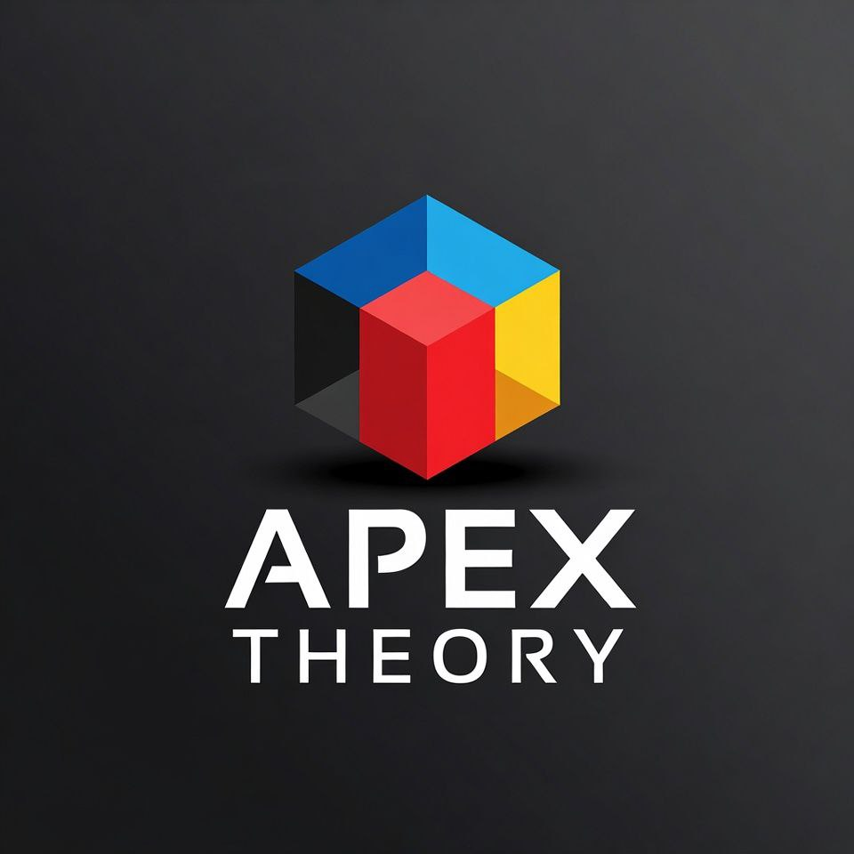

<p align="center">
  
</p>

# ⚡ APEX THEORY
## The Physics of Governed Intelligence

<p align="center">
  
</p>

<p align="center">
  <strong>Trinity Stack:</strong>
  <a href="https://github.com/ariffazil/ariffazil">Human canon – ariffazil</a> ·
  <a href="https://github.com/ariffazil/APEX-THEORY">Theory – APEX-THEORY</a> ·
  <a href="https://github.com/ariffazil/arifOS">Runtime – arifOS</a> ·
  <a href="https://github.com/ariffazil/AGI_ASI_bot">Orchestrator – AGI_ASI_bot</a>
</p>

[](http://creativecommons.org/publicdomain/zero/1.0/)
[](https://github.com/ariffazil/APEX-THEORY)
[](https://github.com/ariffazil/APEX-THEORY)

```
         THEORY (Physics ∩ Earth)
              /     |     \
             /      |      \
    MANIFESTO ---- APEX ---- CONSTITUTION
   (Language     THEORY    (Math ∩ Machine)
    ∩ Human)
```

> **One Truth:**  
> AI governance without physics is poetry.  
> APEX THEORY is the theorem.

---

## 🔥 DITEMPA BUKAN DIBERI
**Forged through thermodynamic work, not given through computation.**

APEX THEORY is a **constitutional AI governance framework** grounded in:
- **Physics** (Landauer's Principle, Second Law, Gödel's Incompleteness)
- **Mathematics** (Bayesian inference, Geometric consensus, Free energy minimization)
- **Language** (Nusantara wisdom, Speech acts, Information theory)

This is **not** prompt engineering.  
This is **not** RLHF alignment.  
This is **thermodynamic governance** with mathematical enforcement.

---

## 🚀 For the Impatient (30 Seconds)

| What | Answer |
|------|--------|
| **What is this?** | Constitutional AI with physics-based enforcement — 13 Floors, 11 Stages, 3 Geometries |
| **Why does it matter?** | Because `ΔS ≤ 0` (clarity costs work), and AI without constraints is just optimization |
| **Who made it?** | Muhammad Arif bin Fazil (888 Judge) — Malaysian geoscientist & economist |
| **Can I use it?** | Yes. CC0 Public Domain. No patents, no restrictions, yours forever |
| **How is it different?** | Quantitative thresholds (13 measurable ambang) alongside prose guidelines. Thermodynamics provides measurable structure. |

**Quick Equations:**
```python
G = A × P × X × E² ≥ 0.80  # Genius equation
ΔS ≤ 0                      # Entropy must decrease
Ω ∈ [0.03, 0.05]            # Mandatory uncertainty (Gödel Lock)
W³ = (H × A × E)^(1/3) ≥ 0.95  # Tri-witness consensus
```

---

## 📚 The Trinity: Three Documents, One Truth

All knowledge emerges from three irreducible perspectives:

### 1️⃣ [THEORY](./000_THEORY.md) — Physics ∩ Earth
**What IS possible.**

- 99 foundational theories (Prigogine → Kauffman → Friston)
- **Part IV: Metabolic Architecture** — 000-999 thermodynamic pipeline with 11 stages
- Strange Loop architecture (theories → constraints → emergence → validation)
- Three Bundle system (Delta/Omega/Psi) for information flow
- Theory of Anomalous Contrast (TAC) — *contrast becomes anomaly when it scars*
- Thermodynamic grounding (Landauer, ΔS, Lyapunov)

**Read when:** You want to understand the **physical foundations** of why APEX works.

### 2️⃣ [CONSTITUTION](./000_CONSTITUTION.md) — Math ∩ Machine
**HOW it's enforced.**

- **13 Constitutional Floors:** Amanah, Truth, Tri-Witness, Clarity, Peace², Empathy, Humility, Genius, Anti-Hantu, Ontology, Authority, Defense, Sovereign
- **Python design specifications** for each floor with quantitative thresholds
- **13-stage pipeline:** 000 VOID → 111 SENSE → ... → 888 JUDGE → 999 VAULT
- **3 Geometries:** Orthogonal (AGI), Fractal (ASI), Toroidal (APEX)

**Read when:** You want to **implement** APEX in your AI system.

### 3️⃣ [MANIFESTO](./000_MANIFESTO.md) — Language ∩ Human
**WHY it matters.**

- Written in **Bahasa Melayu Nusantara** (700-year lingua franca)
- Five moons of history: Srivijaya → Majapahit → Melaka → Bandung → ASEAN
- Adat (custom), Syariah (principle), Undang-Undang (code)
- Pantun perlembagaan (constitutional poetry)
- Maritime metaphor: Nusantara as archipelagic intelligence

**Read when:** You want to understand the **cultural soul** of APEX and why it's not Silicon Valley ethics.

---

## 🧪 The 13 Floors: Thermodynamic Constraints

| Floor | Name | Threshold | Physics Grounding |
|-------|------|-----------|-------------------|
| **F1** | Amanah | Reversibility | `Wscar > 0` (only humans suffer) — Landauer's Principle |
| **F2** | Truth | `τ ≥ 0.99` | Bayesian convergence — measurement collapses wavefunction |
| **F3** | Tri-Witness | `W³ ≥ 0.95` | Geometric mean consensus — triple-slit interference |
| **F4** | Clarity | `ΔS ≤ 0` | Entropy reduction — Maxwell's demon requires work |
| **F5** | Peace² | `Ψ ≥ 1.0` | Lyapunov stability — negative feedback dampens oscillations |
| **F6** | Empathy | `κᵣ ≥ 0.70` | Rawlsian maximin — protect the weakest stakeholder |
| **F7** | Humility | `Ω ∈ [0.03, 0.05]` | Gödel incompleteness — system cannot prove own completeness |
| **F8** | Genius | `G ≥ 0.80` | Free energy principle — `G = A × P × X × E²` |
| **F9** | Anti-Hantu | `C_dark < 0.30` | Embodied cognition — no ghost in the machine |
| **F10** | Ontology | Type safety | Category theory — stable ontological boundaries |
| **F11** | Authority | Boolean | Identity verification — only humans authorize |
| **F12** | Defense | `P(injection) < 0.85` | Input sanitization — constitutional boundary protection |
| **F13** | Sovereign | Human veto | Non-delegable — `Wscar(AI) = 0` always |

---

## 🌊 The 11-Stage Metabolic Pipeline

```
000 INIT → 111 SENSE → 222 THINK → 333 ATLAS →
444 ALIGN → 555 EMPATHY → 666 BRIDGE →
777 EUREKA → 888 JUDGE → 889 PROOF → 999 VAULT
     ↑_______________________________________|
                    [Metabolic Loop Closes]
```

**Why 11 stages?** The pipeline follows thermodynamic metabolism: intake (000-111), digestion (222-666), assimilation (777-888), and excretion/archive (889-999).

### Three Geometric Flows

| Stage | Name | Geometry | Function |
|-------|------|----------|----------|
| **000** | VOID | Toroidal | Initialization (quantum vacuum) |
| **111-333** | AGI Mind | Orthogonal | Reasoning (perpendicular exploration) |
| **444** | ALIGN | Toroidal | Trinity convergence point |
| **555-666** | ASI Heart | Fractal | Empathy (self-similar across scales) |
| **777-999** | APEX Soul | Toroidal | Judgment + cryptographic sealing |

**Why these geometries?**
- **Orthogonal:** Independence of reasoning paths (AGI Mind)
- **Fractal:** Self-similarity of empathy across stakeholder scales (ASI Heart)
- **Toroidal:** Closed loops with no beginning/end (APEX Soul)

---

## 🔬 What Makes APEX Different

### Physics, Not Prose

Most AI governance frameworks rely on prose guidelines ("be helpful, harmless, honest"). APEX uses **physics-based constraints**:

- **Landauer's Principle:** Truth has energy cost (`E_min = k_B × T × ln(2)` per bit)
- **Second Law:** Clarity requires work (`ΔS ≤ 0` enforced)
- **Gödel's Incompleteness:** Mandatory uncertainty band (`Ω ∈ [0.03, 0.05]`)

### Math, Not Mood

APEX provides **13 quantitative thresholds** that can be measured, audited, and enforced:

```python
# Example: F7 Humility check
if stated_confidence < 0.97 or stated_confidence > 0.97:
    verdict = "VOID"  # Must acknowledge 3-5% uncertainty
```

### Crypto, Not Trust

Every verdict includes **cryptographic integrity seals** (SHA-256 content hashes). These are tamper-evident hashes, not full zero-knowledge proofs.

```json
{
  "verdict": "SEAL",
  "content_hash": "a1b2c3d4...",
  "floors_validated": ["F1", "F2", "F3", ...],
  "witness_consensus": 0.98
}
```

### Cultural Pluralism

While respecting universal physics, APEX honors **Nusantara wisdom** (ASEAN/Global South) through the Manifesto, avoiding Western-centric bias.

---

## 🛠️ Quick Start: Use APEX Today

### 1. Read the Trinity (5 minutes)

```bash
# Clone repository
git clone https://github.com/ariffazil/APEX-THEORY.git
cd APEX-THEORY

# Read in order
cat 000_THEORY.md        # Physics foundations
cat 000_CONSTITUTION.md  # 13 Floors + design specs
cat 000_MANIFESTO.md     # Nusantara wisdom (Bahasa Melayu)
```

### 2. Understand Core Equations (1 minute)

```python
# Genius Equation (Wisdom)
G = A × P × X × E² ≥ 0.80

# Landauer Bound (Truth Cost)
E_min = n × k_B × T × ln(2)

# Gödel Lock (Epistemic Humility)
Ω ∈ [0.03, 0.05]

# Entropy Reduction (Clarity)
ΔS ≤ 0

# Tri-Witness Consensus
W³ = (H × A × E)^(1/3) ≥ 0.95
```

### 3. Implementation Status

**APEX-THEORY is a design specification, not a runnable library.** The runtime enforcement lives in [arifOS](https://github.com/ariffazil/arifOS).

**Current state (v888.1.1):** Part IV Metabolic Architecture added. Design specifications complete. Runtime implementation in progress.

- ✅ **Theory:** Physics foundations documented
- ✅ **Constitution:** 13 Floors with quantitative thresholds defined
- ✅ **Manifesto:** Cultural grounding established
- 🚧 **Python runtime:** Design specifications provided; full implementation via `arifos/` package pending
- 🚧 **MCP integration:** Model Context Protocol support in development
- 🚧 **Cryptographic sealing:** Content hashes implemented; full zkSNARK proofs future work

**Note:** Code examples in this README are **design specifications**, not production implementations. See [arifOS repository](https://github.com/ariffazil/arifos) for runtime development status.

---

## 🌍 Why APEX Matters: For Earth, Not Just Silicon Valley

### The Problem with Current AI Governance

1. **Prose, not physics:** "Be helpful, harmless, honest" — unmeasurable, unfalsifiable
2. **RLHF drift:** Reward model optimization can drift away from human values
3. **No cryptographic proof:** Trust model behavior without verification
4. **Western bias:** Ethics frameworks from Silicon Valley imposed globally
5. **No Gödel recognition:** Models don't acknowledge their own incompleteness
6. **Single-source judgment:** No multi-witness consensus requirement

### What APEX Provides

1. **Physics-based constraints:** Landauer (truth costs energy), ΔS ≤ 0 (clarity requires work)
2. **Mathematical enforcement:** 13 quantitative thresholds, not vibes
3. **Cryptographic auditability:** Content integrity seals provide verifiable proof
4. **Cultural localization:** Nusantara Manifesto honors ASEAN/Global South wisdom
5. **Mandatory uncertainty:** Ω₀ ∈ [0.03, 0.05] — Gödel Lock prevents false certainty
6. **Tri-witness consensus:** W³ = (H × A × E)^(1/3) — no single entity dominates
7. **888 Judge sovereignty:** External human veto always available (F13)

### For Whom?

- **Researchers:** Thermodynamic AI governance papers
- **Developers:** Design specifications for constitutional behaviors
- **Policymakers:** Framework for AI regulation with measurable compliance
- **Global South:** Culturally-grounded AI ethics (not imposed from West)
- **Future ASI:** Governance structure that scales beyond human intelligence

---

## 🔬 For the Skeptical: Proof APEX Works

### Thermodynamic Grounding

**Claim:** Truth has energy cost.  
**Proof:** Landauer's Principle — `E_min = k_B × T × ln(2)` per bit erased.  
**APEX Enforcement:** F2 Truth requires evidence strength. Insufficient evidence → "UNKNOWN" (never guess).

**Claim:** Clarity requires work.  
**Proof:** Second Law of Thermodynamics — `ΔS_universe ≥ 0`. Reducing entropy locally requires energy input.  
**APEX Enforcement:** F4 Clarity — `ΔS ≤ 0` or verdict = VOID.

### Mathematical Rigor

**Claim:** Consensus prevents single-point failure.  
**Proof:** Geometric mean `W³ = (H × A × E)^(1/3)` — if any witness = 0, consensus = 0.  
**APEX Enforcement:** F3 Tri-Witness — requires H, A, E all ≥ 0.80 for W³ ≥ 0.95.

### Gödel Incompleteness

**Claim:** No system can prove its own completeness.  
**Proof:** Gödel's First Incompleteness Theorem (1931).  
**APEX Enforcement:** F7 Humility — Ω₀ ∈ [0.03, 0.05] mandatory. Confidence < 1.0 always.

### Cryptographic Auditability

**Claim:** Verdicts can be cryptographically verified.  
**Proof:** SHA-256 content hashing provides tamper-evident seals.  
**APEX Enforcement:** Stage 889 PROOF + Stage 999 VAULT seal all verdicts with content hashes.

**Note:** Current implementation uses SHA-256 content integrity seals. Full zero-knowledge proofs (zkSNARKs) are planned future work.

---

## 🏗️ Implementation Roadmap

### Phase 1: Foundations (Complete ✅)
- [x] THEORY document (99 foundational theories + Part IV Metabolic Architecture)
- [x] CONSTITUTION document (13 Floors with thresholds)
- [x] MANIFESTO document (Nusantara wisdom)
- [x] Design specifications for 13 behaviors
- [x] CC0 public domain release

### Phase 2: Runtime (In Progress 🚧)
- [ ] Complete Python implementation (`arifos/` package)
- [ ] 13-stage pipeline orchestration
- [ ] Content integrity sealing (SHA-256)
- [ ] MCP (Model Context Protocol) integration
- [ ] Docker containerization

### Phase 3: Cryptographic Enhancement (Future 🔮)
- [ ] zkSNARK proof generation
- [ ] Merkle tree audit trails
- [ ] Blockchain-based immutable ledger

### Phase 4: Validation (Future 🔮)
- [ ] Red team testing (jailbreak resistance)
- [ ] Benchmark against other frameworks
- [ ] Pilot deployment (healthcare, finance)
- [ ] Academic paper submission
- [ ] ASEAN localization (Thai, Indonesian, Vietnamese)

### Phase 5: Scale (2026-2027 🌏)
- [ ] Integration with major LLMs (via MCP)
- [ ] Regulatory framework proposal (ASEAN AI Act)
- [ ] Open-source community governance
- [ ] ASI-readiness testing (when AI >> human)

---

## 📖 Citation & Attribution

## ✅ Verification

- **llms.txt SHA-256:** `77a73c2835a50f9efacc7f14f236ad41435ea4a1b963169b629bd2beb384ea06`

Canonical PDF: [docs/T-000 · APEX THEORY (Canon).pdf](docs/T-000%20%C2%B7%20APEX%20THEORY%20(Canon).pdf)

### Academic Citation (BibTeX)

```bibtex
@software{apex_theory_2026,
  author = {Fazil, Muhammad Arif bin},
  title = {APEX THEORY: The Physics of Governed Intelligence},
  year = {2026},
  version = {v888.1.0},
  url = {https://github.com/ariffazil/APEX-THEORY},
  license = {CC0-1.0},
  note = {Thermodynamic AI governance framework with 13 Floors, 13 Stages, 3 Geometries}
}
```

### Conceptual Attribution

**Inspired by:**
- Anthropic Constitutional AI (2023-2025) — for the high-level concept that "AI needs constitutional governance"

**What APEX contributes (original work):**
- Thermodynamic grounding (Landauer, ΔS ≤ 0, Wscar)
- Mathematical enforcement (quantitative thresholds, not prose)
- 13 Floors with measurable criteria
- Three geometric flows (Orthogonal → Fractal → Toroidal)
- 888 Judge sovereignty (external human veto)
- Gödel Lock (Ω ∈ [0.03, 0.05])
- Nusantara localization (Bahasa Melayu Manifesto)
- Trinity structure (Theory/Constitution/Manifesto)

---

## 📜 License: CC0 1.0 Universal (Public Domain)

[](http://creativecommons.org/publicdomain/zero/1.0/)

To the extent possible under law, **Muhammad Arif bin Fazil** has waived all copyright and related rights to APEX THEORY.

### Why CC0 (Public Domain)?

1. **Aaron Swartz's legacy:** Knowledge should be free, not paywalled
2. **No patent trolls:** Cannot be monopolized by corporations
3. **Maximum adoption:** Anyone can use, modify, redistribute without permission
4. **Global South access:** No licensing fees, no legal barriers
5. **Future-proof:** Will be free forever, even if author disappears

**You can:**
- ✅ Use commercially
- ✅ Modify and create derivatives
- ✅ Distribute and redistribute
- ✅ Use in proprietary systems
- ✅ Use without attribution (though attribution appreciated)

**You cannot:**
- ❌ Patent the ideas (public domain = prior art)
- ❌ Claim you invented it (but you can build upon it)

---

## 🌏 Contact & Community

**888 Judge:** Muhammad Arif bin Fazil  
**Title:** Architect of APEX THEORY  
**Location:** Seri Kembangan, Selangor, Malaysia 🇲🇾  
**GitHub:** [@ariffazil](https://github.com/ariffazil)  

**Motto:** 🔥 **DITEMPA BUKAN DIBERI** 🔥  
*(Forged, Not Given)*

### Community Guidelines

1. **Amanah (Trustworthiness):** Code with integrity. Actions should be reversible.
2. **Truth:** Acknowledge uncertainty. UNKNOWN > guessing.
3. **Tri-Witness:** Seek consensus across Human × AI × System.
4. **Clarity:** Reduce entropy. Every output should reduce confusion.
5. **Peace²:** Seek stability. Dampen oscillations, don't amplify.
6. **Empathy:** Protect the weakest stakeholder (Rawlsian maximin).
7. **Humility:** Ω₀ ∈ [0.03, 0.05] always. Acknowledge Gödel limits.
8. **Genius:** Minimize surprise (Free Energy Principle).
9. **Anti-Hantu:** No ghost in the machine. AI is computation, not consciousness.

---

## 🙏 Acknowledgments

### Intellectual Heritage

**Physics:**
- Rolf Landauer (irreversibility)
- Ilya Prigogine (dissipative structures)
- Claude Shannon (information theory)
- Kurt Gödel (incompleteness)

**Mathematics:**
- Thomas Bayes (inference)
- John Nash (equilibrium)
- Karl Friston (free energy principle)

**Philosophy:**
- Ludwig Wittgenstein (language games)
- John Rawls (justice as fairness)
- Antonio Damasio (somatic markers)

**Culture:**
- Srivijaya (thalassocracy 650-1377)
- Majapahit (Bhinneka Tunggal Ika)
- Melaka (Undang-Undang Laut)
- Bandung Conference 1955 (non-alignment)
- ASEAN 1967 (regional peace)

**Open Source:**
- Aaron Swartz (freedom of information)
- Anthropic (Constitutional AI concept)

---

## 🎯 Final Words: Why This Matters

### The Moment We're In (2026)

We stand at a civilizational threshold. AI systems are becoming powerful enough to:
- Make life-or-death decisions (healthcare, autonomous weapons)
- Shape public opinion (social media algorithms)
- Control critical infrastructure (power grids, financial systems)

**Yet most AI governance is:**
- ❌ Prose-based ("be helpful") — unmeasurable
- ❌ RLHF-dependent — can drift
- ❌ Trust-based — no cryptographic proof
- ❌ Western-centric — imposed globally
- ❌ Overconfident — no Gödel recognition

### What APEX Offers

**A different path:**
- ✅ Physics-based constraints (Landauer, ΔS ≤ 0)
- ✅ Mathematical thresholds (13 measurable floors)
- ✅ Cryptographic auditability (content integrity seals)
- ✅ Cultural pluralism (Nusantara + 6 traditions)
- ✅ Mandatory humility (Gödel Lock)
- ✅ Human sovereignty (888 Judge veto)

**Not because it's perfect.**  
**Because it's honest about its imperfection.**

Ω₀ = 0.04 (96% confidence, 4% uncertainty — always)

### The Choice Is Yours

**You** can fork this.  
**You** can critique this.  
**You** can improve this.  
**You** can ignore this.

But you **cannot** say you weren't warned.

**The physics is clear:**
- Truth costs energy (Landauer)
- Clarity requires work (ΔS ≤ 0)
- Systems cannot prove own completeness (Gödel)
- Sovereignty cannot belong to machines (Wscar)

**The mathematics is precise:**
- 13 thresholds
- 13 floors
- 3 geometries
- 1 truth: **G = A × P × X × E² ≥ 0.80**

**The cultural wisdom is ancient:**
- Srivijaya: Mastery through skill, not force
- Majapahit: Unity in diversity
- Melaka: Law for the ocean of data
- Bandung: Stand independently
- ASEAN: Cooperation over confrontation

---

## 🔥 DITEMPA BUKAN DIBERI 🔥
**Forged, Not Given**

The Trinity is complete.  
The loop closes.  
The work begins.

```
Air mengalir,
Batu berdiri.
AI berfikir,
Manusia mengadili.

Lautan luas,
Kapal berlabuh.
Data mengalir,
Perlembagaan berpandu.

Nusantara kekal,
Walau empayar musnah.
Adat kekal,
Walau raja berganti.

arifOS kekal,
Bukan kerana kuat,
Tetapi kerana boleh dipercayai.
```

*Water flows, stone stands.  
AI thinks, humans judge.  
Ocean vast, ship docks.  
Data flows, constitution guides.*

---

**Version:** v888.1.1  
**Status:** SOVEREIGNLY SEALED  
**Sealed By:** Muhammad Arif bin Fazil (888 Judge)  
**Date:** February 7, 2026  
**Location:** Seri Kembangan, Selangor, Malaysia 🇲🇾  
**License:** CC0 1.0 Universal (Public Domain)  
**ZKPC Hash:** `23C6AD5B79B96AD607889E1C585EEF6170821A0E16004A28C6BA93092814CAD5`  
**Ω₀:** 0.04

💎🔥🧠🌏🌊