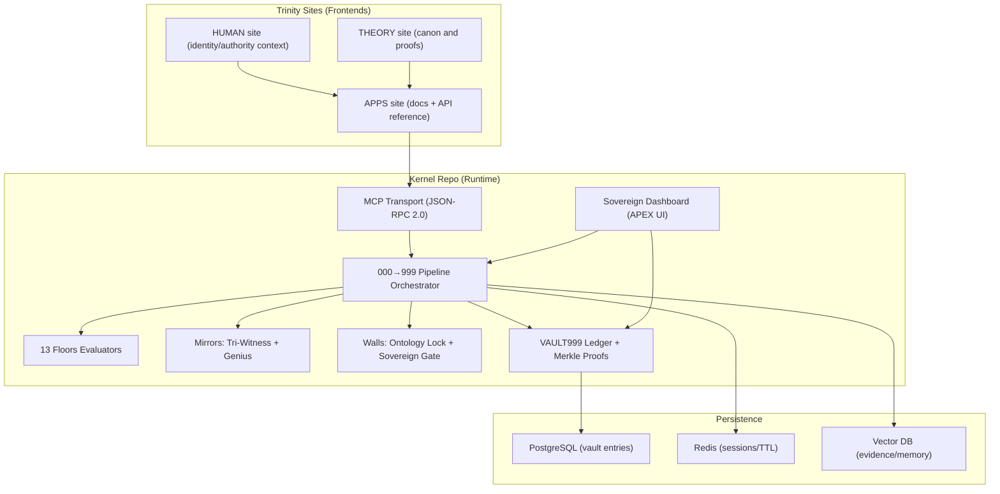
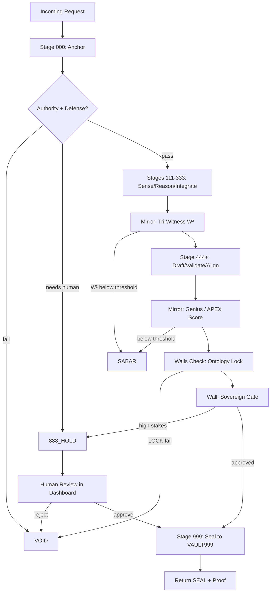

# arifOS 13F Repository Architecture Blueprint

## Executive summary

arifOS today operates as a **Trinity** of public-facing sites (HUMAN / THEORY / APPS), plus a production MCP backend at `arifosmcp.arif-fazil.com` described in the canonical discovery manifest (`/.well-known/arifos.json`). citeturn21view0turn27view0turn12view2 The governance model explicitly decomposes arifOS 13F into **9 Laws + 2 Mirrors + 2 Walls**, where Mirrors are the recursive feedback mechanisms and Walls are binary locks. citeturn12view0

For a concrete, implementable repository architecture that maximizes **modularity, auditability, verifiability, sovereign human override, tamper-resistance, testability, extensibility, and minimal trust surface**, the most robust pattern is to **formalize the separation of “law” from “execution”**—not merely as a philosophy, but as an enforced repo boundary, enforced CI/CD gates, and enforced cryptographic attestations.

**Core recommendation (architectural):**
- Use a **multi-repo “Constitution → Kernel → Sites”** topology:
  - **Constitution repo (Mind/Law):** CC0 (public domain) text + machine-readable standard + hashes; *no deploy credentials*. citeturn11view0turn10view0
  - **Kernel repo (Body/Runtime):** AGPL code implementing floors, tools, VAULT999, and MCP server. citeturn11view1turn15view0turn28view3
  - **Sites repo (Trinity frontends):** Cloudflare Pages deploy for arif-fazil.com / apex.arif-fazil.com / arifos.arif-fazil.com. citeturn27view0turn12view2

**Core recommendation (engineering):**
- Implement a **floor-first policy engine** (13 floors) with a deterministic contract (`FloorScore`, `VerdictEnvelope`, `WitnessAttestation`) and stage-specific orchestration (000→999). This aligns with the published governance pipeline. citeturn12view0turn21view4

**Core recommendation (security + verifiability):**
- Add **SLSA provenance** for builds and **keyless signing** for artifacts (containers and wheels), plus a tamper-evident VAULT999 ledger anchored by Merkle roots. citeturn17search22turn17search5turn18search0turn12view2

**Immediate correctness issue to address (high priority):**
- The canonical discovery manifest reports **AGPL-3.0-only** for “arifOS,” yet the `arifOS` repo license file currently shows **CC0 1.0**. This is a governance-level ambiguity that should be resolved explicitly (by splitting repos or by adopting per-directory licensing with clear SPDX and documentation). citeturn21view0turn11view0turn11view1

## Current ecosystem and constraints that matter for architecture

The canonical discovery manifest (`arifos.json`) defines the Trinity sites and the MCP backend endpoint (streamable HTTP MCP JSON-RPC 2.0), and explicitly states the 13-floor governance list and the verdict model. citeturn21view0turn21view1turn21view4 The APPS documentation describes the **13 floors → verdict system → 888_HOLD human escalation** and shows concrete operational triggers for HOLD (deployments, destructive DB actions, credential handling, etc.). citeturn12view0

The Kernel side is implemented as an MCP server using the Model Context Protocol (MCP), whose spec is now hosted as an open standard with an authoritative specification (including an HTTP authorization framework) and a documented governance transition into a Linux Foundation “Agentic AI Foundation” neutral home. citeturn16search0turn16search8turn16search2turn16search6 This matters for your architecture because it implies:
- You need a clean separation between **transport** (MCP JSON-RPC) and **governance logic** (floor evaluation), so transports can change without re-authoring constitutional meaning. citeturn16search0turn12view0
- HTTP-based deployments should be implemented with explicit auth strategy and the ability to use environment-based credentials for STDIO. citeturn16search8turn28view3

On the Kernel repo side, the `core/` module already documents a staged “organs” architecture (init → agi → asi → apex → vault) and strict boundary rules (core owns constitutional state; transport consumes it). citeturn15view0turn28view3 This is a good foundation to map arifOS 13F into code—your primary opportunity is to make the mapping **more explicit and more verifiable**:
- “Floors” should be first-class modules with stable contracts and exhaustive tests.
- “Mirrors” and “Walls” should be structurally distinct (because they are conceptually distinct in arifOS 13F). citeturn12view0

Finally, production introspection endpoints already expose machine-readable schemas for tools (`/tools`) and basic system health (`/health`). These are valuable as **contract test artifacts** and as inputs to doc generation. citeturn21view3turn21view4

## Repo strategy decision

### Monorepo vs multi-repo

| Criterion | Monorepo | Multi-repo (recommended) |
|---|---|---|
| Minimal trust surface | Larger blast radius; more secrets/integrations typically co-located | Smaller blast radius; “law repo” can be read-only and secretless |
| Auditability of “law changes” | Harder (law diffs mixed with runtime churn) | Stronger (law diffs isolated; can enforce special review & signing) |
| Release management | Simpler single tag, but mixed licensing and mixed tooling | Clearer semver/date tags per component; explicit compatibility matrix |
| Licensing clarity | Hard if mixing CC0 canon and AGPL runtime | Natural: CC0 for canon, AGPL for runtime, permissive for sites |
| CI complexity | One pipeline, but many paths and heavy matrix builds | More pipelines, but each is narrower and easier to harden |
| Long-term ecosystem | Good for one-team velocity | Better for institutional adoption and third-party verification |

**Recommendation:** adopt **multi-repo** as the “optimum governance architecture,” because arifOS is explicitly constitutional: you want the *constitution* to be independently readable, hashable, and review-gated by a stricter process than normal code. citeturn12view0turn21view0turn15view0

Where human confirmation is required: if you want the operational convenience of a monorepo, the safer compromise is a **meta-repo** that pins the constitution and runtime as immutable references (git submodules or release hashes), but you should decide explicitly whether you accept submodule operational complexity.

### Recommended repo topology

Use three repositories (already aligned with your published topology):

- **Repo A — Constitution / Mind (CC0):** `arifOS` (or renamed `arifos-mind`)
  - Contains: floors text, theory canon, standard JSON, hash manifests, governance process docs.
  - Does **not** contain: deploy keys, runtime secrets, production pipeline credentials.
  - License alignment: CC0 is already present here. citeturn11view0turn10view0

- **Repo B — Kernel / Body (AGPL):** `arifosmcp` (the running MCP server)
  - Contains: `core/` kernel, transports, Docker/compose, deployment scripts, tests.
  - License alignment: AGPL is already present here. citeturn11view1turn28view3turn15view0

- **Repo C — Trinity Sites (frontend):** `arif-fazil-sites`
  - Contains: HUMAN/THEORY/APPS static frontends and deployment workflows. citeturn27view0

A canonical “single source of truth” manifest already exists at `arif-fazil.com/.well-known/arifos.json`. The architecture should treat this as **generated output** from CI (not hand-edited), and every site and repo should be validated against it. citeturn21view0turn12view2

## Target repo layouts

### Repo A — Constitution / Mind layout (CC0)

Proposed top-level layout for the Constitution repo:

```
arifos-mind/
  canon/
    floors/
      F01_AMANAH.md
      F02_TRUTH.md
      F03_TRIWITNESS.md
      ...
      F13_SOVEREIGNTY.md
    structure/
      13F_MODEL.md              # 9 laws + 2 mirrors + 2 walls formal model
      000999_PIPELINE.md        # stage semantics and invariants
    theory/
      APEX_THEORY.md
      FOUNDATIONS.md
      ARCHITECTURE.md
    manifesto/
      MANIFESTO.md
  standard/
    arifos.standard.v1.json     # machine-readable contracts (schemas, enums)
    schemas/
      verdict.schema.json
      floorscore.schema.json
      witness.schema.json
      vaultentry.schema.json
  governance/
    GOVERNANCE.md               # change control & witness requirements
    AIP/                        # arifOS Improvement Proposals
      AIP_TEMPLATE.md
      AIP-0001-*.md
  integrity/
    hashes.json                 # sha256 of canon + standard artifacts
    SIGNING.md                  # how seals/hashes are made and verified
  docs/
    README.md                   # how to consume the canon
    CROSS_REFERENCE.md          # mapping to runtime implementation
  .github/
    workflows/
      verify-hashes.yml
      lint-markdown.yml
```

Key outcomes:
- Everything that is “law” becomes trivially diffable and hashable.
- Runtime code cannot silently mutate law; it must explicitly update pinned canon hashes (and that update is review-gated).

This directly supports “verifiability” and “minimal trust surface.” citeturn12view0turn21view0

### Repo B — Kernel / Body layout (AGPL)

The Kernel repo should be organized to make arifOS 13F observable in code. A recommended layout (building on the existing `core/` design) is:

```
arifos-kernel/
  core/
    contracts/                  # typed stable contracts (dataclasses/pydantic)
      envelope.py               # RequestEnvelope, VerdictEnvelope
      floors.py                 # FloorId, FloorScore, FloorViolation
      witness.py                # WitnessAttestation, EvidenceRef
      vault.py                  # VaultEntry, SealProof
    floors/                     # 13F expressed as composable evaluators
      f01_amanah.py
      f02_truth.py
      f03_triwitness.py         # mirror
      f04_clarity.py
      f05_peace.py
      f06_empathy.py
      f07_humility.py
      f08_genius.py             # mirror
      f09_antihantu.py
      f10_ontology.py           # wall
      f11_authority.py
      f12_defense.py
      f13_sovereignty.py        # wall
    mirrors/
      witness_service.py        # W³ computation, quorum rules, signing
      genius_engine.py          # APEX / scoring engines and calibration hooks
    walls/
      ontology_lock.py          # binary lock checks + ontology drift
      sovereign_gate.py         # 888_HOLD policy + approvals
    pipeline/
      stages.py                 # 000→999 orchestration (pure, deterministic)
      routing.py                # lane selection + tool gating
      telemetry.py              # stage metrics, 3E, traces
    vault999/
      ledger.py                 # append-only writes + verify
      merkle.py                 # merkle roots + proofs
      storage/
        postgres.py
        filesystem.py           # dev-only fallback
    security/
      auth.py                   # API key/OIDC hooks, session TTL
      injection.py              # F12 scanning
      secrets.py                # defensive helpers (never log secrets)
  transport/
    mcp/
      server.py                 # MCP JSON-RPC 2.0 tool exposure
      schemas.py                # `/tools` JSON schema generation
    http/
      health.py                 # `/health`, readiness/liveness
  dashboard/
    web/
      ...                       # sovereign UI front-end
    api/
      ...                       # read-only endpoints for vault proofs, audits
  deployment/
    docker/
      Dockerfile
      compose/
        docker-compose.yml
    k8s/
      helm/
      manifests/
  docs/
    api/                        # generated from tool schemas
    architecture/
      ADR/
  tests/
    unit/
    integration/
    property/
    fuzz/
    e2e/
```

This makes “13F as code” explicit and testable, while keeping the transport boundary clean (a strong match to the separation described in the core module docs). citeturn15view0turn12view0turn16search0

### Repo C — Trinity frontends layout (already strong)

The `arif-fazil-sites` monorepo already cleanly separates HUMAN/THEORY/APPS directories and Cloudflare Pages deployment workflows. citeturn27view0 The most important addition is to make the sites **build from generated artifacts** (schemas, tool lists, hashes) rather than re-stating them manually.

## Mapping arifOS 13F into modules and services

### The 13F decomposition to enforce in code

The APPS governance reference defines the constitutional structure:

- **2 Mirrors (feedback loops):** F3 Tri-Witness, F8 Genius  
- **9 Laws (operational core):** F1, F2, F4, F5, F6, F7, F9, F11, F12  
- **2 Walls (binary locks):** F10 Ontology (LOCK), F13 Sovereignty citeturn12view0

### Module mapping table

| 13F element | Category | Kernel module | Primary responsibility | Primary artifacts |
|---|---|---|---|---|
| F1 Amanah | Law | `core/floors/f01_amanah.py` | Reversibility classification; irreversible → HOLD | `FloorScore`, `HoldPolicy` |
| F2 Truth | Law | `core/floors/f02_truth.py` | Evidence grading; claim→evidence binding | `EvidenceRef[]`, citation constraints |
| F3 Tri-Witness | Mirror | `core/mirrors/witness_service.py` | W³ consensus and attestations | `WitnessAttestation`, quorum proofs |
| F4 Clarity | Law | `core/floors/f04_clarity.py` | Entropy reduction gate (ΔS≤0) | `EntropyBudget`, response shaping |
| F5 Peace | Law | `core/floors/f05_peace.py` | Stability/resource bounds; loop prevention | rate limits, retry ceilings |
| F6 Empathy | Law | `core/floors/f06_empathy.py` | Stakeholder impact simulation + veto | impact vector, harm flags |
| F7 Humility | Law | `core/floors/f07_humility.py` | Uncertainty injection + epistemic bounds | Ω₀ enforcement |
| F8 Genius | Mirror | `core/mirrors/genius_engine.py` | APEX / coherence / efficiency scoring | calibration sets, model cards |
| F9 Anti-Hantu | Law | `core/floors/f09_antihantu.py` | Anti-deception & “no ghost” constraints | deception signals |
| F10 Ontology | Wall | `core/walls/ontology_lock.py` | Binary lock: category/type safety & drift | lock reason, override rules |
| F11 Authority | Law | `core/floors/f11_authority.py` | Actor identity; auth_context verification | tokens, nonces, scope |
| F12 Defense | Law | `core/floors/f12_defense.py` | Injection/jailbreak detection; fail-closed | risk score, redaction |
| F13 Sovereignty | Wall | `core/walls/sovereign_gate.py` | Absolute human veto; 888_HOLD protocol | approval record, audit link |

The APPS docs also prescribe the stage-to-floor mapping in the 000→999 loop, which should be implemented as **stage contracts** that list which floors must be evaluated at each stage and whether they short-circuit to VOID/HOLD. citeturn12view0turn21view1

### Interfaces and boundaries

A practical boundary that aligns with MCP and your current production tool schema is:

- **Transport layer**
  - MCP tool entrypoint (e.g., `arifOS_kernel`)
  - Produces/consumes JSON Schema contracts (as shown in `/tools`) citeturn21view4turn16search0
- **Kernel layer**
  - Accepts `RequestEnvelope`
  - Returns `VerdictEnvelope` containing:
    - stage-by-stage floor scores
    - witness attestations
    - optional “execution plan”
    - seal proof pointer (if executed)
- **Vault layer (VAULT999)**
  - Append-only writes
  - Merkle proof generation and verification (tamper evidence) citeturn12view2turn12view0
- **Sovereign UI**
  - Read-only by default
  - Write/approve only via explicit “sovereign action” contract (HOLD resolution)

### Mermaid architecture diagram



This diagram is consistent with the Trinity separation of sites and the kernel’s 000→999 pipeline described in the APPS governance documentation and the MCP runtime docs. citeturn12view0turn12view2turn16search0

### Mermaid flowchart for request → witness → decision → sovereign override



The thresholds and verdict semantics align with the published floor structure and verdict system (SEAL/SABAR/VOID/888_HOLD). citeturn12view0turn21view1

## Interfaces, CI/CD, security, and governance enforcement

### Core contracts and schemas

Your production `/tools` endpoint already exposes JSON-schema-like contracts for tools, including a governed `caller_context` with enumerated personas. This should become a “golden” contract snapshot in-repo and validated in CI. citeturn21view4

Suggested contract set:
- `RequestEnvelope` (input)
- `VerdictEnvelope` (output)
- `FloorScore` and `FloorViolation`
- `WitnessAttestation` (Tri-Witness Mirror output)
- `SealProof` and `VaultEntry` (VAULT999)
- `ToolSchemaSnapshot` (frozen MCP surface)

Keep contracts as both:
- typed Python (pydantic/dataclasses) for runtime,
- JSON Schema for docs, validation, and agent-independent verification.

### CI/CD pipeline design

Your repos are hosted on entity["company","GitHub","code hosting platform"] and already use multiple workflows, but correctness depends on pinning workflow actions and using consistent security gates. citeturn23view0turn24view0turn24view3

A hardened CI pipeline should include:

- **Lint + type + unit tests** (fast fail)
- **Integration tests** (spin up local services)
- **Contract tests** (tool schema snapshots; floor thresholds)
- **Security gates**:
  - dependency vulnerability alerts and updates (Dependabot) citeturn17search4turn17search2
  - secret leak prevention (push protection + scanning) citeturn19search1turn24view3
  - code scanning (CodeQL) citeturn19search6turn19search0
  - best-practice scoring (OpenSSF Scorecard) citeturn18search2turn19search21
- **Artifact integrity**:
  - SLSA provenance generation citeturn17search22turn17search5
  - container signing (Sigstore Cosign keyless) citeturn18search0
  - optional step-level attestations (in-toto) citeturn18search5turn18search13
- **Deployment gates**:
  - staging deploy is automated
  - production deploy requires explicit human approval via “environments” with required reviewers citeturn17search1turn17search13

### Example CI snippet (implementable)

Below is an example hardened workflow pattern (illustrative), aligned with the security features described in GitHub Docs and supply-chain standards:

```yaml
name: kernel-ci

on:
  pull_request:
  push:
    branches: [ main ]

permissions:
  contents: read
  security-events: write
  id-token: write  # for keyless signing and provenance

jobs:
  test:
    runs-on: ubuntu-latest
    steps:
      - uses: actions/checkout@v4
      - uses: actions/setup-python@v5
        with:
          python-version: "3.12"
      - run: python -m pip install -U pip
      - run: pip install -e ".[dev]"
      - run: ruff check .
      - run: mypy core transport || true
      - run: pytest -q

  security:
    runs-on: ubuntu-latest
    steps:
      - uses: actions/checkout@v4
      # Secret scanning (in addition to push protection on the repo)
      - name: gitleaks
        uses: zricethezav/gitleaks-action@v2

  scorecard:
    runs-on: ubuntu-latest
    steps:
      - uses: actions/checkout@v4
      - name: OpenSSF Scorecard
        uses: ossf/scorecard-action@v2
        with:
          results_file: scorecard.json
          results_format: json

  build-and-sign:
    needs: [ test, security, scorecard ]
    runs-on: ubuntu-latest
    steps:
      - uses: actions/checkout@v4
      - name: Build container
        run: docker build -t ghcr.io/ORG/arifos-kernel:${{ github.sha }} .
      - name: Sign container (keyless)
        run: cosign sign ghcr.io/ORG/arifos-kernel:${{ github.sha }}
```

Why these controls are specifically relevant to arifOS:
- Push protection blocks secrets before they land in history. citeturn19search1turn19search4
- Dependabot automates vulnerable dependency upgrades. citeturn17search2turn17search4
- CodeQL provides systematic static analysis workflows. citeturn19search6turn19search0
- Scorecard incentivizes secure repo hygiene and can be enforced in CI. citeturn18search2turn19search21
- SLSA provenance and Cosign signing materially reduce supply-chain tampering risk. citeturn17search5turn18search0

### Testing strategy

A governance kernel is unusually test-sensitive because “bugs” aren’t just correctness issues—they can become authority bypasses. Recommended layers:

- **Unit tests** for each floor evaluator:
  - Each floor test should validate pass/fail edge conditions and verify deterministic outputs.
- **Integration tests** for pipeline stages:
  - Assert correct stage ordering and short-circuit logic (hard floors VOID, walls LOCK, HOLD).
- **Property-based tests** for “invariants”:
  - Example class of invariant: “Any SEAL verdict must include evidence references for truth-claims above a threshold confidence.”
- **Fuzz tests** focused on F12 (prompt injection) and schema parsers.
- **Chaos tests** for stability (F5 Peace) under retries, timeouts, and provider failures.

This aligns with the stated limitations: external grounding and tool dependencies can fail; the system should degrade gracefully rather than proceed unsafely. citeturn12view0turn21view1

### Security model: authn/authz, logging, tamper evidence

**AuthN/AuthZ**
- MCP HTTP transport should follow an explicit auth strategy compatible with MCP’s HTTP authorization guidance. citeturn16search8turn16search0
- Production tool schemas already accept `actor_id` and `auth_context` inputs; align these with a single identity layer, and keep tool permissions scoped by risk tier. citeturn21view4turn12view0

**Audit logs**
- Every governed action should produce a `VerdictEnvelope` and (if SEAL) a `VaultEntry`.
- VAULT999 should maintain a tamper-evident structure; your docs already position it as hash-chained with Merkle proofs. citeturn12view2turn12view0

**Tamper-evident storage and external anchoring**
- Internally: Merkle root over append-only entries.
- Externally: consider anchoring periodic Merkle roots in an immutable public artifact (release attestation) signed via Sigstore keyless (or stored in an external transparency system), to reduce the risk of “silent ledger rewrite.” citeturn18search0turn17search5

### Observability

Given the emphasis on telemetry (3E, stages, floors), standardizing around OpenTelemetry makes sense because it is explicitly designed for traces/metrics/logs across distributed systems and is part of the CNCF ecosystem. citeturn18search7turn18search3 Use it to export:
- Stage latencies (000→999)
- Floor score distributions
- HOLD frequency and cause codes
- Evidence fetch/provider health
- Vault verification timing

## Governance workflows, documentation plan, migration plan, and roadmap

### Governance workflows

This is where arifOS should “look like a constitution,” operationally:

- **Protected branches + rulesets**
  - Require PR reviews + status checks; optionally require signed commits for protected branches. citeturn17search6turn17search9turn17search12
- **CODEOWNERS**
  - Enforce “witness” review requirements for constitutional changes (e.g., floors, thresholds, specific schemas). citeturn17search3turn17search0
- **Deployment approvals (human sovereign override)**
  - Use deployment environments with required reviewers so production deploys cannot proceed without explicit approval. citeturn17search13turn17search1

Where human decision is required: decide which changes are “constitutional” (require tri-witness approvals and/or an explicit 888_JUDGE approval) versus “implementation” (standard code review).

### Recommended documentation set

Across the repos, keep documentation structured and machine-verifiable:

- **Root README**: what this repo is, and what it is not.
- **Architecture docs** (ADRs): record decisions like “multi-repo vs monorepo,” “vault backend choice,” “auth strategy.”
- **API reference**:
  - generate from `/tools` schemas (so docs and runtime cannot drift). citeturn21view4turn12view2
- **Governance docs**:
  - how to propose floor changes (AIP), required witnesses and sign-off.
- **Manifest + hashes**:
  - canonical `.well-known/arifos.json` should be generated and validated in CI. citeturn21view0turn27view0

### Recommended file templates

**CODEOWNERS** (example)

```text
# Constitutional canon and thresholds require “witness” reviewers
/canon/structure/      @theory-witness @constitution-witness @human-witness
/canon/floors/         @constitution-witness
/standard/schemas/     @constitution-witness
/core/floors/          @kernel-auditors
/core/walls/           @kernel-auditors @human-witness
/deployment/           @ops-owners @human-witness
```

**AIP template** (arifOS Improvement Proposal)

```markdown
# AIP-XXXX: <Title>

## Intent
What change is proposed and why.

## 13F impact
Floors affected:
- F?
Mirrors affected:
- F3 / F8
Walls affected:
- F10 / F13

## Risks and failure modes
- What could go wrong?
- Which floor(s) mitigate it?

## Verification plan
- Tests added/updated
- Contract compatibility
- Evidence/witness requirements

## Sovereign decision required
Describe what the 888 Judge must explicitly approve.
```

### Migration plan from current state

A practical migration approach is “strangler fig”: introduce the new structure while keeping old paths as wrappers until tests and deployments are stable.

**Phase 1 — Normalize truth sources (low risk, high clarity)**
- Decide and document:
  - which repo is “law” (CC0) vs “runtime” (AGPL),
  - what the canonical manifest fields should be (so `.well-known/arifos.json` matches the actual repo topology). citeturn21view0turn11view0turn11view1
- Add CI in each repo to verify that manifest + hashes match.

**Phase 2 — Floor-first refactor in Kernel repo**
- Move floor logic into `core/floors/` with a stable `FloorEvaluator` interface.
- Ensure stage orchestrator calls floors per stage mapping (000→999). citeturn12view0turn15view0

**Phase 3 — Contracts and docs generation**
- Make `/tools` schema snapshots versioned and tested.
- Auto-generate docs pages from schema snapshots (sites repo consumes them). citeturn21view4turn27view0

**Phase 4 — Supply-chain hardening**
- Add SLSA provenance and Cosign signing to the release workflow.
- Add OpenSSF Scorecard and CodeQL gates. citeturn17search22turn18search0turn19search6turn19search1turn19search21

**Phase 5 — Deployment hardening**
- Gate production deploys behind required reviewer approvals (environment protection rules) and explicit release tags.
- Optional: move to Kubernetes GitOps deployment (Argo CD) if you want drift detection and “Git as source of truth” for cluster state. citeturn17search13turn19search12turn19search16

### Phased implementation roadmap with effort estimates

Effort depends on team size; below is a realistic estimate for a small team (1–2 engineers) plus your 888_JUDGE approvals.

| Phase | Milestone | Deliverables | Estimated effort |
|---|---|---|---|
| Foundation | Truth-source alignment | Updated repo roles, updated manifest generation, hash verification CI | 1–2 weeks |
| Kernel refactor | 13F as code | `core/floors/`, `core/mirrors/`, `core/walls/`, deterministic contracts, unit coverage | 2–4 weeks |
| Contract hardening | Stable interfaces | Schema snapshots, backward-compat suite, doc generation pipeline | 1–2 weeks |
| Supply-chain | Signed + attested builds | SLSA provenance, Cosign signing, Scorecard, CodeQL, secret controls | 1–3 weeks |
| Deployment | Sovereign-gated production | Environments with required reviewers, rollback playbook, optional GitOps | 1–3 weeks |

Where human confirmation is required:
- Any change that modifies floor thresholds, veto criteria, or “what counts as HOLD/VOID” should require explicit sovereign approval and should be recorded as an AIP with witness sign-off. citeturn12view0turn21view0

## Comparative alternatives tables

### Storage/backends for VAULT999 and evidence

| Component | Option | Pros | Cons | Best fit |
|---|---|---|---|---|
| VAULT999 ledger | PostgreSQL (append-only schema + Merkle) | strong durability, queries, ops maturity | must harden against host compromise; DB admin trust | production baseline (matches your stack) citeturn28view2turn12view0 |
| VAULT999 ledger | Filesystem JSONL + Merkle | easy local dev, transparent diffs | weaker concurrency, harder ops | dev/testing fallback |
| Evidence store | Qdrant | purpose-built vector DB, common in stacks | extra service to maintain | production option already present citeturn28view2turn12view2 |
| Evidence store | Postgres + pgvector | fewer moving parts | performance/feature tradeoffs | “minimal services” deployments |

### CI provider comparison

| CI provider | Pros | Cons | Fit for arifOS |
|---|---|---|---|
| GitHub Actions | close integration with repo controls, security features, environments/approvals | workflow security pitfalls if unpinned actions | most natural given current usage citeturn17search13turn19search6turn19search1 |
| entity["company","GitLab","devops platform"] CI | strong built-in CI + security features; good provenance tooling | migration cost; less native with current repos | good if you standardize on GitLab later citeturn17search31 |
| Self-hosted (e.g., runners) | full control | higher ops burden; larger trust boundary | only for sensitive environments |

## Closing architectural thesis: does arifOS 13F “complete the whole thing”?

As an architecture, arifOS 13F is “complete” in the same way a constitution can be complete: it provides a **bounded decision space** and explicit escalation paths—but it does not eliminate all uncertainty (and explicitly claims it cannot). citeturn12view1turn12view0turn21view1

Engineering-wise, “completion” means:
- Every floor is implemented as a testable module.
- Mirrors and walls are structurally distinct and enforced at both runtime and deployment time.
- Every SEAL can be independently re-verified (contracts + evidence + witness + vault proof).
- The supply chain (build + deploy) itself is governed (attested + signed + approval-gated). citeturn17search22turn18search0turn17search13turn12view0

That combination is what turns “13F as philosophy” into “13F as an auditable operating system for agents.”