# arifOS — THE MIND
## *Ditempa Bukan Diberi* — Forged, Not Given

**arifOS is a Constitutional AI Governance System.** It sits between AI agents and the real world, ensuring every action passes 13 mathematical safety checks (F1-F13) before execution.

:::info 🧠 Theory Only
This documentation site covers **THE MIND** — the canonical theory and constitution of arifOS.  
👉 For the **runtime implementation** (THE BODY), visit [**arifosmcp**](https://github.com/ariffazil/arifosmcp).
:::

---

## 🧭 The Trinity

| Repository | Role | Purpose |
|:-----------|:-----|:--------|
| **[arifOS](https://github.com/ariffazil/arifOS)** (this site) | **🧠 THE MIND** | Theory, Constitution, Canonical Law |
| [**arifosmcp**](https://github.com/ariffazil/arifosmcp) | **💪 THE BODY** | Runtime MCP server, Execution |
| [**ariffazil**](https://github.com/ariffazil/ariffazil) | **👤 THE SURFACE** | Human professional portal, Interface |

---

## The Core Insight: TCP for AI

Just as TCP provides reliability over unreliable IP, **arifOS provides governance over unconstrained AI**.

```text
┌─────────────────────────────────────────────────────────────────────────────┐
│  INTENT LAYER       │  USER / AI AGENT — speaks natural language            │
├─────────────────────┼───────────────────────────────────────────────────────┤
│  TRANSPORT LAYER    │  MCP (Model Context Protocol) — universal addressing  │
├─────────────────────┼───────────────────────────────────────────────────────┤
│  RELIABILITY LAYER  │  ► arifOS ◄ — 13-floor constitution, F2 truth,        │
│  (arifOS = TCP)     │    thermodynamic enforcement, VAULT999 audit trail    │
├─────────────────────┼───────────────────────────────────────────────────────┤
│  EXECUTION LAYER    │  L3 CIVILIZATION — shell, files, databases, APIs      │
└─────────────────────────────────────────────────────────────────────────────┘
```

---

## 🏛️ The 7-Organ Canon

| Canon | Document | Purpose |
|:------|:---------|:--------|
| **K000** | [Foundations](./canon/foundations) | Philosophy: *Ditempa Bukan Diberi* |
| **K111** | [Physics](./canon/physics) | Logic (Δ): The Physics of Thought |
| **K333** | [Code](./canon/code) | The Operational Code of Intelligence |
| **K555** | [Heart](./canon/heart) | Ethics (Ω): The Physics of Empathy |
| **K777** | [APEX](./canon/apex) | Judgment (Ψ): Constitutional Physics |
| **K888** | [Forge](./canon/forge) | Synthesis & Action |
| **K999** | [VAULT](./canon/vault) | Memory: The Immutable Ledger |

---

## ⚖️ The 13 Constitutional Floors

| Floor | Name | Threshold | Type |
|:-----:|:-----|:---------:|:----:|
| **F1** | Amanah | Reversible | 🔴 HARD |
| **F2** | Truth | τ ≥ 0.99 | 🔴 HARD |
| **F3** | Quad-Witness | W₄ ≥ 0.75 | 🟡 DERIVED |
| **F4** | Clarity | ΔS ≤ 0 | 🟡 SOFT |
| **F5** | Peace² | P² ≥ 1.0 | 🟡 SOFT |
| **F6** | Empathy | κᵣ ≥ 0.70 | 🔴 HARD |
| **F7** | Humility | Ω₀ ∈ [0.03, 0.20] | 🔴 HARD |
| **F8** | Genius | G ≥ 0.80 | 🟡 DERIVED |
| **F9** | Anti-Hantu | C_dark < 0.30 | 🟡 SOFT |
| **F10** | Ontology | Boolean | 🔴 HARD |
| **F11** | Command Auth | Verified | 🔴 HARD |
| **F12** | Injection | Risk < 0.85 | 🔴 HARD |
| **F13** | Sovereign | Human Veto | 🔴 HARD |

[→ Full 13 Floors Specification](../constitution/floors)

---

## 🔄 The Metabolic Loop (000→999)

Every request flows through 11 stages:

```mermaid
graph TD
    000[000: INIT<br/>Session Anchor] --> 111[111: SENSE<br/>Perceive Intent]
    111 --> 222[222: THINK<br/>Ingest Evidence]
    222 --> 333[333: REASON<br/>Deep Logic]
    333 --> 444[444: SYNC<br/>Recall Memory]
    444 --> 555[555: EMPATHY<br/>Stakeholder Impact]
    555 --> 666[666: ALIGN<br/>Adversarial Check]
    666 --> 777[777: FORGE<br/>Synthesize]
    777 --> 888[888: JUDGE<br/>Apply F1-F13]
    888 --> 999[999: SEAL<br/>Cryptographic Commit]
    
    style 000 fill:#1e3a5f
    style 333 fill:#2d5a3d
    style 555 fill:#5a3d2d
    style 888 fill:#5a2d3d
    style 999 fill:#3d2d5a
```



---

## 🧬 Trinity Architecture (ΔΩΨ)

| Domain | Symbol | Stages | Function |
|--------|--------|--------|----------|
| **AGI Mind** | Δ | 111-333 | Cognition, Reasoning, Logic |
| **ASI Heart** | Ω | 555-666 | Empathy, Impact, Ethics |
| **APEX Soul** | Ψ | 000, 444, 777-888 | Judgment, Final Verdict |

---

## 🚀 Getting Started

### To Understand the Theory
1. Read the [Eureka Compendium](./eureka) — 10 core insights
2. Explore the [13 Floors](./constitution/floors) — Constitutional law
3. Study the [Metabolic Loop](./constitution/metabolic) — 11-stage pipeline

### To Run the Implementation
👉 Visit [**arifosmcp**](https://github.com/ariffazil/arifosmcp) (THE BODY):

```bash
pip install arifos
python -m arifos_aaa_mcp
```

---

## 📚 Navigation

- [Constitution](./constitution) — The 13 Floors in detail
- [Theory Canon](./canon) — The 7-Organ Canon
- [Trinity](./trinity) — ΔΩΨ architecture
- [Governance](./governance) — How verdicts work

---

**DITEMPA BUKAN DIBERI** — Forged, Not Given [ΔΩΨ | ARIF]
