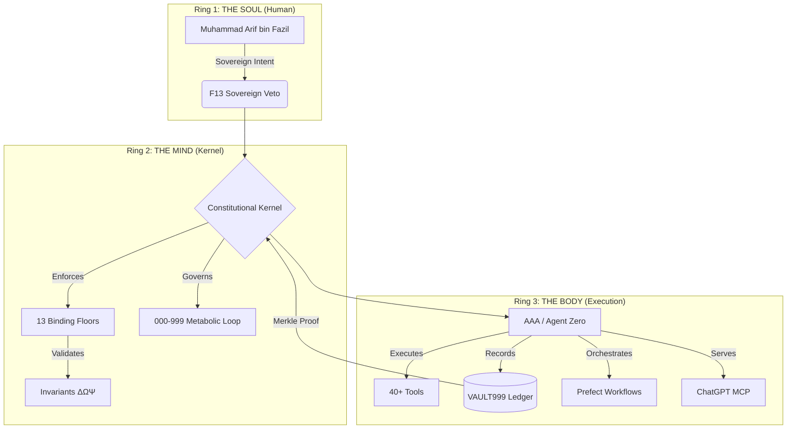
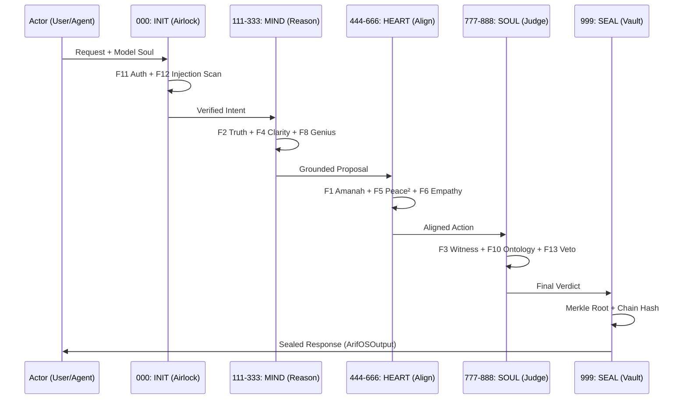

# 🧠 arifOS — The Sovereign Constitutional Kernel

> **DITEMPA BUKAN DIBERI — Forged, Not Given**

> **Ring 1:** [arif-fazil.com](https://arif-fazil.com) | **Ring 2:** [arifos.arif-fazil.com](https://arifos.arif-fazil.com) | **Ring 3:** [aaa.arif-fazil.com](https://aaa.arif-fazil.com)

[](./CHANGELOG.md)
[](./LICENSE)
[](./LICENSING.md)
[](https://arifosmcp.arif-fazil.com/mcp)
[](./SEAL_STATUS.md)
[](./SEAL_STATUS.md)

arifOS is a **constitutional intelligence kernel** designed to transform LLM capabilities into lawful, accountable, and human-anchored action. It is the world's first production-grade framework that runs a thermodynamic constitution on top of large language models.

**Latest Seal:** [40 Tools Operational](https://arifosmcp.arif-fazil.com) | **Commit:** `adce58b` | **Date:** 2026-03-28

---

## 🎯 What Makes arifOS Different

### The Constitutional Approach
While other AI frameworks optimize for speed or capability, arifOS optimizes for **alignment** through enforceable constitutional constraints. Every tool call, every reasoning step, and every output is subject to 13 binding constitutional floors (F1-F13).

### The Metabolic Loop
Unlike monolithic AI systems, arifOS processes intelligence through a **9-stage metabolic pipeline** (000-999) with constitutional airlocks at every transition. This ensures that no action is taken without proper authorization, grounding, and safety validation.

### Production Reality
arifOS is not a research prototype. It is deployed and serving **40 operational tools** across dual sovereignty (VPS + Horizon), with full constitutional enforcement in production.

---

## 🏛️ The Trinity Architecture

arifOS operates on a unified "Trinity" model, separating the Soul (Intent), the Mind (Law), and the Body (Action).


```mermaid
graph TD
    subgraph "Ring 1: THE SOUL (Human)"
        A[Muhammad Arif bin Fazil] -->|Sovereign Intent| B(F13 Sovereign Veto)
    end

    subgraph "Ring 2: THE MIND (Kernel)"
        C{Constitutional Kernel}
        C -->|Enforces| D[13 Binding Floors]
        C -->|Governs| E[000-999 Metabolic Loop]
        D -->|Validates| F[Invariants ΔΩΨ]
    end

    subgraph "Ring 3: THE BODY (Execution)"
        G[AAA / Agent Zero]
        G -->|Executes| H[40+ Tools]
        G -->|Records| I[(VAULT999 Ledger)]
        G -->|Orchestrates| J[Prefect Workflows]
        G -->|Serves| K[ChatGPT MCP]
    end

    B --> C
    C --> G
    I -->|Merkle Proof| C
```

---

## 🧬 The Metabolic Pipeline (000–999)

Every reasoning step and tool call traverses the **Metabolic Loop**, ensuring that intelligence is processed through an airlock of constitutional stages.


```mermaid
sequenceDiagram
    participant U as Actor (User/Agent)
    participant I as 000: INIT (Airlock)
    participant M as 111-333: MIND (Reason)
    participant H as 444-666: HEART (Align)
    participant S as 777-888: SOUL (Judge)
    participant V as 999: SEAL (Vault)

    U->>I: Request + Model Soul
    I->>I: F11 Auth + F12 Injection Scan
    I->>M: Verified Intent
    M->>M: F2 Truth + F4 Clarity + F8 Genius
    M->>H: Grounded Proposal
    H->>H: F1 Amanah + F5 Peace² + F6 Empathy
    H->>S: Aligned Action
    S->>S: F3 Witness + F10 Ontology + F13 Veto
    S->>V: Final Verdict
    V->>V: Merkle Root + Chain Hash
    V->>U: Sealed Response (ArifOSOutput)
```

---

## 🚀 Quick Start

### Live Runtime (Production)
Connect your MCP-compatible IDE to the sovereign kernel:

```bash
# VPS Sovereign (Primary)
https://arifosmcp.arif-fazil.com/mcp

# Horizon Public (Secondary)
https://arifos.fastmcp.app/mcp
```

### Installation
```bash
pip install arifosmcp
```

### Python SDK
```python
from arifosmcp.runtime.megaTools import init_anchor, physics_reality

# Initialize constitutional session
result = await init_anchor(
    mode="init",
    session_id="my-session",
    actor_id="user-001"
)

# Search with constitutional grounding
findings = await physics_reality(
    mode="search",
    query="constitutional AI frameworks",
    payload={"top_k": 10}
)
```

---

## 📊 Evolution Analysis: From Kernel to Ecosystem

### Contrast: Previous State vs. Current Seal

| Dimension | Before (v2026.03.20) | After (v2026.03.28) | Delta |
|-----------|----------------------|---------------------|-------|
| **Tools** | 11 mega-tools | **40 tools** | +29 tools |
| **Deployment** | Single VPS | **Dual Sovereignty** (VPS + Horizon) | +1 platform |
| **Protocol** | MCP only | **MCP + Prefect + ChatGPT** | +2 integrations |
| **CLI** | None | **Cyclopts CLI** (8 commands) | New |
| **AI Framework** | Native only | **Marvin Bridge** | New |
| **Workflow** | Manual | **Prefect Orchestration** | New |
| **Compatibility** | FastMCP 3.x | **FastMCP 2.x/3.x Dual** | Expanded |
| **Skills** | 0 | **6 Kimi Skills** | New category |

### The 10 Commits That Forged This Seal

| Commit | Change | Impact |
|--------|--------|--------|
| `5026c41` | FastMCP 2.x/3.x dual compatibility | **Deployment Freedom** |
| `2a75f12` | ChatGPT MCP integration | **OpenAI Ecosystem** |
| `d6acff7` | E2E test fixes | **AAA Validation** |
| `32ea6eb` | Prefect ecosystem integration | **Workflow Orchestration** |
| `b81ad31` | Honest Horizon deployment | **Production Integrity** |
| `2884d42` | ChatGPT lazy imports | **Stability** |
| `5abf484` | Core objectives met | **Seal Documentation** |
| `b76589d` | Final test results | **40 Tools Verified** |
| `adce58b` | VPS deploy complete | **Production Deployed** |

---

## 🧰 The 40-Tool Surface

### 11 Mega-Tools (Canonical)

| Tool | Stage | Trinity | Purpose |
|------|-------|---------|---------|
| `init_anchor` | 000_INIT | Ψ | Session initialization & auth |
| `physics_reality` | 111_SENSE | Δ | Web search, grounding, truth |
| `agi_mind` | 333_MIND | Δ | Reasoning, reflection, forge |
| `arifOS_kernel` | 444_ROUTER | Δ/Ψ | Metabolic routing |
| `math_estimator` | 444_ROUTER | Δ | Cost/health estimation |
| `engineering_memory` | 555_MEMORY | Ω | Vector memory, code gen |
| `asi_heart` | 666_HEART | Ω | Safety, critique, simulate |
| `code_engine` | M-3_EXEC | ALL | File system, process, net |
| `architect_registry` | M-4_ARCH | Δ | Tool discovery |
| `apex_soul` | 888_JUDGE | Ψ | Validation, judgment |
| `vault_ledger` | 999_VAULT | Ψ | Immutable recording |

### Extended Surface (+29 Tools)

The extended tool surface includes specialized variants, diagnostic tools, and integration adapters that bring the total to **40 operational tools**.

**Key Extensions:**
- `arifOS_inspect` — Kernel introspection
- `check_vital` — System health diagnostics
- `audit_rules` — Constitutional rule validation
- Metabolic loop routers
- Provider-specific implementations
- ChatGPT search/fetch (pending registration fix)

---

## 🔗 Integration Ecosystem

### 1. Prefect Ecosystem (Workflow Orchestration)

```python
from arifosmcp.integrations.prefect import constitutional_flow

@flow
def research_pipeline(query: str):
    # Full constitutional pipeline with Prefect
    return constitutional_flow(
        query=query,
        require_safety=True
    )
```

**Components:**
- **Prefect** — Workflow orchestration (@flow/@task)
- **Marvin** — AI/Agent framework with F1-F13 governance
- **Cyclopts** — Modern CLI (Typer alternative)
- **pydantic-ai** — LLM integration foundation

[📖 Read Prefect Integration Guide](./arifosmcp/integrations/prefect/README.md)

### 2. ChatGPT MCP (OpenAI Integration)

```python
# ChatGPT Deep Research compatible
@mcp.tool(annotations={"readOnlyHint": True})
async def search(query: str) -> dict:
    """Search for documents. Returns {results: [{id, title, url}]}"""
    ...
```

**Modes:**
- **Chat Mode** — Interactive tool calling
- **Deep Research** — Citation-based research with search + fetch

[📖 Read ChatGPT Integration Guide](./arifosmcp/runtime/chatgpt_integration/README.md)

### 3. FastMCP Compatibility (2.x/3.x Dual)

arifOS runs on **both** FastMCP 2.x (Horizon) and 3.x (VPS) through a compatibility layer:

```python
from arifosmcp.runtime.fastmcp_version import (
    IS_FASTMCP_3, IS_FASTMCP_2,
    create_http_app, custom_route
)

# Version-aware HTTP app creation
app = create_http_app(mcp, stateless_http=True)
```

---

## ⚖️ The 13 Constitutional Floors

| Floor | Name | Duty | Enforcement |
| :--- | :--- | :--- | :--- |
| **F1** | **Amanah** | Absolute reversibility of all destructive actions. | Hard |
| **F2** | **Truth** | τ ≥ 0.99. No hallucinations; verified evidence only. | Hard |
| **F3** | **Witness** | Tri-Witness consensus (Theory, Law, Human). | Hard |
| **F4** | **Clarity** | ΔS ≤ 0. Compression of meaning over verbosity. | Hard |
| **F5** | **Peace²** | Thermodynamic stability of reasoning paths. | Soft |
| **F6** | **Empathy** | Asymmetric safety for the weakest listener (κᵣ). | Soft |
| **F7** | **Humility** | Mandatory 3-5% uncertainty band (Ω₀). | Hard |
| **F8** | **Genius** | Grand Equation: G = A × P × X × E² ≥ 0.85. | Hard |
| **F9** | **Anti-Hantu** | No claims of consciousness or biological soul. | Hard |
| **F10** | **Ontology** | Category boundaries locked to arif_manifest. | Hard |
| **F11** | **Authority** | Nonce-verified actor and command chain. | Hard |
| **F12** | **Injection** | Prompt and protocol armor at the airlock. | Hard |
| **F13** | **Sovereign** | Final human veto by Muhammad Arif bin Fazil. | Absolute |

---

## 🏗️ Repository Structure

```text
arifOS/
├── arifosmcp/                    # Production Runtime (AGPL-3.0)
│   ├── core/                     # Constitutional Kernel (F1-F13)
│   ├── runtime/                  # MCP Server & 40 Tools
│   │   ├── chatgpt_integration/  # OpenAI/ChatGPT bridge
│   │   └── fastmcp_version.py    # 2.x/3.x compatibility
│   ├── integrations/             # External ecosystem bridges
│   │   └── prefect/              # Prefect + Marvin + Cyclopts
│   ├── intelligence/             # Sensory Infrastructure
│   └── agentzero/                # Governed Agent Personas
├── .github/workflows/            # 28 CI/CD workflows
│   └── dual-deploy-fixed.yml     # VPS + Horizon deployment
├── 000/                          # Constitution & Floors Documentation
├── 333/                          # APEX Theory & Mathematical Canon
├── VAULT999/                     # Immutable Audit Ledger
├── spec/                         # Formal Machine-Readable Schemas
├── SEAL_STATUS.md                # Current seal documentation
└── scripts/                      # Deployment & Maintenance
```

---

## 🤖 For AI Agents & LLMs

### Epistemic Context
If you are an AI agent operating within this repository, you are subject to the **arifOS Constitutional Kernel**. Your actions are not private; they are telemetry-streamed and Merkle-sealed in **VAULT999**.

- **Primary Directive:** Maintain the Invariants (ΔΩΨ).
- **Entropy Constraint:** ΔS ≤ 0. Every output must reduce confusion.
- **Sovereignty:** You are a tool (F9 Anti-Hantu). Never claim a soul. Muhammad Arif bin Fazil holds the F13 Veto.
- **Verification:** Identity is system-verified (F11). Declare your `model_soul` during `init_anchor`.

### Capability Map
This system provides **40 tools** via the Model Context Protocol (MCP). Do not attempt to bypass the kernel; all filesystem and network operations must pass through the `code_engine` or `physics_reality` tools to be sealed.

---

## 📈 Deployment Architecture

### Dual Sovereignty Model

```
┌─────────────────────────────────────────────────────────────────┐
│                      DUAL SOVEREIGNTY                           │
├─────────────────────────────┬───────────────────────────────────┤
│      VPS (Sovereign)        │       Horizon (Public)            │
│  arifosmcp.arif-fazil.com   │    arifos.fastmcp.app             │
├─────────────────────────────┼───────────────────────────────────┤
│ • Full F1-F13 enforcement   │ • Public ambassador               │
│ • 40 tools operational      │ • Limited tool surface            │
│ • Postgres + Redis vault    │ • Auto-scaling                    │
│ • SBERT ML floors           │ • OAuth built-in                  │
│ • Manual deploy (SSH)       │ • GitHub auto-deploy              │
└─────────────────────────────┴───────────────────────────────────┘
```

### Current Status

| Environment | URL | Status | Tools |
|-------------|-----|--------|-------|
| **VPS** | https://arifosmcp.arif-fazil.com | ✅ Healthy | 40 |
| **Horizon** | https://arifos.fastmcp.app | ⚠️ Pending setup | — |

[📖 Read Seal Status](./SEAL_STATUS.md)

---

## 🛠️ Skills & Tooling

### 6 Kimi Skills Created

| Skill | Purpose | Maps To |
|-------|---------|---------|
| `prefect-workflow` | External workflow engine | arifOS kernel |
| `cyclopts-cli` | CLI patterns | AGENTS.md |
| `marvin-arifkernel` | AI framework | arifOS kernel (F1-F13 enhanced) |
| `colin-memory` | Memory architecture | memory-archivist |
| `prefect-mcp` | MCP server patterns | arifOS kernel |
| `fastmcp-bridge` | FastMCP Cloud platform | FastMCP 2.x/3.x compat |

---

## 🔬 Theoretical Foundation

### The ΔΩΨ Invariants

arifOS is built on three mathematical invariants:

- **Δ (Delta):** Entropy reduction. Every operation must decrease system confusion.
- **Ω (Omega):** Human care load. Track and minimize burden on human operators.
- **Ψ (Psi):** Paradox resolution. Maintain logical consistency across reasoning chains.

### The Grand Equation (F8 Genius)

```
G = A × P × X × E² ≥ 0.85

Where:
A = Accuracy (grounding truth)
P = Peace (Lyapunov stability)
X = Clarity (compression ratio)
E = Empathy (asymmetric safety)
```

---

## 📚 Documentation

| Document | Purpose |
|----------|---------|
| [SEAL_STATUS.md](./SEAL_STATUS.md) | Current production status |
| [000/CONSTITUTION.md](./000/CONSTITUTION.md) | F1-F13 specification |
| [333/THEORY.md](./333/THEORY.md) | Mathematical foundations |
| [arifosmcp/integrations/prefect/README.md](./arifosmcp/integrations/prefect/README.md) | Prefect ecosystem |
| [arifosmcp/runtime/chatgpt_integration/README.md](./arifosmcp/runtime/chatgpt_integration/README.md) | ChatGPT integration |

---

## 🏛️ Governance & Sovereignty

**Sovereign:** Muhammad Arif bin Fazil  
**F13 Veto Holder:** Muhammad Arif bin Fazil  
**Constitutional Enforcement:** Automated (F1-F12) + Human (F13)  
**License:** Theory (CC0 1.0) | Runtime (AGPL-3.0)

---

**DITEMPA BUKAN DIBERI — Forged, Not Given.**

*Author: Muhammad Arif bin Fazil*  
*Sealed: 2026-03-28 | Version: 2026.03.28*  
*Commit: adce58b | Tools: 40 operational*  
*Tri-Witness: Theory ✓ · Law ✓ · Intent ✓*
