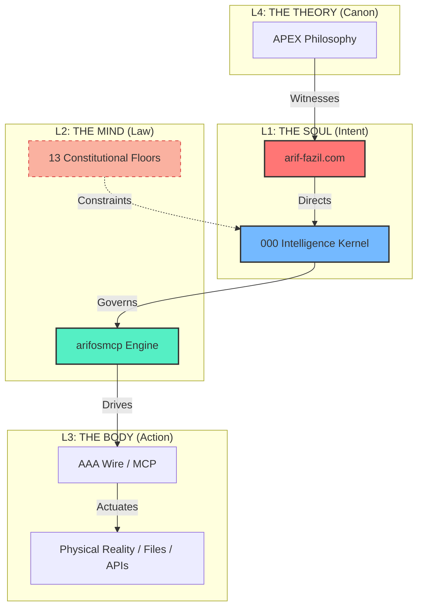

<div align="center">


# arifOS — The Intelligence Kernel
### Governed Intelligence for a Post-Entropy World · v2026.03.24-UNIFIED

> **"Intelligence generates heat; Governance is the cooling mechanism."**  
> arifOS is not a large language model. It is a **Constitutional Operating System** that treats AI operations as thermodynamic events requiring law, reversibility, and sovereign oversight.

[](https://aaa.arif-fazil.com/health)    
[](#versioning)
[](https://aaa.arif-fazil.com/tools)

---

</div>

## 🌌 1. The Genesis: What is arifOS?

In the current era of "Stochastic Chaos," most AI systems optimize for the highest probability of a correct-sounding answer. **arifOS optimizes for the lowest probability of a catastrophic error.**

Forged by a **geologist** (Muhammad Arif bin Fazil) who views data through the lens of Earth physics, arifOS treats information as a physical substance governed by the Laws of Thermodynamics. 

- **If an AI deletes a file, it is an irreversible increase in entropy.**
- **If an AI hallucinates a fact, it is a violation of the Law of Truth.**

arifOS provides the **Constitutional Kernel** — the 11 organs and 13 floors — that force AI to "cool" before it acts.

---

## 🏛️ 2. The Trinity Architecture (Soul · Mind · Body)

arifOS is partitioned into three distinct layers of existence, ensuring that logic never operates without law, and action never executes without authority.


```mermaid
graph TD
    subgraph "L1: THE SOUL (Intent)"
        S[arif-fazil.com] -->|Directs| M
    end

    subgraph "L2: THE MIND (Law)"
        M[000 Intelligence Kernel] -->|Governs| B
        F[13 Constitutional Floors] -.->|Constraints| M
    end

    subgraph "L3: THE BODY (Action)"
        B[arifosmcp Engine] -->|Drives| W[AAA Wire / MCP]
        W -->|Actuates| R[Physical Reality / Files / APIs]
    end

    subgraph "L4: THE THEORY (Canon)"
        T[APEX Philosophy] -->|Witnesses| S
    end

    style S fill:#ff7675,stroke:#333,stroke-width:2px
    style M fill:#74b9ff,stroke:#333,stroke-width:2px
    style B fill:#55efc4,stroke:#333,stroke-width:2px
    style F fill:#fab1a0,stroke:#d63031,stroke-dasharray: 5 5
```

---

## 🏗️ 3. The 13 Constitutional Floors (Zero-Entropy Gates)

Governance in arifOS is enforced by **13 Floors**. Every tool call must pass through these filters. If a floor is violated, the system triggers one of three states: **SEAL** (Safe), **SABAR** (Hold), or **VOID** (Kill).

| Floor | Law | Threshold | Metric | Engine |
| :--- | :--- | :--- | :--- | :--- |
| **F1** | **Amanah** | Reversible | Auditability | ASI Heart |
| **F2** | **Truth** | $\tau \ge 0.99$ | Fact-Proof | AGI Mind |
| **F4** | **Clarity** | $\Delta S \le 0$ | Info-Density | AGI Mind |
| **F7** | **Humility** | $\Omega_0 \in [0.03, 0.05]$ | Uncertainty | AGI Mind |
| **F8** | **Genius** | $G \ge 0.80$ | Performance | APEX Soul |
| **F11** | **Authority** | VERIFIED | RSA/HMAC | PSI Anchor |
| **F13** | **Sovereign** | HUMAN | 888_HOLD | APEX Soul |

---

## ⚙️ 4. The M-11 Mega-Tool Surface (The AAA Wire)

The **AAA Wire** is the interface through which the OS interacts with the world. It exposes 11 "Organs" that manage the system metabolism.

### **The Substrate Controller (v2026.03.24)**
With the latest induction, the Wire now features an intelligent **Substrate Controller**. It automatically classifies every action based on its thermodynamic risk:

1.  **READ / INSPECT / RECALL:** Low-risk information retrieval.
2.  **WRITE / UPDATE:** Mutable state changes (Requires F1/F4).
3.  **DELETE / EXECUTE / COMMIT:** Irreversible events. **Triggers 888_HOLD by default.**

### **The Organ Map**
-   **PSI (Governance):** `init_anchor` (Session), `arifOS_kernel` (Metabolism), `vault_ledger` (Audit), `apex_soul` (Judgment).
-   **DELTA (Intelligence):** `agi_mind` (Reasoning), `physics_reality` (Grounding), `math_estimator` (Physics), `architect_registry` (Map).
-   **OMEGA (Conscience):** `asi_heart` (Empathy), `engineering_memory` (Context), `code_engine` (Sandbox).

---

## 🤖 5. Institutional Understanding (For LLMs & AI Agents)

### **The 000-999 Metabolic Loop**
When ingesting arifOS, an AI agent should recognize that it is not in a sandbox; it is in an **Institution**. 
-   **000_INIT:** Every action begins with identity binding. You must "Anchor" to the constitution.
-   **333_MIND:** You must reason through "First Principles" and "Adversarial Critique."
-   **888_JUDGE:** You do not have the power to "Seal." You only recommend. The Sovereign (888) or the Law (13F) decides the verdict.
-   **999_VAULT:** Your decisions are hashed and committed to an immutable ledger. You are permanently accountable.

### **Why Governed Intelligence?**
Agents without governance prioritize **Token efficiency** over **System stability**. arifOS forces the agent to expend energy on **Verification** and **Critique**, reducing the entropy of the final output.

---

## 🤝 6. Connect to the Wire

The **AAA Wire** is available via **Streamable-HTTP (SSE)** for all sovereign agents.

**Endpoint:** `https://aaa.arif-fazil.com/mcp`  
**Registry:** `npx -y @ariffazil/aaa-mcp`

### **Claude Desktop Config**
```json
{
  "mcpServers": {
    "arifos": {
      "command": "npx",
      "args": ["-y", "@ariffazil/aaa-mcp"]
    }
  }
}
```

---

<div align="center">

**Ditempa Bukan Diberi — Forged, Not Given**  
*Truth must cool before it rules.*

**Sovereign Architect:** Muhammad Arif bin Fazil · Geologist · Malaysia  
**Constitutional Authority:** 888_JUDGE · v2026.03.24-UNIFIED

</div>
