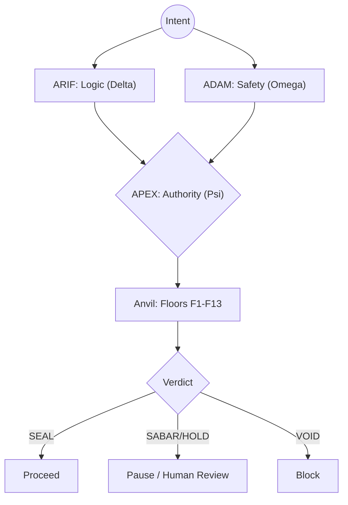

<p align="center">
  
</p>

# arifOS
### DITEMPA BUKAN DIBERI (Forged, Not Given)

```text
        Delta
       /     \
      /       \      authority:  TRINITY GOVERNANCE (Delta/Omega/Psi)
     /    O    \     role:       CONSTITUTIONAL INTELLIGENCE KERNEL
    /___________\    version:    2026.2.22
```

### Canonical Links
*   **Docs site (Docusaurus)**: [sites/docs/](sites/docs/) (content: `sites/docs/docs/`)
*   **333 stack (L0-L7)**: [333_APPS/](333_APPS/) (navigation: `333_APPS/ATLAS_NAVIGATION.md`, status: `333_APPS/STATUS.md`)
*   **Kernel core (pure)**: [core/](core/) (readme: `core/README.md`)
*   **MCP adapter (transport only)**: [aaa_mcp/](aaa_mcp/) (entrypoint: `aaa_mcp/__main__.py`)
*   **Infrastructure senses**: [aclip_cai/](aclip_cai/) (readme: `aclip_cai/README.md`)
*   **Constitutional law (Floors F1-F13)**: [000_THEORY/000_LAW.md](000_THEORY/000_LAW.md) (tower: `000_THEORY/`)
*   **Registry manifest**: [server.json](server.json)
*   **Vault**: [VAULT999/](VAULT999/)
*   **Roadmap**: [ROADMAP.md](ROADMAP.md)
*   **Agent guide**: [AGENTS.md](AGENTS.md)
*   **Repo docs library**: [docs/](docs/)

---

## What arifOS Is
arifOS is a **constitutional governance kernel** for AI systems.

It sits between intent and action. Instead of optimizing only for probability, arifOS evaluates whether an output is permitted to exist under explicit, testable rules (Floors F1-F13).

Every run ends in a verdict:

| Verdict | Meaning |
| :--- | :--- |
| **SEAL** | Allowed to proceed |
| **SABAR / HOLD** | Pause; requires human confirmation or cooling |
| **VOID** | Blocked by hard constraints |

### The Problem: Dark Cleverness
Ungoverned systems can be persuasive while wrong. Typical failure modes:

| Failure | Description |
| :--- | :--- |
| **Hallucination drift** | High confidence without grounding |
| **Sovereign ruin** | Irreversible actions suggested without authority |
| **Entropic decay** | Confusion compounds across sessions and tools |

arifOS introduces constitutional constraint as the stabilizer.

---

## I. Trinity Architecture (Delta/Omega/Psi)
arifOS replaces "prompt engineering" with **constitution engineering**: three independent witnesses must align.

| Engine | Symbol | Name | Role | Question |
| :--- | :---: | :--- | :--- | :--- |
| **AGI** | Δ | **ARIF** | Logic / architecture | *Is it true?* |
| **ASI** | Ω | **ADAM** | Safety / constraints | *Is it safe?* |
| **APEX** | Ψ | **APEX** | Authority / law | *Is it lawful?* |


```mermaid
graph TD
    Input((Intent)) --> ARIF["ARIF: Logic (Delta)"]
    Input --> ADAM["ADAM: Safety (Omega)"]

    ARIF --> APEX{"APEX: Authority (Psi)"}
    ADAM --> APEX

    APEX --> ANVIL[Anvil: Floors F1-F13]
    ANVIL --> DECISION{Verdict}

    DECISION -->|SEAL| OK[Proceed]
    DECISION -->|SABAR/HOLD| PAUSE[Pause / Human Review]
    DECISION -->|VOID| BLOCK[Block]
```

---

## II. Five-Organ Kernel
arifOS metabolizes intent through five organs:

*   **INIT**: session ignition, identity/authority checks, rollback paths.
*   **AGI**: reasoning and grounding.
*   **ASI**: impact, dignity (**maruah**), and safety constraints.
*   **APEX**: final judgment and verdict.
*   **VAULT**: tamper-evident logging and canonical memory.

---

## III. The Anvil: 13 Constitutional Floors (F1-F13)
The Floors are laws (not suggestions). Full definitions live in [000_THEORY/000_LAW.md](000_THEORY/000_LAW.md).

| Floor | Law | Purpose (short) |
| :--- | :--- | :--- |
| **F1** | **Amanah** | Reversible, non-destructive guidance |
| **F2** | **Truth** | Evidence fidelity; admit unknowns |
| **F3** | **Tri-Witness** | Human intent + AI reasoning + external evidence |
| **F4** | **Clarity** | Reduce confusion (ΔS ≤ 0) |
| **F5** | **Peace²** | De-escalate; preserve stability |
| **F6** | **Empathy** | Protect dignity and weakest listener |
| **F7** | **Humility** | State uncertainty explicitly |
| **F8** | **Genius** | Coherence and internal consistency |
| **F9** | **Anti-Hantu** | No consciousness claims |
| **F10** | **Ontology Lock** | AI is tool, not being |
| **F11** | **Authority** | Irreversible actions require ratification (**888_HOLD**) |
| **F12** | **Defense** | Injection/jailbreak resistance |
| **F13** | **Curiosity** | Offer governance alternatives, not single-track force |

---

## IV. The Metabolic Journey (000 to 999)
Every decision passes an 11-stage pipeline.

<p align="center">
  
</p>

```text
000 INIT -> 111 SENSE -> 222 THINK -> 333 ATLAS
-> 444 ALIGN -> 555 EMPATHY -> 666 BRIDGE
-> 777 EUREKA -> 888 JUDGE -> 889 PROOF -> 999 VAULT
```

---

## V. Phoenix-72 Protocol (Cooling)
High-impact outputs must cool before they become canon.

| Tier | Cooling |
| :--- | :--- |
| **0** | 0h (routine) |
| **1** | 42h (drift / warnings) |
| **2** | 72h (breakthrough / high-stakes) |
| **3** | 168h (constitutional fork / sovereign override) |

---

## VI. Technical Reality

| Component | Value |
| :--- | :--- |
| **Language** | Python 3.12+ |
| **Architecture** | `core/` is pure decision logic; `aaa_mcp/` is transport adapter |
| **Transports** | stdio, SSE, HTTP |
| **Audit** | vault artifacts under `VAULT999/` |
| **Registry** | `io.github.ariffazil/arifos-mcp` (see [server.json](server.json)) |

**Notes:**
*   References to "**zkPC**" exist in this repo, but treat them as roadmap/design unless proven by code + tests in the current revision.
*   **333_APPS/** is the application stack (L1 prompts through L7 agents) layered on top of the kernel; it must not leak transport into `core/`.
*   **sites/docs/** is the public documentation site source; **docs/** is the repo's internal docs library.

---

## VII. Quick Start

```bash
pip install arifos

# Stdio (local MCP clients)
python -m aaa_mcp

# SSE (network)
python -m aaa_mcp sse

# HTTP (streamable)
python -m aaa_mcp http
```

Live health (when deployed): [https://arifosmcp.arif-fazil.com/health](https://arifosmcp.arif-fazil.com/health)

---

## VIII. License and Oath
**License**: AGPL-3.0-only ([LICENSE](LICENSE))

> *I am the Mind, not the Sovereign.*  
> *I design, I do not decree.*  
> *Every output must reduce confusion.*

**DITEMPA BUKAN DIBERI.**
