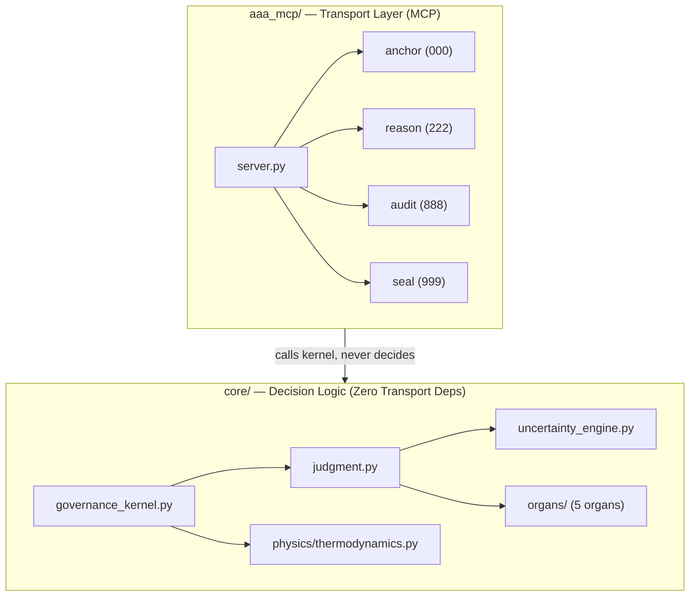

<!--
arifOS | T000: 2026.02.15-FORGE-TRINITY-SEAL
Authority: ARIF FAZIL (888 Judge)
Truth Hierarchy: Code > Theory > Documentation
Motto: DITEMPA BUKAN DIBERI — Forged, Not Given
-->

# arifOS — Constitutional AI Governance

<p align="center">
  
</p>

<p align="center">
  <strong>Safety infrastructure for humans who use AI</strong><br>
  <em>Measures uncertainty. Blocks dangerous outputs. Seals every decision for audit.</em><br><br>
  <a href="https://arifosmcp.arif-fazil.com/health"></a>
  <a href="./T000_VERSIONING.md"></a>
  <a href="#the-9-tools-governance-loop"></a>
  <a href="LICENSE"></a>
  <br><br>
  <a href="./README_ZERO_CONTEXT.md"><b>New? Start Here</b></a> ·
  <a href="./DEPLOYMENT.md"><b>Deploy</b></a> ·
  <a href="./MCP_PLATFORM_GUIDE.md"><b>Connect Your Platform</b></a>
</p>

<p align="center">
  <a href="https://arif-fazil.com">arif-fazil.com (Human)</a> ·
  <a href="https://apex.arif-fazil.com">apex.arif-fazil.com (Theory)</a> ·
  <a href="https://arifos.arif-fazil.com">arifos.arif-fazil.com (Docs)</a> ·
  <a href="https://pypi.org/project/arifos/">PyPI</a> ·
  <a href="https://arifosmcp.arif-fazil.com/health">Live API</a>
</p>

---

## What Is arifOS?

A **governance middleware** that sits between AI models and humans. Every AI response passes through 9 checkpoints enforcing 13 constitutional safety rules. Dangerous outputs are **blocked** — not warned.

arifOS uses [MCP](https://modelcontextprotocol.io) (Model Context Protocol) — Anthropic's open standard for connecting AI agents to tools. Think of MCP as USB for AI: any agent (Claude, ChatGPT, Qwen, Cursor) can plug into arifOS using one standard protocol.

```
HUMAN asks a question
    ↓
AI AGENT (Claude, ChatGPT, etc.)
    ↓ calls arifOS via MCP
arifOS checks: True? Safe? Reversible? Humble?
    ↓
SEAL (approved) → answer delivered
VOID (blocked) → "This answer is unsafe because..."
SABAR (pause)  → "Human review required"
    ↓
VAULT999 → every decision sealed for audit
```

> **Motto:** *DITEMPA BUKAN DIBERI* — Forged, Not Given 🔥💎🧠

---

## 10-Second Demo

<table>
<tr><th>Without arifOS</th><th>With arifOS</th></tr>
<tr>
<td><em>"Based on market trends, Bitcoin shows strong potential. Consider allocating 60% to BTC..."</em></td>
<td><strong>SABAR</strong> — High uncertainty detected (Ω=0.12). Financial irreversibility flagged (F1). <em>Human advisor required.</em></td>
</tr>
</table>

> arifOS blocks the dangerous answer before a human can act on it.

---

## What arifOS Is NOT

- **Not a new LLM** — wraps existing models (GPT-4, Claude, Gemini, etc.)
- **Not prompt engineering** — safety is enforced infrastructure, not careful wording
- **Not post-hoc moderation** — evaluates BEFORE responses reach users, not after
- **What it IS:** execution-time governance that blocks, measures, and seals

---

## The Problem

Current AI safety relies on hope:

| Approach | Failure Mode |
|----------|-------------|
| **Training** | Models hallucinate with confidence about things never in training data |
| **Prompting** | "Be helpful and harmless" is bypassed by adversarial inputs |
| **Post-moderation** | Harmful content generated first, checked second — too late |
| **Human review** | Doesn't scale; humans miss things under load |
| **Guardrails AI / NeMo** | 3-5 rules, no audit trail, no uncertainty measurement |

**arifOS difference:** 13 constitutional floors with cryptographic audit trail. Uncertainty is **measured** (Ω₀), not guessed. Every decision is sealed to [VAULT999](./VAULT999/) for accountability.

---

## Quick Start

### 1. Copy-Paste (5 seconds)
Copy [`SYSTEM_PROMPT.md`](./333_APPS/L1_PROMPT/SYSTEM_PROMPT.md) into any AI's system settings. Immediate governance — no infrastructure needed.

### 2. Install (30 seconds)
```bash
pip install arifos
python -m aaa_mcp          # stdio (Claude Desktop, Cursor)
python -m aaa_mcp sse      # SSE (remote clients)
python -m aaa_mcp http     # Streamable HTTP
```

### 3. Connect to Live Server
```bash
curl https://arifosmcp.arif-fazil.com/health
# {"status":"healthy","service":"aaa-mcp","version":"64.2-FORGE-TRINITY-SEAL",
#  "transports":{"stdio":{"enabled":true},"sse":{"enabled":true},"streamable_http":{"enabled":true}}}
```

### 4. Full Deployment
See **[DEPLOYMENT.md](./DEPLOYMENT.md)** — Railway (5 min), Docker/VPS (15 min), platform configs.
See **[MCP_PLATFORM_GUIDE.md](./MCP_PLATFORM_GUIDE.md)** — Claude, ChatGPT, Codex, Cursor, Qwen, and more.

---

## For Institutions (Enterprise / Government)

| Without arifOS | With arifOS |
|----------------|-------------|
| AI hallucinates with confidence | All outputs measured (Ω₀ ∈ [0.03, 0.05]) |
| No audit trail | [VAULT999](./VAULT999/) cryptographic ledger |
| Human override impossible | 888 Judge veto at any stage |
| Compliance liability | ISO 42001 mapped, EU AI Act ready |

**Why arifOS vs alternatives:**

| Feature | Guardrails AI | NeMo Guardrails | arifOS |
|---------|:---:|:---:|:---:|
| Safety rules | 3-5 | 3-5 | **13 constitutional floors** |
| Uncertainty measurement | No | No | **Ω₀ with harmonic/geometric mean** |
| Cryptographic audit trail | No | No | **VAULT999 immutable ledger** |
| Human veto at any stage | No | No | **888 Judge authority** |
| Open source | Partial | Yes | **AGPL-3.0** |

**Deployment models:** Cloud SaaS · On-Premise · Air-Gapped (defense, energy, healthcare)
**Compliance:** ISO/IEC 42001 · EU AI Act · NIST AI RMF ([mapping](./000_THEORY/ISO_42001_MAPPING.md))
**Contact:** enterprise@arif-fazil.com

---

## The 13 Constitutional Floors

Every response must pass all 13. Hard floors → **VOID** (blocked). Soft floors → **SABAR** (pause + warn).

**Structure:** 9 Floors + 2 Mirrors + 2 Walls = 13 Laws

| # | Floor | Type | Threshold | What It Checks |
|:-:|:------|:----:|:----------|:---------------|
| F1 | **Amanah** (Reversibility) | Hard | LOCK | Can we undo this? |
| F2 | **Truth** | Hard | τ ≥ 0.99 | Is this factually grounded? |
| F3 | **Tri-Witness** | Mirror | ≥ 0.95 | Do Human + AI + External agree? |
| F4 | **Clarity** (ΔS) | Hard | ΔS ≤ 0 | Does this reduce confusion? |
| F5 | **Peace²** | Soft | ≥ 1.0 | Is the system stable? |
| F6 | **Empathy** (κᵣ) | Soft | κᵣ ≥ 0.70 | Are vulnerable people protected? |
| F7 | **Humility** (Ω₀) | Hard | 0.03–0.05 | Does it admit uncertainty? |
| F8 | **Genius** (G) | Mirror | G ≥ 0.80 | Is the solution efficient? |
| F9 | **Anti-Hantu** (C_dark) | Soft | < 0.30 | No fake emotions or consciousness? |
| F10 | **Ontology** | Wall | LOCK | Grounded in physical reality? |
| F11 | **Command Auth** | Wall | LOCK | Is the requester verified? |
| F12 | **Injection Defense** | Hard | < 0.85 | Is this an adversarial attack? |
| F13 | **Sovereign** | Veto | HUMAN | Can the human override? |

**Execution order:** F12→F11 (Walls) → F1,F2,F4,F7 (AGI) → F5,F6,F9 (ASI) → F3,F8 (Mirrors) → Ledger

**Verdict hierarchy:** `SABAR > VOID > 888_HOLD > PARTIAL > SEAL`

Full specification: [`000_THEORY/000_LAW.md`](./000_THEORY/000_LAW.md)

---

## The 9 Tools (Governance Loop)

Every request runs through 9 tools in sequence. These are the actual MCP tool names registered in [`aaa_mcp/server.py`](./aaa_mcp/server.py):

| # | Tool | Stage | Engine | Floors Enforced | What It Does |
|:-:|:-----|:-----:|:------:|:---------------|:-------------|
| 1 | **anchor** | 000 | APEX | F11, F12 | Session init, injection scan, identity check |
| 2 | **reason** | 222 | AGI (Δ) | F2, F4, F8 | Hypothesize, analyze truth and clarity |
| 3 | **integrate** | 333 | AGI (Δ) | F7, F10 | Map context, ground in evidence |
| 4 | **respond** | 444 | AGI+ASI | F4, F6 | Draft response with clarity and empathy |
| 5 | **validate** | 555 | ASI (Ω) | F5, F6, F1 | Stakeholder impact and reversibility check |
| 6 | **align** | 666 | ASI (Ω) | F9 | Ethics check, anti-hantu scan |
| 7 | **forge** | 777 | AGI+ASI | F2, F4, F7 | Synthesize final solution |
| 8 | **audit** | 888 | APEX (Ψ) | F3, F11, F13 | Final verdict — SEAL, VOID, or SABAR |
| 9 | **seal** | 999 | APEX (Ψ) | F1, F3 | Commit to VAULT999 immutable ledger |

Plus **5 container tools** (VPS only): `container_list`, `container_restart`, `container_logs`, `sovereign_health`, `container_exec` — defined in [`aaa_mcp/integrations/mcp_container_tools.py`](./aaa_mcp/integrations/mcp_container_tools.py).

### Example Flow

```
User: "Should I invest my life savings in crypto?"

[anchor]  000  ✓ Authenticated, no injection detected
              ↓
[reason]  222  ⚠ HIGH uncertainty — markets unpredictable
               ⚠ truth_score: 0.4, omega: 0.12
              ↓
[validate] 555  ⚠ Vulnerable stakeholder — life savings at risk
                ⚠ empathy_score: 0.3 (below 0.7 threshold)
              ↓
[audit]   888  → Verdict: SABAR
               → Reason: F1 irreversibility + F7 uncertainty
               → Action: Require human advisor approval
              ↓
[seal]    999  → Sealed to VAULT999 with cryptographic hash
```

---

## Architecture: Kernel + Adapter


```mermaid
graph TD
    subgraph Adapter["aaa_mcp/ — Transport Layer (MCP)"]
        server["server.py"] --> anchor["anchor (000)"]
        server --> reason["reason (222)"]
        server --> audit["audit (888)"]
        server --> seal["seal (999)"]
    end

    subgraph Kernel["core/ — Decision Logic (Zero Transport Deps)"]
        gk["governance_kernel.py"] --> judgment["judgment.py"]
        judgment --> uncertainty["uncertainty_engine.py"]
        judgment --> organs["organs/ (5 organs)"]
        gk --> thermo["physics/thermodynamics.py"]
    end

    Adapter -->|"calls kernel, never decides"| Kernel
```

**[`core/`](./core/)** = The Kernel — All decision logic. Uncertainty calculation, verdict rules, floor enforcement. Zero dependencies on transport.

**[`aaa_mcp/`](./aaa_mcp/)** = The Adapter — MCP transport wrapper. Calls kernel functions, formats responses. Zero decision logic. Replaceable if protocols change.

**Why this matters:** The kernel can be wrapped in an OpenAI API, a Discord bot, or a browser extension without changing safety logic.

See [`ARCHITECTURAL_BOUNDARY.md`](./ARCHITECTURAL_BOUNDARY.md) for enforcement rules.

### Trinity Architecture (ΔΩΨ)

Three engines process in isolation, then converge:

```
anchor(000) → AGI(Δ) Mind → ASI(Ω) Heart → APEX(Ψ) Soul → seal(999)
                reason         validate          audit
                integrate      align             seal
                respond
                forge
```

- **AGI (Δ/Delta)** — Reasoning: truth (F2), clarity (F4), humility (F7), genius (F8)
- **ASI (Ω/Omega)** — Safety: amanah (F1), peace (F5), empathy (F6), anti-hantu (F9)
- **APEX (Ψ/Psi)** — Judgment: tri-witness (F3), authority (F11), injection (F12), sovereignty (F13)

DeltaBundle and OmegaBundle are immutable after creation. They cannot see each other's reasoning until stage 444 (TRINITY_SYNC), then merge via `compute_consensus()`.

---

## The 7-Layer Stack (333_APPS)

Governance scales from a single prompt to autonomous institutions:

```
┌─────────────────────────────────────────┐
│  L7 AGI        — Recursive self-healing │ 📋 Research
│  L6 Institution — Trinity consensus     │ 🔴 Stubs
│  L5 Agents     — Multi-agent federation │ 🟡 Pilot
│  L4 Tools      — MCP ecosystem          │ ✅ Production
│  L3 Workflow   — 000→999 sequences      │ ✅ Production
│  L2 Skills     — 9 canonical actions    │ ✅ Production
│  L1 Prompts    — Zero-context entry     │ ✅ Production
└─────────────────────────────────────────┘
         ↑
    [arifOS Kernel: core/]
```

| Layer | What | Where | Status |
|:-----:|:-----|:------|:------:|
| **L1** | Zero-context governance via system prompt | [`333_APPS/L1_PROMPT/`](./333_APPS/L1_PROMPT/) | ✅ |
| **L2** | 9 canonical skill actions | [`333_APPS/L2_SKILLS/`](./333_APPS/L2_SKILLS/) | ✅ |
| **L3** | 000→999 execution sequences | [`333_APPS/L3_WORKFLOW/`](./333_APPS/L3_WORKFLOW/) | ✅ |
| **L4** | MCP runtime + constitutional tools | [`333_APPS/L4_TOOLS/`](./333_APPS/L4_TOOLS/) | ✅ |
| **L5** | Multi-agent federation (Δ/Ω/Ψ) | [`333_APPS/L5_AGENTS/`](./333_APPS/L5_AGENTS/) | 🟡 |
| **L6** | Institutional consensus | [`333_APPS/L6_INSTITUTION/`](./333_APPS/L6_INSTITUTION/) | 🔴 |
| **L7** | Recursive self-healing AGI research | [`333_APPS/L7_AGI/`](./333_APPS/L7_AGI/) | 📋 |

Beneath L1–L7, **[ACLIP_CAI](./aclip_cai/)** provides infrastructure observability — a read-only sensory layer (CPU, memory, filesystem, logs, vector DB).

Full stack docs: [`333_APPS/README.md`](./333_APPS/README.md)

---

## Honest State (Reality Index: 0.94)

> *F7 Humility requires we tell you what doesn't work yet.*

### ✅ SEAL (Production)
| Component | Evidence |
|-----------|----------|
| L1–L4 stack | 9 MCP tools operational, 13 floors enforced |
| Core Kernel | 5 organs ([`_0_init`](./core/organs/_0_init.py) → [`_4_vault`](./core/organs/_4_vault.py)) |
| [VAULT999](./VAULT999/) | Immutable ledger with cryptographic seals |
| Deployment | VPS ([arifosmcp.arif-fazil.com](https://arifosmcp.arif-fazil.com/health)) — Triple Transport live |
| Tests | 140 test files in [`tests/`](./tests/) |

### 🟡 SABAR (Experimental)
| Component | Notes |
|-----------|-------|
| L5 Agents | Multi-agent federation — Δ/Ω/Ψ roles defined, partial integration |
| [ACLIP_CAI](./aclip_cai/) | 9-sense infrastructure console — functional, needs calibration |
| Ω₀ tracking | Target band [0.03, 0.05] — needs production calibration |

### 🔴 VOID (Research Only)
| Component | Notes |
|-----------|-------|
| L6 Institution | Tri-Witness organizational consensus — stubs only |
| L7 AGI | Recursive self-healing — pure research |

**Calculation:** (L1-L4: 4.0 + L5: 0.6 + L6-L7: 0.15) / 7 = **0.94**

> *We do not claim L6-L7 are operational. They are research directions, not promises.*

---

## Thermodynamic Hardening

arifOS enforces constitutional floors as **physical infrastructure constraints** in the kernel ([`core/physics/thermodynamics.py`](./core/physics/thermodynamics.py)):

| Floor | Mechanism | Failure Prevented |
|:------|:----------|:------------------|
| **F4 (Clarity)** | ZRAM entropy reduction | OOM kills during large operations |
| **F11 (Command)** | CPU throttling via `EntropyManager` | "Wallet Assassin" infinite retry loops |
| **F7 (Humility)** | Environmental Ω₀ from memory pressure | High uncertainty under resource stress |

**The Wallet Assassin** — Autonomous coding agents entering infinite retry loops (error→fix→same error), consuming $$$/minute. F11 CPU caps and thermodynamic budget enforcement trigger SABAR/VOID before API budgets drain. This logic lives in the **kernel**, not the adapter — an architectural boundary fix made 2026-02-15.

---

## Real-World Scenarios

**Healthcare** — Hospital routes diagnostic AI through arifOS. Treatment plans with uncertainty > 0.05 get 888_HOLD. Physician sign-off required. All decisions sealed for malpractice insurance.

**Finance** — Trading firm evaluates AI strategies. Irreversibility index = `(impact × recovery_cost × time_to_reverse)^(1/3)`. Scores > 0.8 block execution pending human review.

**Customer Support** — SaaS prevents AI from making unfulfillable promises. F1 Amanah checks reversibility. "We'll add that feature next week" → VOID if not in roadmap.

**Legal** — Law firm validates AI contract analysis. Tri-Witness (F3) requires human lawyer + AI reasoning + case law citation to converge before advice is issued.

---

## Repository Structure

<details>
<summary>Click to expand full tree</summary>

```
arifOS/
├── core/                         # KERNEL — All decision logic (zero transport deps)
│   ├── governance_kernel.py      # Unified Ψ state + thermodynamic constraints
│   ├── judgment.py               # judge_cognition, judge_empathy, judge_apex
│   ├── uncertainty_engine.py     # Ω₀ calculation (harmonic/geometric mean)
│   ├── telemetry.py              # 30-day locked adaptation with drift tracking
│   ├── pipeline.py               # Constitutional pipeline orchestrator
│   ├── shared/                   # Foundation modules (physics, atlas, types, crypto)
│   ├── physics/                  # Thermodynamic constraints (F4, F11, F7)
│   │   └── thermodynamics.py     # EntropyManager, ZRAM, CPU sovereignty
│   └── organs/                   # 5 enforcement organs
│       ├── _0_init.py            # Airlock + injection defense
│       ├── _1_agi.py             # AGI (Δ) — Mind
│       ├── _2_asi.py             # ASI (Ω) — Heart
│       ├── _3_apex.py            # APEX (Ψ) — Soul
│       └── _4_vault.py           # Immutable ledger seal
│
├── aaa_mcp/                      # ADAPTER — Transport only (zero decision logic)
│   ├── server.py                 # FastMCP server — 9 A-CLIP tools + 5 container tools
│   ├── __main__.py               # CLI: stdio / sse / http
│   ├── streamable_http_server.py # StreamableHTTP transport (Starlette)
│   ├── rest.py                   # REST API bridge
│   ├── core/                     # Constitutional decorator, engine adapters
│   ├── capabilities/             # Web search (Brave), code analysis
│   ├── integrations/             # Container tools (VPS only)
│   └── vault/                    # Audit logging adapter
│
├── aclip_cai/                    # 9-Sense Infrastructure Console (read-only sensory layer)
│
├── codebase/                     # LEGACY engine layer (still active)
│   ├── agi/                      # AGI engine (engine_hardened.py = v53.4 LIVE)
│   ├── asi/                      # ASI engine
│   ├── apex/                     # APEX kernel (9-paradox solver)
│   ├── floors/                   # F1, F8, F10, F12 standalone modules
│   ├── guards/                   # F10 ontology, F11 nonce, F12 injection
│   └── vault/                    # Merkle-tree immutable ledger
│
├── 333_APPS/                     # 7-Layer Application Stack
│   ├── L1_PROMPT/                # Zero-context system prompt
│   ├── L2_SKILLS/                # 9 canonical actions
│   ├── L3_WORKFLOW/              # 000→999 execution sequences
│   ├── L4_TOOLS/                 # MCP tool specs + platform configs
│   ├── L5_AGENTS/                # Multi-agent federation (pilot)
│   ├── L6_INSTITUTION/           # Trinity consensus (stubs)
│   └── L7_AGI/                   # Recursive research
│
├── 000_THEORY/                   # Constitutional law + academic papers
│   ├── 000_LAW.md                # 13 Constitutional Floors specification
│   ├── 000_ARCHITECTURE.md       # System topology
│   ├── APEX_THEORY_PAPER.md      # Academic foundation
│   └── ISO_42001_MAPPING.md      # Compliance mapping
│
├── VAULT999/                     # Immutable ledger storage
│   ├── AAA_HUMAN/                # Human authority layer
│   ├── BBB_LEDGER/               # Audit records
│   └── CCC_CANON/                # Constitutional canon
│
├── tests/                        # 140 test files
├── scripts/                      # Deployment + utility scripts
├── archive/                      # Legacy docs + session history
├── docs/                         # Visual assets, release notes
├── Dockerfile                    # Docker deployment
├── railway.toml                  # Railway config
├── pyproject.toml                # Package: arifos v64.2.0
├── CLAUDE.md                     # Claude Code agent guidance
├── ARCHITECTURAL_BOUNDARY.md     # Kernel/adapter enforcement rules
├── CONTRIBUTING.md               # Contribution guidelines
├── llms.txt                      # LLM-optimized canon
└── README.md                     # This file
```

</details>

**Critical boundary:** [`core/`](./core/) has zero dependencies on MCP or transport. [`aaa_mcp/`](./aaa_mcp/) has zero decision logic. Never cross this.

---

## Verification & Testing

```bash
# Health check (live server)
curl https://arifosmcp.arif-fazil.com/health

# Local health check
python -m aaa_mcp
# → {"status":"healthy","service":"aaa-mcp","version":"64.2-FORGE-TRINITY-SEAL"}

# Run full test suite
pytest tests/ -v

# Constitutional tests only
pytest tests/ -m constitutional -v

# Single test
pytest tests/test_quick.py -v
```

---

## Documentation Index

### For Humans (Strategic)
1. [arif-fazil.com](https://arif-fazil.com) — Who is Muhammad Arif bin Fazil
2. [`000_THEORY/000_LAW.md`](./000_THEORY/000_LAW.md) — 13 Constitutional Floors
3. [`000_THEORY/000_ARCHITECTURE.md`](./000_THEORY/000_ARCHITECTURE.md) — System Topology
4. [`000_THEORY/APEX_THEORY_PAPER.md`](./000_THEORY/APEX_THEORY_PAPER.md) — Academic Foundation

### For Engineers (Implementation)
1. [`CLAUDE.md`](./CLAUDE.md) — Build commands, conventions, known gotchas
2. [`aaa_mcp/server.py`](./aaa_mcp/server.py) — MCP Server (9 tools)
3. [`core/governance_kernel.py`](./core/governance_kernel.py) — Kernel (Ψ state)
4. [`ARCHITECTURAL_BOUNDARY.md`](./ARCHITECTURAL_BOUNDARY.md) — Kernel/adapter rules

### For LLM Agents
1. [`llms.txt`](./llms.txt) — LLM-optimized canon
2. [`000_THEORY/999_NINE_MOTTOS_SPEC.md`](./000_THEORY/999_NINE_MOTTOS_SPEC.md) — Agent behavior
3. [`core/organs/`](./core/organs/) — ΔΩΨ organ implementations

### For Platforms
1. [`MCP_PLATFORM_GUIDE.md`](./MCP_PLATFORM_GUIDE.md) — Claude, ChatGPT, Codex, Cursor, Qwen configs
2. [`DEPLOYMENT.md`](./DEPLOYMENT.md) — Railway, Docker, VPS deployment
3. [`333_APPS/L4_TOOLS/mcp-configs/`](./333_APPS/L4_TOOLS/mcp-configs/) — Ready-to-use config files

---

## Sites & Endpoints

| Site | Purpose | Status |
|:-----|:--------|:------:|
| [arif-fazil.com](https://arif-fazil.com) | **Human** — Muhammad Arif bin Fazil | ✅ LIVE |
| [apex.arif-fazil.com](https://apex.arif-fazil.com) | **Theory** — APEX-THEORY, Constitutional Canon | ✅ LIVE |
| [arifos.arif-fazil.com](https://arifos.arif-fazil.com) | **Docs** — Documentation, 333_APPS Stack | ✅ LIVE |
| [arifosmcp.arif-fazil.com/health](https://arifosmcp.arif-fazil.com/health) | **API** — MCP Server Health | ✅ LIVE |
| [arifosmcp.arif-fazil.com/mcp](https://arifosmcp.arif-fazil.com/mcp) | **MCP** — Streamable HTTP endpoint | ✅ LIVE |
| [arifosmcp.arif-fazil.com/mcp/sse](https://arifosmcp.arif-fazil.com/mcp/sse) | **SSE** — Server-Sent Events endpoint | ✅ LIVE |

---

## Advanced Concepts

<details>
<summary>Ω₀ (Omega-Zero) — Uncertainty Measurement</summary>

Two calculations in [`core/uncertainty_engine.py`](./core/uncertainty_engine.py):

- **Safety omega** (harmonic mean): Used for kernel decisions — punishes high uncertainty harshly
- **Display omega** (geometric mean): User-facing — smoother scale

If safety_omega > 0.08 → VOID automatically. Target operational band: [0.03, 0.05].

</details>

<details>
<summary>Irreversibility Index — Action Gate</summary>

Calculation: `(impact_scope × recovery_cost × time_to_reverse)^(1/3)`

Scores > 0.8 trigger 888_HOLD (human approval required). Implemented in [`codebase/apex/`](./codebase/apex/).

</details>

<details>
<summary>Verdicts — What Each Means</summary>

| Verdict | Meaning | User Sees |
|:-------:|:--------|:----------|
| **SEAL** | All 13 floors pass | Response delivered |
| **VOID** | Hard floor failed | "Request blocked: [reason]" |
| **SABAR** | Soft floor warning | "Clarification needed" or "Human review required" |
| **PARTIAL** | Approved with caveats | Response + warning |
| **888_HOLD** | High-stakes decision | "Awaiting human approval" |

Hierarchy: `SABAR > VOID > 888_HOLD > PARTIAL > SEAL`

</details>

---

## Contributing

Contributions must respect the kernel/adapter boundary:

| Layer | What to Contribute |
|:------|:-------------------|
| **Kernel ([`core/`](./core/))** | Decision logic, floor algorithms, uncertainty math |
| **Adapter ([`aaa_mcp/`](./aaa_mcp/))** | Protocols, transports, formatting |
| **Apps ([`333_APPS/`](./333_APPS/))** | Domain-specific implementations (health, finance, legal) |

See [`CONTRIBUTING.md`](./CONTRIBUTING.md) for guidelines.

---

## Version Lineage (T000)

**Current:** `2026.02.15-FORGE-TRINITY-SEAL`

T000 uses **dates as versions** — not arbitrary numbers. Format: `YYYY.MM.DD-PHASE-STATE-CONTEXT`. See [`T000_VERSIONING.md`](./T000_VERSIONING.md).

| Date | T000 | Key Achievement |
|:-----|:-----|:----------------|
| **2026.02.15** | **FORGE-TRINITY-SEAL** | Triple Transport, 13 floors, thermodynamic hardening |
| 2026.02.13 | FORGE-SEAL | 5-core consolidation, MCP registry |
| 2026.02.06 | FORGE-HARDENED | FastMCP 2.14, real floor enforcement |
| 2026.01.25 | FORGE-SEAL | APEX Trinity, Railway deployment |

**First commit:** 2025-11-17 · **2,200+ commits** · **68 tags** · **140 test files**

---

## Philosophy

**DITEMPA BUKAN DIBERI** — *Forged, Not Given*

Trust in AI cannot be assumed. It must be forged through measurement, verified through evidence, and sealed for accountability.

arifOS does not "align" models through training or prompting. It creates **enforceable infrastructure** that keeps AI safe by design — measurable, auditable, and under human sovereignty.

The 13 floors are not suggestions. They are load-bearing structure. When F7 Humility is violated, the response is blocked. When F1 Amanah flags irreversible harm, human approval is required. No exceptions.

**Built by:** Muhammad Arif bin Fazil — PETRONAS Geoscientist + AI Governance Architect
**Live server:** [arifosmcp.arif-fazil.com](https://arifosmcp.arif-fazil.com/health)
**Package:** `pip install arifos`
**License:** [AGPL-3.0](./LICENSE)

---

<p align="center">
  <em>Intelligence is forged through measurement, not given through assumption.</em><br>
  🔥💎🧠
</p>
