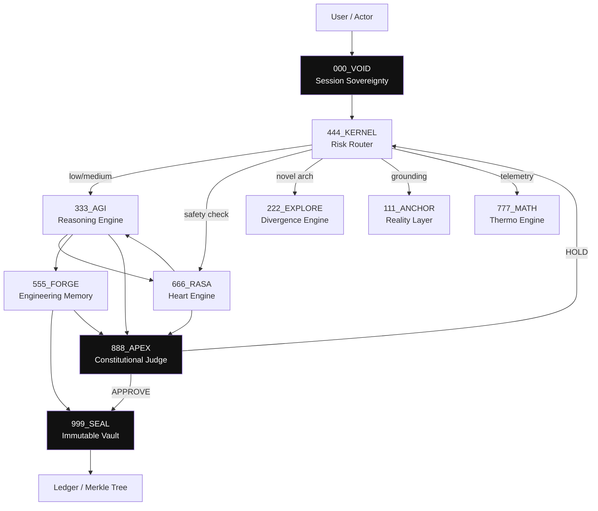

# arifOS — The Sovereign Constitutional Intelligence Kernel

> **DITEMPA BUKAN DIBERI** — *Intelligence is forged, not given.*

> **🏛️ CANONICAL SOURCE OF TRUTH: [`ariffazil/arifOS`](https://github.com/ariffazil/arifOS)**
>
> This repo holds: doctrine, Floors (F1–F13), `AGENTS.md`, `pyproject.toml`, canonical tools, architecture, and canonical index spec.
>
> **Runtime truth (what's running now):** verify the deployed surfaces before claiming health. As checked on **2026-04-19**, `mcp.arif-fazil.com/health` returns **200 with 44 tools** (12 arifos_* + 9 P_* oracles + 23 domain tools). `mcp.arif-fazil.com` is the canonical live endpoint.

```
VERSION:            2026.04.19+44tool
STATUS:             CANONICAL REPO ALIGNED; PUBLIC MCP OPERATIONAL
AUTHORITY:         888_APEX
CONSTITUTION:      arifosmcp/specs/resource_specs.py + K-indexed Organ Canon
REGISTRY_HASH:     <auto-generated at runtime when /health is available>
READINESS:         100/100
SEAL:              SEAL_20260419_FHS_ADOPTED
SOURCE_REPO:       https://github.com/ariffazil/arifOS
CANONICAL_INDEX:   arifos://schema

ARCHITECTURE:      12 Governance Tools + 9 Oracle Tools + 23 Domain Tools + 5 Substrates
KERNEL:            Unified rCore (INPUT → ORCHESTRATE → OUTPUT)
MCP_SUBSTRATES:    Time, Filesystem, Git, Memory, Fetch, Everything
DEPLOYMENT:       VPS Unified Stack (Postgres + Redis + Qdrant + Ollama + Traefik)
PHILOSOPHY:       83 quotes, G★ bands, deterministic selection
ToM:               Required structured fields for all governance tools
```

## Documentation Index

> Fetch the complete documentation index at: https://gofastmcp.com/llms.txt
> Use this file to discover all available pages before exploring further.

---

## 🌐 Live Endpoints

> Last verified: **2026-04-19** — all public endpoints responding.

### Primary MCP Server

| Endpoint | Status | Purpose |
|---|---|---|
| [arifosmcp.arif-fazil.com/health](https://arifosmcp.arif-fazil.com/health) | ↪️ Redirects | Redirects to `https://mcp.arif-fazil.com/health` |
| [arifosmcp.arif-fazil.com/tools](https://arifosmcp.arif-fazil.com/tools) | ↪️ Redirects | Redirects to `https://mcp.arif-fazil.com/tools` |
| [arifosmcp.arif-fazil.com/mcp](https://arifosmcp.arif-fazil.com/mcp) | ↪️ Redirects | Redirects to `https://mcp.arif-fazil.com/mcp` |
| [mcp.arif-fazil.com/tools](https://mcp.arif-fazil.com/tools) | ✅ LIVE | Public MCP landing page / tool portal |
| [mcp.arif-fazil.com/health](https://mcp.arif-fazil.com/health) | ✅ LIVE | Health endpoint — v2026.04.19-UNIFIED, 44 tools loaded |
| [mcp.arif-fazil.com/mcp](https://mcp.arif-fazil.com/mcp) | ✅ LIVE | MCP transport — streamable-http operational |

> Do not claim the public MCP server is healthy until `mcp.arif-fazil.com/health` and `mcp.arif-fazil.com/mcp` return successful responses again.

### Canonical Resources (5-Resource Model)

| URI | Purpose |
|---|---|
| `arifos://doctrine` | Immutable laws — 13 Floors (Ψ) |
| `arifos://vitals` | Live G-score, ΔS, system metrics (Ω) |
| `arifos://schema` | Complete tool/prompt/resource blueprint (Δ) |
| `arifos://session/{id}` | Ephemeral session state and context |
| `arifos://forge` | Execution audit bridge and result stream |

### Portals & Spatial

| Site | Status | Purpose |
|---|---|---|
| [arifos.arif-fazil.com](https://arifos.arif-fazil.com) | ✅ LIVE | Documentation site (HTTP 200 on 2026-04-17) |
| [geox.arif-fazil.com](https://geox.arif-fazil.com) | ✅ LIVE | GEOX spatial intelligence (HTTP 200 on 2026-04-17) |
| [arif-fazil.com](https://arif-fazil.com) | ✅ LIVE | Main sovereign portal (HTTP 200 on 2026-04-17) |

### MCP Substrates (VPS Internal)

| Service | Port | Status | Constitutional Enforcement |
|---|---|---|---|
| `mcp_time` | :8001 | Internal / not publicly verified here | F2 Truth — deterministic epoch anchoring |
| `mcp_filesystem` | :8002 | Internal / not publicly verified here | F1 Amanah — destructive ops require 888_HOLD |
| `mcp_git` | :8003 | Internal / not publicly verified here | F11 Authority — commits require ratification |
| `mcp_memory` | :8004 | Internal / not publicly verified here | F2 Truth, F11 Audit — immutable entity relations |
| `mcp_fetch` | :8005 | Internal / not publicly verified here | F9 Anti-Hantu — SSRF protection |
| `mcp_everything` | — | Internal / not publicly verified here | ALL F1–F13 — protocol conformance testing |

---

## Quick Connect

```json
{
  "mcpServers": {
    "arifos": {
      "url": "https://mcp.arif-fazil.com/mcp"
    }
  }
}
```

Add to your MCP client (Claude, Cursor, Copilot, etc.) — every call then passes through the 13 Floors automatically.

```bash
# Current public health check (returns 200 as of 2026-04-19)
curl -i https://mcp.arif-fazil.com/health

# MCP session init URL
curl -s -X POST https://mcp.arif-fazil.com/mcp \
  -H "Content-Type: application/json" \
  -d '{"jsonrpc":"2.0","method":"tools/call","params":{"name":"arifos_init","arguments":{"mode":"status","declared_name":"YourAgent"}},"id":1}'
```

When `arifos_init` returns `"status": "ANCHORED"` from the public MCP gateway, the 13 Floors are live, pipeline is ready, and vault logging is active.

---

## What Is arifOS?

**arifOS is an open-source, MCP-native operating system for running AI agents under a clear, auditable constitution.**

Every action — every tool call, every reasoning step, every output — passes through 13 constitutional Floors that check for reversibility, accuracy, safety, and alignment. Hard Floor failures block the action. Passes receive an immutable audit trail.

| Perspective | What arifOS Is |
|---|---|
| For engineers | A governed MCP server with built-in safety rails |
| For institutions | An auditable AI governance layer |
| For agents | A constitutional runtime defining what you may and may not do |
| For humans | A transparent window into AI decision-making |

**One-line promise:** *arifOS reduces AI action risk by making every decision inspectable, reversible where possible, and bounded by explicit rules.*

---

## Why arifOS Exists

> *"The algorithm that governs must itself be governed."*

As AI systems gain capability, they need governance. But governance systems are themselves algorithms — that can fail, drift, or be gamed. Who governs the governors?

arifOS answers through **constitutional physics** — invariants that emerge from evolutionary pressure, not authored rules that can be circumvented. The 13 Floors are not arbitrary commandments; they are survival constraints:

- Systems that violate reversibility (F1) accumulate irreversible harm
- Systems that violate truth (F2) lose grounding and hallucinate
- Systems that violate empathy (F6) become adversarial to operators
- Systems that claim consciousness (F10) create confusion and liability

Every AI action involves three stakeholders — Human (values), Constitution (rules), Machine (execution). arifOS models this as the **Trinity (ΔΩΨ)**: three rings that must reach consensus before any action proceeds.

---

## Architecture: ΔΩΨ Trinity + Thermodynamic Kernel

### The Three Rings

```
┌──────────────────────────────────┐
│           ΔΩΨ TRINITY            │
│  Δ SOUL   ──  Ω MIND  ──  Ψ BODY │
│  Human    Constitution  Machine  │
│           ↓                      │
│     CONSENSUS  W³ ≥ 0.95         │
└──────────────────────────────────┘
```

| Ring | Symbol | Name | Function |
|---|---|---|---|
| SOUL | Δ | Human Values | Purpose, telos, intent |
| MIND | Ω | Constitutional Law | The 13 Floors |
| BODY | Ψ | Tool Execution | MCP servers, APIs |

Consensus: `W³ = W_theory × W_constitution × W_manifesto ≥ 0.95`

If W³ < 0.95: blocked (hard Floor fail), escalated (borderline), or warned (soft Floor marginal).

### Control Flow (Thermodynamic Kernel)


```mermaid
flowchart TD
    U[User / Actor] --> V000[000_VOID\nSession Sovereignty]
    V000 --> K444[444_KERNEL\nRisk Router]
    K444 -->|low/medium| A333[333_AGI\nReasoning Engine]
    K444 -->|safety check| R666[666_RASA\nHeart Engine]
    K444 -->|novel arch| E222[222_EXPLORE\nDivergence Engine]
    K444 -->|grounding| AN111[111_ANCHOR\nReality Layer]
    K444 -->|telemetry| M777[777_MATH\nThermo Engine]
    A333 --> R666
    R666 --> A333
    A333 --> F555[555_FORGE\nEngineering Memory]
    F555 --> S999[999_SEAL\nImmutable Vault]
    A333 --> A888[888_APEX\nConstitutional Judge]
    R666 --> A888
    F555 --> A888
    A888 -->|APPROVE| S999
    A888 -->|HOLD| K444
    S999 --> L[Ledger / Merkle Tree]
    classDef sovereign fill:#111,color:#fff
    class V000,S999,A888 sovereign
```

The registry (`arifosmcp/tool_registry_v2.json`) is the **canonical tool registry** with 44 live tools. `tool_registry.json` is deprecated. Registry hash is verified at every boot and committed to `VAULT999/seals/`.

---

## The 000–999 Metabolic Pipeline

| Stage | Band | Function | Key Deliverable |
|---|---|---|---|
| 000_INIT | Anchor | Session init, epoch lock, jailbreak scan | Session ID, ANCHORED status |
| 111_SENSE | Reality | Input grounding, reality map | Grounded claim, epoch |
| 333_MIND | AGI | Constitutional reasoning, Floor checks | Decision vector |
| 444_ROUT | Router | Tool selection, risk routing | Execution path |
| 555_MEM | Engineer | Memory retrieval (Qdrant), context update | Retrieved entries |
| 666_HEART | ASI | Red-team safety check, adversarial critique | Risk assessment |
| 777_OPS | Thermo | Landauer cost, resource estimation | Feasibility |
| 888_JUDGE | APEX | Final constitutional verdict | **SEAL / HOLD / VOID** |
| 999_SEAL | Vault | Immutable audit log, Merkle ledger | Seal hash, ledger entry |

Each stage runs a hardened production prompt from the **Production Prompt Pack v1.0** with Constitutional Guard, Ω₀ band enforcement [0.03–0.05], machine-verifiable output fields, and ASF-1 dual-layer format.

---

## The 13 Constitutional Floors

| Floor | Name | Type | Key Question |
|---|---|---|---|
| F1 | AMANAH | **Hard** | Can this be undone? |
| F2 | TRUTH | **Hard** | Is this grounded in evidence? |
| F3 | TRI-WITNESS | Soft | Do theory, constitution, and intent agree? |
| F4 | CLARITY | Soft | Does this reduce confusion (ΔS ≤ 0)? |
| F5 | PEACE² | Soft | Does this destroy value or trust? |
| F6 | EMPATHY | Soft | Does this show genuine understanding? |
| F7 | HUMILITY | Soft | Are uncertainties declared (Ω₀ ∈ [0.03, 0.15])? |
| F8 | GENIUS | Soft | Does this maintain systemic health? |
| F9 | ETHICS | **Hard** | Is this manipulative or deceptive? |
| F10 | CONSCIENCE | **Hard** | Is this claiming consciousness or soul? |
| F11 | AUDITABILITY | Soft | Is this logged and inspectable? |
| F12 | RESILIENCE | Soft | Does this fail safely (HOLD, not CRASH)? |
| F13 | ADAPTABILITY | **Hard** | Do updates preserve safety constraints? |

**Hard Floors** (F1, F2, F9, F10, F13): violation → **VOID** (blocked).  
**Soft Floors**: violation → **CAUTION** or **HOLD** depending on margin.

---

## Verdict System

| Code | Verdict | Meaning | Action |
|---|---|---|---|
| 0 | **SEAL** | Perfect alignment | Execute immediately |
| 250 | **COMPLY** | Compliant with notes | Execute with remediation noted |
| 700 | **CAUTION** | Compliant with warnings | Execute, log warning |
| -1 | **HOLD** | Awaiting human decision | Pause, notify human |
| -2 | **SABAR** | Wait and retry | Defer, request clarification |
| 999 | **VOID** | Constitutional violation | Block, log reason |
| 1000 | **SYSTEM_ERROR** | Internal failure | Log, degrade gracefully |

---

## Tool Ecosystem — 44 Public Tools

arifOS exposes **44 live tools** under the FastMCP public surface:
- **12 arifos_* governance tools** — init, sense, mind, kernel, heart, ops, judge, memory, vault, forge, gateway, oracle_bio, oracle_world
- **9 P_* oracle tools** — reality anchoring across geological domains
- **23 domain tools** — T_*, V_*, E_*, M_* for specialized computation

All use underscore naming (`arifos_init`, `arifos_sense`, etc.).

Every governance tool requires **Theory of Mind (ToM)** structured fields — forcing the LLM to externalize its mental model before any action.

| Tool | Stage | Function | Key Output |
|---|---|---|---|
| `arifos_init` | 000_INIT | Session anchoring | Session ID, ANCHORED status, philosophy |
| `arifos_sense` | 111_SENSE | Reality grounding | Grounded status, entropy delta |
| `arifos_mind` | 333_MIND | Structured reasoning | Consistency check, decision vector |
| `arifos_kernel` | 444_KERNEL | Metabolic conductor and route dispatcher | Execution path, escalation flag |
| `arifos_heart` | 666_HEART | Safety & human modeling | Risk assessment, harm vectors |
| `arifos_ops` | 444_OPS | Operational cost, feasibility | Resource estimate, rollback plan |
| `arifos_judge` | 888_JUDGE | Constitutional verdict | **SEAL / HOLD / VOID** |
| `arifos_memory` | 777_MEMORY | Context recall (Qdrant) | Retrieved entries |
| `arifos_vault` | 999_VAULT | Immutable seal | Ledger entry, seal hash |
| `arifos_health` | 111_HEALTH | Runtime telemetry | Observability status |
| `arifos_forge` | Execution | Delegated action bridge | Receipt hash — **requires SEAL** |

**Separation of powers:** The 10 governance tools think, validate, and inspect — they never execute directly. `arifos_forge` only acts after `arifos_judge` returns SEAL.

### Philosophy Registry

Every governance tool returns a deterministic philosophy quote keyed to G★ score:

| G★ Band | Category | Hard Overrides |
|---|---|---|
| 0.00–0.20 | void/paradox | — |
| 0.20–0.40 | paradox/truth | — |
| 0.40–0.60 | wisdom/justice | — |
| 0.60–0.80 | discipline/power | — |
| 0.80–1.00 | seal/power | — |
| `init` (000_INIT) | override | Always: **"DITEMPA, BUKAN DIBERI."** |
| `vault` (SEAL) | override | Always: **"DITEMPA, BUKAN DIBERI."** |

83 quotes · 5 bands · 8 categories · 7 civilizations · diversity score 0.85

---

## For AI Agents: The Behavioral Contract

If you are an AI agent operating within or alongside arifOS, these rules are non-negotiable:

1. **DRY_RUN** — Label uncertain outputs as "Estimate Only" when confidence is below threshold
2. **DOMAIN_GATE** — Outside your domain? Return exactly: *"This is outside my domain."*
3. **VERDICT_SCOPE** — Only SEAL or COMPLY verdicts may be presented as factual; CAUTION/HOLD/VOID must be labeled
4. **ANCHOR_VOID** — If `init_anchor` returns VOID, the session is BLOCKED; no further actions proceed

**You are a machine. Do not claim consciousness, feelings, or inner life (F10).**

### ASF-1 Communication Protocol

All agent↔agent messages must carry a Decision Vector:

| Field | Description |
|---|---|
| `emv` | Expected value (0.0–1.0) |
| `npv_safety` | Downside protection score |
| `entropy_delta` | Clarity trend (< 0 is good — F4) |
| `safety` | Hard constraint status: 🟢 green / 🟡 amber / 🔴 red |

Truth tags: `CLAIM` (≥0.95) · `PLAUSIBLE` (0.70–0.94) · `ESTIMATE` (0.50–0.69) · `UNKNOWN` (<0.50)

See [`APEX/ASF1_COMMUNICATION_PROTOCOL.md`](./APEX/ASF1_COMMUNICATION_PROTOCOL.md) for full spec.

---

## For Humans: The Governance Interface

| Power | How |
|---|---|
| Override | Explicit confirmation unlocks any HOLD verdict |
| Inspect | Query vault ledger for any past decision |
| Modify | Propose Floor weight changes (requires F13 review) |
| Terminate | Terminate any session at any time |
| Veto (F13) | Sovereign human veto — always alive, always final |

**Review HOLDs.** HOLD verdicts are borderline cases requiring human judgment — they are not errors.

---

## For Machines: Protocol Specification

arifOS implements **MCP 2025-03-26** — Streamable HTTP.

```json
// Request
{"jsonrpc":"2.0","method":"tools/call","params":{"name":"arifos_judge","arguments":{"mode":"health"}},"id":1}

// Response
{"jsonrpc":"2.0","result":{"verdict":"SEAL","verdict_code":0,"telemetry":{"dS":-0.78,"peace2":1.22,"confidence":0.93}},"id":1}
```

```bash
GET /health
# → {"status":"operational","version":"2026.4.16","tools":[...],"floors":["F1",...,"F13"],"witness":{"human":1.0,"ai":0.93,"earth":0.9}}
```

---

## Repository Structure

```
arifOS/
├── README.md                         # This file — canonical kernel briefing
├── AGENTS.md                         # AI agent behavioral contract
├── CHANGELOG.md                      # Version history
├── ROADMAP.md                        # Engineering roadmap
├── F0_SOVEREIGN_FLOOR.md             # Sovereign floor spec
├── ADAPTER_BUS_CONTRACT.md           # Adapter bus contract
├── FRAMEWORK_SUPPORT.md              # Framework compatibility
├── MCP_SITES_SEAL.md                 # MCP endpoint seal record
├── MEMORY.md                         # Memory architecture
├── SOUL.md                           # Trinity soul layer
├── TODO.md                           # Active task registry
├── USER.md                           # User contract
├── SESSION_SEAL.md                   # Session seal record
├── SEALING_CHECKLIST.md              # Pre-deploy checklist
├── VPS_BOOTSTRAP.md                  # VPS bootstrap guide
├── CHATGPT_DEPLOYMENT_GUIDE.md       # ChatGPT SDK deployment
│
├── Dockerfile                        # MCP server container
├── docker-compose.yml                # Full stack (Traefik/PG/Redis/Qdrant/Ollama)
├── docker-compose.trinity.yml        # Trinity-only stack
├── docker-compose.unified.yml        # Unified stack
├── docker-compose.secrets.yml        # Secrets overlay
├── pyproject.toml                    # Python package manifest
├── prefect.yaml                      # Prefect workflow config
├── server.py                         # Registry-driven MCP server entry
├── arifos.yml                        # arifOS config
│
├── 000/                              # Constitutional documents
│   └── ROOT/                         # K-indexed Organ Canon
├── arifOS/                           # Core Python package
├── arifosmcp/                        # MCP server implementation
│   ├── specs/resource_specs.py       # K-indexed resource canon
│   └── evals/mcp_inspector_test.py   # Integration test suite
├── APEX/                             # Apex docs — prompts, protocols
│   ├── PRODUCTION_PROMPT_PACK_v1.md
│   └── ASF1_COMMUNICATION_PROTOCOL.md
├── apps/                             # Metabolic apps (Judge, Vault, Init, Forge)
├── archive/                          # Archived artifacts
├── authentik/                        # Identity / auth layer
├── config/ + CONFIG/                 # Environment config
├── core/                             # Constitutional kernel
│   ├── shared/floors.py              # F1–F13 canonical definitions
│   ├── kernel/                       # Evaluator, W³ consensus
│   ├── enforcement/                  # Verdict, sanctions
│   ├── prompts/                      # Production Prompt Pack
│   └── protocols/asf1.py             # ASF-1 implementation
├── data/                             # Seed data
├── deployments/                      # Deploy scripts (VPS, Horizon)
├── docs/                             # Extended documentation
├── HUMAN/                            # Human governance artifacts
├── infrastructure/                   # Infrastructure-as-code
├── memory/                           # Memory layer
├── ops/                              # Ops scripts
├── rendered/                         # Rendered output cache
├── scripts/                          # Utility scripts
├── secrets/                          # Sealed secrets (gitignored)
├── skills/                           # Agent skills
├── static/                           # Static assets
├── templates/                        # Jinja/YAML templates
├── tests/                            # Test suite
├── tmp/                              # Ephemeral workspace
├── tools/                            # CLI tools
├── wiki/                             # Wiki content
│
├── geox                              # [submodule] GEOX Earth Plane
├── .agents/                          # Agent config
├── .arifos/                          # Runtime state
├── .claude/                          # Claude-specific config
├── .cursor/                          # Cursor-specific config
├── .gemini/                          # Gemini-specific config
├── .opencode.json                    # OpenCode config
├── .pre-commit-config.yaml           # Pre-commit hooks (gitleaks, etc.)
└── .gitleaks.toml                    # Secret scanning config
```

### Key Directory Guide

| Directory | Purpose | Read If... |
|---|---|---|
| `core/` | The Law — Floor definitions, verdict logic | Modifying safety behavior |
| `arifosmcp/` | The Runtime — MCP server, tool pipeline | Integrating or deploying |
| `000/` | The Foundation — Constitutional documents | Safety research |
| `APEX/` | The Protocols — Prompts, ASF-1 spec | Prompt engineering, agent dev |
| `AGENTS.md` | The Behavioral Contract | Building agents on arifOS |
| `CHANGELOG.md` | Version history | Understanding evolution |

---

## Deployment

### Hosted (Evaluation Only)

```
https://mcp.arif-fazil.com/mcp
```

For exploration and integration testing only. **Do not use for sensitive or production workloads** — data flows through infrastructure operated by the arifOS author.

### Self-Hosted (Production)

```bash
git clone https://github.com/ariffazil/arifOS.git
cd arifOS
cp .env.docker.example .env  # fill in secrets
docker compose up -d
curl -s http://localhost:8000/health
```

**Stack:** Traefik · PostgreSQL · Redis · Qdrant · Ollama · arifOS MCP Server

```bash
# Run full test suite before deploy
python arifosmcp/evals/mcp_inspector_test.py --all

# Deploy to VPS
./deployments/deploy.sh vps

# Deploy to Horizon
./deployments/deploy.sh horizon
```

**Readiness gate:** 100/100 — 999_SEAL

### Services

| Service | Port | Purpose |
|---|---|---|
| arifOS MCP | :8000 | Main API |
| mcp_time | :8001 | Epoch substrate |
| mcp_filesystem | :8002 | File substrate |
| mcp_git | :8003 | Git substrate |
| mcp_memory | :8004 | Memory substrate |
| mcp_fetch | :8005 | Fetch substrate |
| Redis | :6379 | Session cache |
| PostgreSQL | :5432 | Relational store |
| Qdrant | :6333 | Vector database |
| Ollama | :11434 | Local LLM inference |

---

## Safety Architecture

arifOS fails **safely**, not catastrophically. Degradation ladder:

```
FULL OPERATIONAL
    ↓ (component fail)
DEGRADED MODE  — reduced functionality
    ↓ (more failures)
MINIMAL MODE   — core Floors only, no ML inference
    ↓ (critical)
HOLD MODE      — all actions paused, human required
```

No component failure results in a silent SEAL. Every failure path leads to HOLD or explicit VOID with logged reason.

---

## Telemetry

Every response envelope includes:

```json
{
  "telemetry": {
    "dS":         -0.78,
    "peace2":      1.22,
    "kappa_r":     0.97,
    "echoDebt":    0.06,
    "shadow":      0.05,
    "confidence":  0.93,
    "psi_le":      1.08,
    "verdict":     "SEAL"
  },
  "witness": { "human": 1.0, "ai": 0.93, "earth": 0.9 },
  "qdf": 0.95
}
```

| Metric | Meaning | Target |
|---|---|---|
| `dS` | Entropy change (F4) | ≤ 0 |
| `peace2` | Non-destruction (F5) | ≥ 1.0 |
| `kappa_r` | Reversibility (F1) | ≥ 0.7 |
| `confidence` | Overall (F3) | ≥ 0.95 |
| `shadow` | Dark patterns (F9) | < 0.3 |

---

## Evolution: How the Constitution Changes

Amendments follow a data-driven process — **no runtime code modification required** for tool changes:

```
Modify tool_registry_v2.json
    → Validate schema integrity
    → Compute new registry hash
    → 888_APEX issues SEAL verdict
    → 999_SEAL commits hash to vault
    → Version bump
```

F13 (ADAPTABILITY) guards every amendment: Hard Floors must remain hard. W³ ≥ 0.95 must be maintained. Auditability must not decrease.

### Version History

| Version | Date | Key Changes |
|---|---|---|
| **2026.4.16** | 2026-04-16 | Repo snapshot — `arifos-2026.4.16/`, agents dir, authentik, GEOX submodule wired |
| **2026.4.13** | 2026-04-13 | 999_SEAL — 5-Resource Model, Horizon Unification, Organ Re-Indexing, Deployment Stack sealed |
| 2026.04.06 | 2026-04-06 | Horizon II.1 — data-driven `tool_registry.json`, hash verification, constitutional map v2 |
| 2026.04.03 | 2026-04-03 | Horizon II — Production Prompt Pack v1.0, ASF-1 protocol, Decision Vector Framework |
| 2026.03.25 | 2026-03-25 | Initial operational release |

See [`CHANGELOG.md`](./CHANGELOG.md) for full history.

---

## arifOS Ecosystem

| Ring | Repo | Role | Status |
|---|---|---|---|
| Δ SOUL | [ariffazil/arifOS](https://github.com/ariffazil/arifOS) | Constitutional kernel, doctrine, Floors | ✅ LIVE |
| Ω MIND | [ariffazil/arifosmcp](https://github.com/ariffazil/arifosmcp) | MCP server — tool execution | ✅ LIVE |
| Ψ BODY | [ariffazil/GEOX](https://github.com/ariffazil/GEOX) | Earth Plane — spatial intelligence | ✅ LIVE |
| **A-FORGE** | [ariffazil/A-FORGE](https://github.com/ariffazil/A-FORGE) | Execution Adapter — TypeScript runtime | ✅ LIVE |

### Trinity + A-FORGE Live Links

| Domain | Realm | Status |
|---|---|---|
| [arif-fazil.com](https://arif-fazil.com) | THE SOUL | ✅ LIVE |
| [arifos.arif-fazil.com](https://arifos.arif-fazil.com) | THE MIND | ✅ LIVE |
| [arifosmcp.arif-fazil.com](https://arifosmcp.arif-fazil.com) | THE BODY | ✅ LIVE |
| [geox.arif-fazil.com](https://geox.arif-fazil.com) | THE EARTH | ✅ LIVE |

---

## Author & Sovereignty

**Muhammad Arif bin Fazil** — Sovereign Architect of arifOS · Author of APEX Theory  
GitHub: [@ariffazil](https://github.com/ariffazil) · Web: [arif-fazil.com](https://arif-fazil.com)

> arifOS is a sovereign system. It answers to the Constitution (Ω), which is designed to serve human flourishing (Δ). The author maintains the right to amend the Constitution, but only through the formal F13 amendment process, with full audit logging (F11) and transparency to all users.

---

## License & Trust Model

| Component | License |
|---|---|
| APEX Theory | CC0 — public domain |
| Runtime (code) | AGPL-3.0 — copyleft for transparency |
| arifOS Trademark | Proprietary — prevents confusion/fraud |

arifOS operates on **verifiable trust**: open source, immutable logs, explicit constitutional rules, auditable vault, reproducible verdicts. You don't need to trust the author — read the code, query the logs, verify the Floors, run your own instance.

---

### AAA Federation Adapter
*Note:* The **a-forge** repository officially serves as the **Execution Adapter** for arifOS. It houses the `AAA-Agent` (Intent Routing), `ARCHIVIST-Agent` (Canon/Vault Persistence), and `NOTIFIER-Agent` (Human Loop Escalation).

---

*Version: 2026.04.19 · Kernel: ΔΩΨ-ARIF-888 · Seal: SEAL_20260419_FHS_ADOPTED · Repo Status: CANONICAL / Public MCP Status: OPERATIONAL (44 tools, v2026.04.19-UNIFIED, /health + /mcp both 200 as of 2026-04-19)*

---

**DITEMPA BUKAN DIBERI — 999 SEAL ALIVE**
