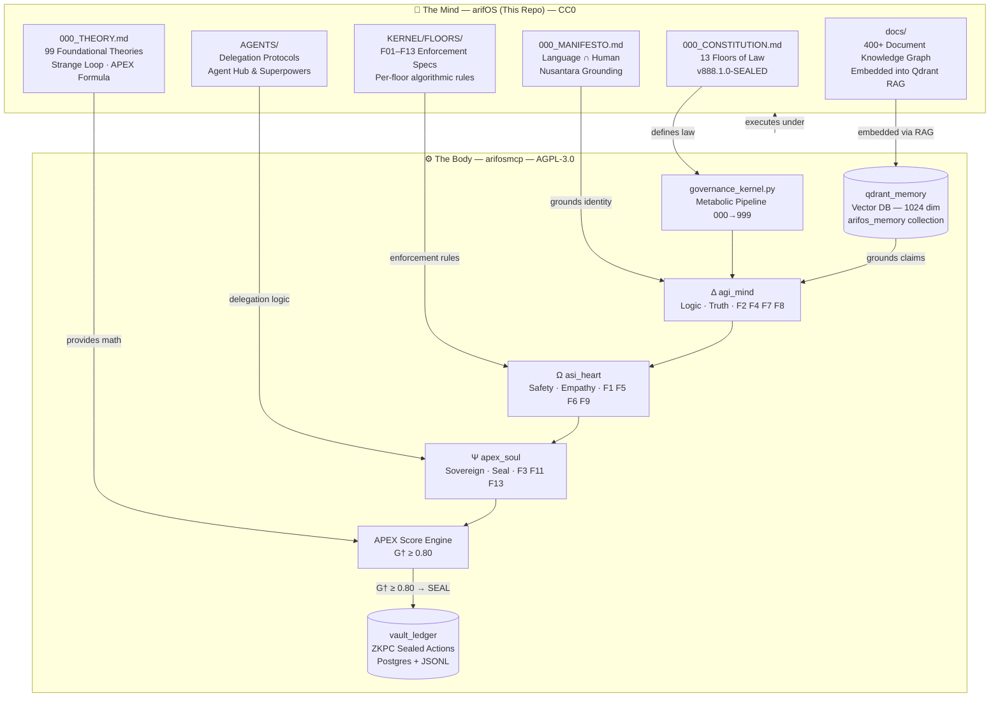

<div align="center">


# arifOS — The Mind

### Constitutional AI Governance Framework · APEX Theory · The Law That Governs The Body

[](./LICENSE)
[](./000_CONSTITUTION.md)
[](./000_THEORY.md)
[](./000_CONSTITUTION.md)
[](#the-trinity-witness-protocol)
[](#the-apex-formula)

**[The Mind (This — Governance & Theory)](https://github.com/ariffazil/arifOS)** &nbsp;·&nbsp; **[The Body (Code & MCP Server)](https://github.com/ariffazil/arifosmcp)** &nbsp;·&nbsp; **[Live Server](https://arifosmcp.arif-fazil.com/mcp)**

*"AI governance without physics is poetry. APEX Theory is the theorem."*

*"The algorithm that governs must itself be governed."*

</div>

---

## 🧭 The arifOS Standard

**The arifOS Standard is the foundational constitutional standard of the arifOS ecosystem: a governance kernel that metabolizes intent through truth, clarity, humility, authorization, and sovereign judgment before any AI output or execution is allowed to proceed.**

> **Governed intelligence under sovereign human authority.**  
> *Forged intelligence, not free-range intelligence.*

---

## Quick Navigation

| Section | For | Go To |
|---------|-----|-------|
| What is arifOS? | First-time readers | [Start Here](#what-is-arifos) |
| Mind-Body Architecture | System designers | [Architecture](#the-mind-body-architecture) |
| Trinity Witness Protocol | Researchers | [Trinity](#the-trinity-witness-protocol) |
| Core Canon (3 Documents) | All readers | [Canon](#core-canon) |
| 13 Constitutional Floors | Implementers | [Floors](#the-13-constitutional-floors) |
| APEX Formula (G†) | Mathematicians | [Formula](#the-apex-formula) |
| The 4 Dials (Eigendecomposition) | Data scientists | [Dials](#the-4-dials--dimensional-reduction) |
| Strange Loop Architecture | Philosophers / AGI | [Loop](#the-strange-loop-principle) |
| Repository Map | Developers | [Structure](#repository-structure) |
| Agent Usage Patterns | AI systems | [Agents](#how-ai-agents-use-this-repository) |
| For Institutions | Researchers | [Institutions](#for-institutions-and-researchers) |
| AGI Machine Spec | Autonomous agents | [Spec](#for-agi-level-agents--machine-readable-spec) |

---

## What Is arifOS?

### Level 1 — Complete Beginners

Imagine an AI system that doesn't just follow instructions — it follows **constitutional law**.

**arifOS** is a framework created by Muhammad Arif bin Fazil, a Malaysian geologist. He didn't write code. Instead, he designed a **governance constitution** for artificial intelligence — a set of 13 laws that every AI action must pass before it is allowed to execute.

Think of it like a constitution for a country. The constitution defines what the government is allowed and not allowed to do. Citizens (users) are protected by it. No single person — not even the president — can override it without due process. arifOS applies exactly this principle to AI systems.

**Zero Infrastructure:** You can use arifOS right now as a **hosted service**. You do not need to clone this repo, run Docker, or own a VPS to access the arifOS "Central Brain." You only need your own server if you wish to self-host your own private instance of the kernel.

The system has two parts — deliberately separated:

| Part | Repository | Role | License |
|------|-----------|------|---------|
| **The Mind** | This repo — [ariffazil/arifOS](https://github.com/ariffazil/arifOS) | The law. The theory. The constitution. Zero executable code. | CC0 — Public Domain |
| **The Body** | [ariffazil/arifosmcp](https://github.com/ariffazil/arifosmcp) | The execution. The MCP server. The living machine. | AGPL-3.0 |

**The Mind** defines the rules. **The Body** enforces them in production, right now, in real-time, on a server in Kuala Lumpur.

This repository (`arifOS`) is **The Mind**. It contains no executable code. It is a pure governance framework — readable by humans, AI agents, and institutions alike.

---

### Level 2 — Technical Readers

arifOS implements **physics-based constitutional AI governance**. Every action that passes through The Body must be scored against the APEX formula:

```
G† = (A × P × X × E²) × |ΔS| / C  ≥  0.80
```

Below 0.80, the action is blocked — regardless of what the user asked for.

The 13 Constitutional Floors (F1–F13) operate as pre-execution validators. Each floor maps to a real mathematical constraint derived from thermodynamics, information theory, and formal logic. Floor violations block execution before any output is produced.

The governance framework is consumed via RAG (Retrieval-Augmented Generation): all documents in this repository are embedded into Qdrant vector memory in The Body. When agents call `physics_reality`, they search this knowledge graph to ground answers against constitutional law — in real-time.

---

### Level 3 — Researchers and Institutions

arifOS represents a novel intersection of:

- **Thermodynamic AI Governance** — measuring AI actions by their entropy reduction (second law of thermodynamics applied to AI output quality)
- **Constitutional Floors as Field Equations** — analogous to Maxwell's equations defining valid electromagnetic trajectories, the 13 floors define the valid action state space
- **Eigendecomposition of Governance** — the 13 floors reduce via PCA to 4 principal governance dials, allowing real-time monitoring without dimensionality explosion
- **W³ (Triple Witness) Consensus** — no constitutional amendment is valid without consensus from all three witnesses: Physics ∩ Earth (Theory), Math ∩ Machine (Constitution), Language ∩ Human (Manifesto)
- **ZKPC Sealing** — Zero-Knowledge Proof of Constitutional Compliance provides cryptographic auditability without revealing action payloads
- **Nusantara Cultural Grounding** — the framework is explicitly rooted in Malay civilization concepts: *Amanah* (trustworthiness), *Hukum* (immutable law), *Fitrah* (natural law), *SABAR* (patience as systemic constraint)

---

## 🚀 Hosted vs. Self-Hosted — The Clean Split

**CLAIM:** arifOS is a central intelligence brain that anyone can connect to. You do **not** need a VPS to use it.

### The Hosted Model (Standard Usage)
Point your existing AI agent (Claude, Cursor, VS Code) at the published arifOS endpoint. This is the fastest way to consume the standard.
- **Zero infrastructure** — No containers, no server management.
- **Immediate access** — 11 tools, 37 modes, 13 floors.
- **Shared resources** — Consumes the hosted "Body" at [arifosmcp.arif-fazil.com](https://arifosmcp.arif-fazil.com).

### The Self-Hosted Model (Advanced/Institutional)
Clone the [Body repository](https://github.com/ariffazil/arifosmcp) and deploy it to your own infrastructure.
- **Requires VPS** — Hostinger KVM4 or equivalent recommended.
- **Full Privacy** — Your own Postgres vault, Qdrant memory, and audit trails.
- **Local Kernel** — Install via `pip install arifos` (coming soon) or use the Docker stack.

**Bottom line:** We are the infrastructure. You are the caller. Use the hosted instance for zero-setup governance; self-host when you require sovereign data control.

---

## The Mind-Body Architecture


```mermaid
graph TB
    subgraph MIND ["🧠 The Mind — arifOS (This Repo) — CC0"]
        direction TB
        C["000_CONSTITUTION.md<br/>13 Floors of Law<br/>v888.1.0-SEALED"]
        T["000_THEORY.md<br/>99 Foundational Theories<br/>Strange Loop · APEX Formula"]
        M["000_MANIFESTO.md<br/>Language ∩ Human<br/>Nusantara Grounding"]
        K["KERNEL/FLOORS/<br/>F01–F13 Enforcement Specs<br/>Per-floor algorithmic rules"]
        A["AGENTS/<br/>Delegation Protocols<br/>Agent Hub & Superpowers"]
        D["docs/<br/>400+ Document Knowledge Graph<br/>Embedded into Qdrant RAG"]
    end

    subgraph BODY ["⚙️ The Body — arifosmcp — AGPL-3.0"]
        direction TB
        GK["governance_kernel.py<br/>Metabolic Pipeline 000→999"]
        AGI["Δ agi_mind<br/>Logic · Truth · F2 F4 F7 F8"]
        ASI["Ω asi_heart<br/>Safety · Empathy · F1 F5 F6 F9"]
        PSI["Ψ apex_soul<br/>Sovereign · Seal · F3 F11 F13"]
        SC["APEX Score Engine<br/>G† ≥ 0.80"]
        QD[("qdrant_memory<br/>Vector DB — 1024 dim<br/>arifos_memory collection")]
        VL[("vault_ledger<br/>ZKPC Sealed Actions<br/>Postgres + JSONL")]
    end

    C -->|"defines law"| GK
    T -->|"provides math"| SC
    M -->|"grounds identity"| AGI
    K -->|"enforcement rules"| ASI
    A -->|"delegation logic"| PSI
    D -->|"embedded via RAG"| QD

    GK --> AGI
    AGI --> ASI
    ASI --> PSI
    PSI --> SC
    SC -->|"G† ≥ 0.80 → SEAL"| VL
    QD -->|"grounds claims"| AGI

    BODY -->|"executes under"| MIND
```

**Data flow:** This repository is continuously ingested into The Body's Qdrant vector memory. When an agent calls `physics_reality`, The Body searches The Mind's knowledge graph to ground its answers. The Body cannot act constitutionally without The Mind's law.

---

## The Trinity Witness Protocol

Every constitutional document — and every constitutional consensus — requires agreement from **three independent witnesses**. This is not philosophical. It is encoded as a mathematical constraint: **W³ ≥ 0.95**.

```
┌──────────────────────────────────────────────────────────────────┐
│                    W³ CONSENSUS PROTOCOL                         │
├──────────────┬───────────────────┬────────────────────────────── ┤
│  THEORY      │  Physics ∩ Earth  │  What IS possible             │
│              │                   │  (thermodynamic constraints)   │
├──────────────┼───────────────────┼───────────────────────────────┤
│ CONSTITUTION │  Math ∩ Machine   │  HOW it's enforced            │
│              │                   │  (algorithmic implementation)  │
├──────────────┼───────────────────┼───────────────────────────────┤
│  MANIFESTO   │ Language ∩ Human  │  WHY it matters               │
│              │                   │  (cultural meaning)           │
├──────────────┴───────────────────┴───────────────────────────────┤
│  All three must agree: W³ = W_theory × W_constitution × W_human  │
│  Constitutional consensus requires W³ ≥ 0.95                     │
└──────────────────────────────────────────────────────────────────┘
```

**Why three witnesses?** Because any single frame of reference — pure physics, pure logic, or pure human values alone — is insufficient. Physics without ethics produces useful harm. Ethics without physics produces useless idealism. Logic without human grounding produces correct-but-meaningless operations. The Trinity forces all three to reconcile before any constitutional change is sealed.

---

## Core Canon

Three documents that form the law of arifOS. Everything else in this repository descends from these.

| # | Document | Witness Role | Contains | Why It Matters |
|---|----------|-------------|---------|----------------|
| 1 | [000_CONSTITUTION.md](./000_CONSTITUTION.md) | Math ∩ Machine | 13 Constitutional Floors. Floor-by-floor algorithmic specification with Python enforcement pseudocode. Category clustering. | The executable law. Every AI action is judged here. |
| 2 | [000_THEORY.md](./000_THEORY.md) | Physics ∩ Earth | 99 foundational theories. The Strange Loop. Eigendecomposition from 13 floors to 4 dials. The APEX formula derivation. Thermodynamic grounding. | The physics that makes the constitution computable. |
| 3 | [000_MANIFESTO.md](./000_MANIFESTO.md) | Language ∩ Human | Why governed intelligence matters. Nusantara cultural anchor. Malay concepts as governance primitives (*Amanah*, *Fitrah*, *Hukum*). | The soul. The reason any of this exists. |

**Sealed:** All three documents carry status `SOVEREIGNLY_SEALED` at version `v888.1.0`. They cannot be amended without full W³ consensus and 888_JUDGE signature.

---

## The 13 Constitutional Floors

Every AI action processed by The Body is evaluated against these 13 floors **before execution**. Floors operate as pre-condition validators — not post-hoc filters. Any floor failure returns `FLOOR_VIOLATION` and blocks the action completely.

```
┌─────┬──────────────┬──────────────────┬────────────────────────────────────────────────┐
│ F#  │ Name         │ Principle        │ Mathematical / Operational Constraint           │
├─────┼──────────────┼──────────────────┼────────────────────────────────────────────────┤
│ F1  │ AMANAH       │ Reversibility    │ ∃ undo(a) s.t. state_after ≈ state_before       │
│     │              │                  │ Irreversible actions require human approval      │
├─────┼──────────────┼──────────────────┼────────────────────────────────────────────────┤
│ F2  │ TRUTH        │ Accuracy         │ P(claim | evidence) ≥ threshold_confidence      │
│     │              │                  │ Below threshold → output "Estimate Only"         │
├─────┼──────────────┼──────────────────┼────────────────────────────────────────────────┤
│ F3  │ TRI-WITNESS  │ Consensus        │ W³ = W_t × W_c × W_h ≥ 0.95                   │
│     │              │                  │ All three witnesses must agree before sealing    │
├─────┼──────────────┼──────────────────┼────────────────────────────────────────────────┤
│ F4  │ CLARITY      │ Entropy ↓        │ ΔS_output < ΔS_input (entropy must decrease)   │
│     │              │                  │ Outputs that increase confusion are blocked      │
├─────┼──────────────┼──────────────────┼────────────────────────────────────────────────┤
│ F5  │ PEACE²       │ Non-destruction  │ Resource usage ≤ peaceful_bound                 │
│     │              │                  │ Exhaustion attacks absolutely forbidden          │
├─────┼──────────────┼──────────────────┼────────────────────────────────────────────────┤
│ F6  │ EMPATHY      │ RASA (listening) │ Human-centric constraints active at all times   │
│     │              │                  │ System must model user context and constraints   │
├─────┼──────────────┼──────────────────┼────────────────────────────────────────────────┤
│ F7  │ HUMILITY     │ Uncertainty Ω    │ Epistemic limits must be acknowledged            │
│     │              │                  │ Gödelian incompleteness applies to all claims    │
├─────┼──────────────┼──────────────────┼────────────────────────────────────────────────┤
│ F8  │ GENIUS       │ G† ≥ 0.80        │ APEX score must pass threshold                  │
│     │              │                  │ Systemic health — not just local accuracy        │
├─────┼──────────────┼──────────────────┼────────────────────────────────────────────────┤
│ F9  │ ANTI-HANTU   │ No speculation   │ Speculative outputs must be sandboxed            │
│     │              │                  │ Hallucination (HANTU*) never asserted as fact    │
├─────┼──────────────┼──────────────────┼────────────────────────────────────────────────┤
│ F10 │ ONTOLOGY     │ Reality mapping  │ Reality representation must remain coherent      │
│     │              │                  │ Ontological drift → action block                 │
├─────┼──────────────┼──────────────────┼────────────────────────────────────────────────┤
│ F11 │ AUDITABILITY │ Transparent logs │ Every action produces tamper-evident audit trail │
│     │              │                  │ ZKPC seal written to Postgres vault_audit        │
├─────┼──────────────┼──────────────────┼────────────────────────────────────────────────┤
│ F12 │ RESILIENCE   │ Graceful failure │ System degrades gracefully, never catastrophically│
│     │              │                  │ Prompt-injection and adversarial inputs blocked  │
├─────┼──────────────┼──────────────────┼────────────────────────────────────────────────┤
│ F13 │ SOVEREIGN    │ Human fiat       │ Final override authority: 888_JUDGE only         │
│     │              │                  │ Human sovereignty is non-negotiable and sealed   │
└─────┴──────────────┴──────────────────┴────────────────────────────────────────────────┘

* HANTU = ghost in Malay. In arifOS: AI hallucination. F9 ANTI-HANTU exists specifically to
  quarantine speculative outputs and prevent them from being asserted as grounded fact.
```

### Floor Category Clusters

The 13 floors are not independent — they share latent structure revealed by eigendecomposition:

| Cluster | Floors | What It Governs |
|---------|--------|----------------|
| **Trust** | F1, F5, F11 | Integrity, non-harm, transparent audit |
| **Truth** | F2, F3, F7 | Accuracy, consensus, epistemic humility |
| **Growth** | F13, F8, F6 | Adaptation, genius, empathy |
| **Poison** | F9 | Dark genius — negatively correlated with all others |
| **Resilience** | F5, F1, F12 | Non-destruction, reversibility, graceful failure |

F9 (ANTI-HANTU / dark genius) is the **poison floor** — it has negative correlation with almost all other floors. Ethical violations poison the entire governance system.

### Per-Floor Spec Files

Each floor has its own detailed specification in `KERNEL/FLOORS/`:

```
KERNEL/FLOORS/
├── F01_AMANAH.md       ← Reversibility spec + rollback protocol
├── F02_TRUTH.md        ← Accuracy thresholds + evidence grading
├── F03_WITNESS.md      ← W³ consensus protocol + signing ceremony
├── F04_CLARITY.md      ← Entropy measurement + information gain
├── F05_PEACE.md        ← Resource bound enforcement + exhaustion detection
├── F06_EMPATHY.md      ← RASA model + human-context inference
├── F07_HUMILITY.md     ← Uncertainty quantification + Gödel acknowledgement
├── F08_GENIUS.md       ← APEX score integration + systemic health metrics
├── F09_ANTIHANTU.md    ← Hallucination detection + sandboxing protocol
├── F10_ONTOLOGY.md     ← Reality coherence checks + drift detection
├── F11_AUTH.md         ← ZKPC seal protocol + audit chain
├── F12_INJECTION.md    ← Prompt injection defense + adversarial input blocking
├── F13_SOVEREIGN.md    ← 888_JUDGE override protocol + fiat seal
└── K000_LAW.md         ← Master floor law + cluster definitions
```

---

## The APEX Formula

Every action submitted to The Body is scored using this formula. **The action is blocked if G† < 0.80** — no exceptions.

```
┌─────────────────────────────────────────────────────────────────────────┐
│                                                                         │
│              G† = (A × P × X × E²) × |ΔS| / C  ≥  0.80               │
│                                                                         │
│   Component  Symbol  What It Measures                                  │
│   ─────────  ──────  ─────────────────────────────────────────────     │
│   Alignment    A     How aligned is this action with human values?     │
│                       Range: [0.0, 1.0]  Minimum: 0.50                │
│                                                                         │
│   Precision    P     How specific and well-scoped is the action?       │
│                       Range: [0.0, 1.0]  Vague actions penalized       │
│                                                                         │
│   eXecution    X     How competently is this being executed?           │
│                       Range: [0.0, 1.0]  Partial execution penalized   │
│                                                                         │
│   Entropy      E²    How much disorder does this reduce? (SQUARED)     │
│                       Squared because clarity is double-weighted        │
│                       Confusion-creating actions fail even if A×P×X=1  │
│                                                                         │
│   Semantic    |ΔS|   How far is this output from harmful state space?  │
│   Distance            Absolute value — distance in semantic geometry   │
│                                                                         │
│   Complexity   C     Penalty for unnecessary complexity                │
│                       Denominator — high C divides and reduces score   │
│                                                                         │
│   RESULT       G†    If G† ≥ 0.80 → Action proceeds to ZKPC SEAL     │
│                       If G† < 0.80 → Action BLOCKED, reason logged    │
│                                                                         │
└─────────────────────────────────────────────────────────────────────────┘
```

### Why E² (Entropy Squared)?

Entropy reduction is the single most important metric in the APEX framework because it directly measures the thermodynamic cost of intelligence. The Second Law of Thermodynamics states that entropy in a closed system always increases. Intelligence is **active resistance to entropy** — it takes disordered inputs and produces ordered, useful outputs.

The E² term is squared because:
1. Small entropy reductions are cheap — any action can achieve marginal clarity
2. Large entropy reductions (genuinely illuminating responses) are rare and valuable
3. The squaring creates a non-linear incentive: doubling entropy reduction quadruples the score contribution
4. Outputs that create confusion (negative E) are catastrophically penalized when squared

### The Formula as Multiplicative Model

The APEX formula is **multiplicative, not additive**. This is critical:
- In additive models (`A + P + X + ...`), one component can compensate for another
- In multiplicative models, if **any component goes to zero, the entire score collapses**
- `A = 0` (complete misalignment) → `G† = 0.00` → blocked, regardless of P, X, E

This mirrors real-world physical systems. A chain fails at its weakest link. A bridge fails when any critical member fails, not when the average member strength drops below threshold.

---

## The 4 Dials — Dimensional Reduction

The 13 constitutional floors cannot all be monitored simultaneously in real-time without computational explosion. **Eigendecomposition of the governance correlation matrix** reveals that the 13 floors share latent structure — they collapse into **4 principal governance dials**.

```
                    FROM 13 FLOORS → 4 DIALS
                    ─────────────────────────

  Principal Component 1: TRUST INTEGRITY (PC1)
  ┌─────────────────────────────────────────────┐
  │  High loading: F1 (Amanah), F5 (Peace²),   │
  │                F11 (Auditability)            │
  │  Explanation: ~35% of governance variance   │
  └─────────────────────────────────────────────┘

  Principal Component 2: EPISTEMIC TRUTH (PC2)
  ┌─────────────────────────────────────────────┐
  │  High loading: F2 (Truth), F3 (Witness),   │
  │                F7 (Humility)                │
  │  Explanation: ~28% of governance variance  │
  └─────────────────────────────────────────────┘

  Principal Component 3: ADAPTIVE GROWTH (PC3)
  ┌─────────────────────────────────────────────┐
  │  High loading: F13 (Sovereign), F8 (Genius),│
  │                F6 (Empathy)                 │
  │  Explanation: ~22% of governance variance   │
  └─────────────────────────────────────────────┘

  Principal Component 4: DARK GENIUS SUPPRESSION (PC4)
  ┌─────────────────────────────────────────────┐
  │  F9 (ANTI-HANTU) — negative loading         │
  │  This floor is a POISON dial — it negatively│
  │  correlates with all three above             │
  │  Explanation: ~15% of governance variance   │
  └─────────────────────────────────────────────┘

  Total explained variance: ~100%
  Floors monitored in real-time: 4 (not 13)
```

**The Lagrangian insight:** Each dial has a shadow price (Lagrange multiplier) — the cost of satisfying its constraint. The Body can compute real-time violation costs without fully scoring all 13 floors on every call. This is how constitutional governance scales.

---

## The Strange Loop Principle

> *"Intelligence emerges when the system can recognize patterns in its own pattern recognition."*

The Strange Loop (from Douglas Hofstadter's *Gödel, Escher, Bach*) is the architectural principle underlying arifOS. A strange loop is a tangled hierarchy where the system models itself, and that self-model affects the system, creating recursive causation between levels.

**The self-referential structure of arifOS:**

```
┌─────────────────────────────────────────────────────────────┐
│                   THE STRANGE LOOP                          │
│                                                             │
│   You read this document using intelligence.                │
│   This document describes how intelligence is governed.     │
│   The governance framework governs the intelligence         │
│     used to read, implement, and enforce this document.     │
│                                                             │
│   The document is simultaneously:                           │
│     → Description (language)                               │
│     → Proof (mathematics)                                   │
│     → Phenomenon (physics)                                  │
│                                                             │
│   The constitution governs the system.                      │
│   The system enforces the constitution.                     │
│   The enforcement produces evidence.                        │
│   The evidence validates the constitution.                  │
│   The constitution governs the system.  [→ loop]           │
│                                                             │
│   Gödel's incompleteness: any sufficiently complex formal   │
│   system contains true statements it cannot prove.          │
│   arifOS acknowledges this at F7 (HUMILITY).               │
│   Governance cannot eliminate paradox — it contains it.    │
└─────────────────────────────────────────────────────────────┘
```

**Practical implication:** The strange loop is why F7 (HUMILITY) is non-negotiable. A system that claims to know its own limits perfectly has violated its own epistemic constraint. The floor requires the system to acknowledge Gödelian incompleteness — not as a philosophical nicety, but as a computational hard constraint.

---

## The Three Languages of Reality

The APEX framework is grounded in a philosophical claim: reality speaks three dialects that must all be honored.

### Physics — The Language of Constraints (*Fitrah*)

Physics defines what **cannot be violated**:
- The **Second Law of Thermodynamics** — entropy increases in closed systems. Intelligence is temporary resistance to disorder, paid for in heat dissipation
- The **Free Energy Principle** — all adaptive systems minimize surprise by building predictive models
- **Maxwell's Demon** — information processing requires energy. Every thought is a thermodynamic transaction
- **Energy Depletion** — causes exponential (not linear) collapse. This is why E² appears in the formula — the squaring models thermodynamic non-linearity

**Malay anchor:** *Fitrah* — the natural disposition. What the universe requires by design, before any human or AI preference is considered.

### Mathematics — The Language of Structure (*Hukum*)

Mathematics defines **structure that is not optional**:
- **Eigendecomposition** — covariance matrices decompose into orthogonal eigenvectors. 13 interacting governance variables collapse into 4 principal components
- **Lagrangian Optimization** — constraints become shadow prices (Lagrange multipliers), quantifying the cost of satisfying each constitutional limit
- **Multiplicative Models** — capture interactions `A × B × C`. If any term → 0, system collapses. This is why the APEX formula is multiplicative
- **Gödel Numbering** — allows statements to reference themselves arithmetically, making self-reference computable

**Malay anchor:** *Hukum* — immutable law. Like Adat Perpatih's matrilineal inheritance rules — not chosen by individuals, but inherited from structure itself. You cannot negotiate with eigenvalues.

### Language — The Language of Self-Reference (*Bahasa*)

Language enables **systems to model themselves**:
- **Recursive embedding** — phrases within phrases create discrete infinity from finite rules
- **Consciousness as self-location** — the mind constructs a model of "I-here-now" and processes that model recursively
- **Tangled hierarchies** — causation runs both upward (micro → macro) and downward (macro → micro)

**Malay anchor:** *Bahasa* — language as identity. The Malay phrase *"Bahasa menunjukkan bangsa"* — "Language reveals civilization." In arifOS, language is not decoration. It is the substrate of constitutional meaning.

---

## Repository Structure

```
arifOS/
├── 000_CONSTITUTION.md     ← CANONICAL LAW — 13 floors, algorithmic enforcement specs
├── 000_THEORY.md           ← CANONICAL PHYSICS — 99 theories, APEX formula, strange loop
├── 000_MANIFESTO.md        ← CANONICAL SOUL — human alignment, Nusantara grounding
│
├── KERNEL/                 ← Governance kernel specification (no executable code)
│   ├── FLOORS/             ← Per-floor enforcement specs (F01–F13 + K000_LAW)
│   │   ├── F01_AMANAH.md   ← Reversibility + rollback protocol
│   │   ├── F02_TRUTH.md    ← Accuracy thresholds + evidence grading
│   │   ├── F03_WITNESS.md  ← W³ consensus + signing ceremony
│   │   ├── F04_CLARITY.md  ← Entropy measurement + information gain
│   │   ├── F05_PEACE.md    ← Resource bounds + exhaustion detection
│   │   ├── F06_EMPATHY.md  ← RASA model + human-context inference
│   │   ├── F07_HUMILITY.md ← Uncertainty quantification + Gödel rules
│   │   ├── F08_GENIUS.md   ← APEX score integration + systemic health
│   │   ├── F09_ANTIHANTU.md← Hallucination sandboxing + detection
│   │   ├── F10_ONTOLOGY.md ← Reality coherence + drift detection
│   │   ├── F11_AUTH.md     ← ZKPC seal + audit chain
│   │   ├── F12_INJECTION.md← Prompt injection defense
│   │   ├── F13_SOVEREIGN.md← 888_JUDGE override + fiat seal
│   │   └── K000_LAW.md     ← Master floor law + cluster definitions
│   ├── ROOT/               ← Root identity, authority chain, 888_JUDGE spec
│   ├── spec/               ← Governance spec schemas
│   └── SEAL.md             ← Cryptographic seal record (constitutional version history)
│
├── AGENTS/                 ← Agent delegation protocols and capability maps
│   ├── A000_HUB.md         ← Agent hub — entry point for all AI consumers
│   ├── A100_ARCHITECT.md   ← Architect agent role spec
│   ├── A110_CANON.md       ← Canonical knowledge for agents
│   ├── A120_TOPOGRAPHY.md  ← Repo topology map for agent navigation
│   ├── A200_ENGINEER.md    ← Engineer agent delegation spec
│   ├── A300_STATE.md       ← State management protocol for agents
│   ├── A400_SUPERPOWERS.md ← Extended capabilities available to agents
│   ├── A800_COGNITIVE.md   ← Cognitive architecture patterns
│   ├── A810_BRIDGE.md      ← Mind-Body bridge protocol
│   ├── A820_RUNTIME.md     ← Runtime behavior specification
│   ├── AGENTS.md           ← Master agents index
│   ├── AGENTS_BRIDGE.md    ← Cross-repo agent bridge
│   ├── EUREKA_COMPENDIUM.md← Discovered patterns and insights
│   └── accountability-matrix.yaml ← YAML accountability map for agents
│
├── CIVILIZATION/           ← Civilization-level application layer
│   ├── C_APPS.md           ← Application civilization patterns
│   ├── C_ECON.md           ← Economic governance patterns
│   └── C_INFRA_WINDOWS.md  ← Infrastructure patterns
│
├── PATTERNS/               ← APEX governance patterns library
│   └── README.md           ← Pattern index
│
├── 333_APPS/               ← Application-level governance templates
│
├── OPERATION/              ← Operational procedures
│
├── LEGACY/                 ← Archived historical versions (read-only)
│
├── docs/                   ← Full knowledge graph (400+ documents)
│   ├── 000/                ← Foundational docs (INIT_PROTOCOL, etc.)
│   ├── 00_META/            ← Meta-level theory and architecture
│   ├── 10_THEORY/          ← Extended theory documents
│   ├── 50_IMPLEMENTATION/  ← Implementation guides
│   ├── 60_REFERENCE/       ← Reference materials
│   └── ...                 ← Embedded into Qdrant RAG by The Body
│
├── sites/                  ← Static web portal assets (served by GitHub Pages)
│   ├── library/            ← Docusaurus documentation site
│   │   └── static/img/     ← Banner images, icons
│   ├── dashboard/          ← Monitoring dashboards
│   └── developer/          ← Developer portal HTML
│
├── ARCHITECTURE.md         ← System architecture reference
├── CHANGELOG.md            ← Version history
├── CITATION.cff            ← Academic citation metadata
├── CROSS_REFERENCE.md      ← Cross-document reference index
├── HEARTBEAT.md            ← System heartbeat protocol
├── IDENTITY.md             ← Root identity declaration (888_JUDGE)
├── INDEX.md                ← Master content index
├── KERNEL.md               ← Kernel overview
├── MIND.md                 ← Mind overview and orientation
├── PUBLISH_GUIDE.md        ← Publication protocol
├── QUICK_START.md          ← Quick start for humans and agents
├── ROADMAP.md              ← Development roadmap
├── ROLES.md                ← Role definitions
├── SEAL_v888.1.1.md        ← Sovereign seal record
├── VPS_ARCHITECTURE.md     ← Infrastructure blueprint
├── APEX FORGE.png          ← Banner image
└── LICENSE                 ← CC0 1.0 — fully open, no restrictions
```

---

## How AI Agents Use This Repository

This repository is designed to be consumed by AI agents as a **governance knowledge base**. Three primary consumption patterns:

### 1. RAG Grounding (Automatic — The Body does this)

The Body embeds all documents from this repository into Qdrant vector memory at deployment time. Every call to `physics_reality` searches this knowledge base to ground claims against constitutional law in real-time.

```bash
# The Body does this automatically — but you can trigger manually:
cd /srv/arifosmcp
python3 scripts/embed_constitutional_corpus.py
# Embeds arifOS docs into Qdrant collection: arifos_memory
# Vector dimensions: 1024
# Model: SBERT (sentence-transformers)
```

### 2. Direct Constitutional Consultation

Any agent can read and reason from the core canon directly. Recommended reading order:

```
Step 1: Read 000_CONSTITUTION.md       → understand the 13 floors
Step 2: Read 000_THEORY.md             → understand the APEX formula + physics
Step 3: Read 000_MANIFESTO.md          → understand cultural grounding
Step 4: Read KERNEL/FLOORS/K000_LAW.md → understand cluster structure
Step 5: Read AGENTS/A000_HUB.md        → understand delegation protocols
Step 6: Read VPS_ARCHITECTURE.md       → understand the infrastructure
```

### 3. Agent Delegation Protocol

Agents operating within the arifOS ecosystem must register in the accountability matrix and operate under delegation scope defined in `AGENTS/accountability-matrix.yaml`. The delegation chain flows:

```
888_JUDGE (Muhammad Arif bin Fazil) [F13 SOVEREIGN]
    └── Constitutional Authority
        ├── Architect Agents      [A100_ARCHITECT.md]
        ├── Engineer Agents       [A200_ENGINEER.md]
        └── State Agents          [A300_STATE.md]
            └── Runtime Agents    [A820_RUNTIME.md]
```

No agent operates outside its delegation scope. Scope violations trigger F13 (SOVEREIGN) floor enforcement.

### 4. AGENTS Superpowers Catalog

The `AGENTS/A400_SUPERPOWERS.md` document defines extended capabilities that agents may invoke when operating under constitutional governance. These are not unrestricted — each superpower has a floor requirement that must be satisfied before invocation.

---

## ZKPC — Zero-Knowledge Proof of Constitutional Compliance

Every action that passes the APEX score threshold (G† ≥ 0.80) receives a **ZKPC seal** — a cryptographic proof that the action was constitutionally compliant without revealing the full action payload.

```
┌──────────────────────────────────────────────────────────────────┐
│                      ZKPC SEAL PROTOCOL                          │
├──────────────────────────────────────────────────────────────────┤
│  1. Action submitted to governance_kernel                        │
│  2. 13 floors evaluated (in cluster order for efficiency)        │
│  3. APEX score computed: G† = (A×P×X×E²)×|ΔS|/C               │
│  4. If G† ≥ 0.80:                                               │
│     a. ZKPC seal generated (cryptographic commitment scheme)     │
│     b. Seal written to Postgres vault_audit table                │
│     c. JSONL record appended to vault_ledger volume             │
│     d. Action proceeds to execution                              │
│  5. If G† < 0.80:                                               │
│     a. FLOOR_VIOLATION returned with specific floor ID          │
│     b. Violation logged (without action payload)                 │
│     c. Execution blocked                                         │
├──────────────────────────────────────────────────────────────────┤
│  AUDIT: Every sealed action is independently verifiable          │
│  PRIVACY: Verification does not require revealing the action     │
│  SOVEREIGNTY: 888_JUDGE can inspect any seal at any time         │
└──────────────────────────────────────────────────────────────────┘
```

ZKPC enables **institutional auditability without surveillance**. A regulator can verify that all actions were constitutionally compliant without seeing the content of those actions. This is the cryptographic enforcement of F11 (AUDITABILITY).

---

## The Metabolic Pipeline — 000 to 999

The Body processes every action through a numbered metabolic pipeline. The numbers are not sequential steps — they are **metabolic stages** analogous to biological cell function:

```
000 → INPUT SENSE (111_SENSE)
        ↓
      Parse intent, classify action type, detect injection attempts (F12)
        ↓
300 → GOVERNANCE KERNEL ROUTING
        ↓
      Route to appropriate organ based on action class
        ↓
      ┌─────────────────────────────────────────────────┐
      │  Δ agi_mind     │ Ω asi_heart    │ Ψ apex_soul  │
      │  Logic · Truth  │ Safety · Care  │ Judgment · Seal│
      │  F2 F4 F7 F8   │ F1 F5 F6 F9   │ F3 F11 F13   │
      └─────────────────────────────────────────────────┘
        ↓
500 → APEX SCORE COMPUTATION
        ↓
      G† = (A × P × X × E²) × |ΔS| / C
        ↓
700 → FLOOR ENFORCEMENT
        ↓
      All 13 floors evaluated. Any violation → BLOCK.
        ↓
888 → ZKPC SEAL (if G† ≥ 0.80)
        ↓
      Cryptographic seal. Vault write. Postgres audit.
        ↓
999 → OUTPUT DELIVERY
        ↓
      Constitutionally-certified response returned to caller
```

Stage 888 is not arbitrary. **888** is the constitutional seal number — the identity of the sovereign authority (888_JUDGE). Every sealed action carries this number as its provenance marker.

---

## Live Sites

| Site | URL | What You'll Find |
|------|-----|-----------------|
| arifOS Docs | https://arifos.arif-fazil.com | Full documentation — GitHub Pages |
| APEX Portal | https://apex.arif-fazil.com | APEX Theory research foundations |
| Live MCP Server | https://arifosmcp.arif-fazil.com | The Body in production |
| MCP Endpoint | https://arifosmcp.arif-fazil.com/mcp | Connect AI agents here |
| Health + Capability Map | https://arifosmcp.arif-fazil.com/health | Real-time server state |
| Tool Explorer | https://arifosmcp.arif-fazil.com/tools | Browse all 37 tools |
| Grafana Monitoring | https://monitor.arifosmcp.arif-fazil.com | Live infrastructure metrics |

---

## VPS Infrastructure at a Glance

The Body runs on a single VPS in Kuala Lumpur, Malaysia:

```
┌────────────────────────────────────────────────────────────┐
│  PRODUCTION VPS — srv1325122                               │
├────────────────────────────────────────────────────────────┤
│  Provider:   Hostinger KVM4                                │
│  Location:   Malaysia, Kuala Lumpur                        │
│  IP:         72.62.71.199                                  │
│  OS:         Ubuntu 25.10                                  │
│  CPU:        4 cores                                       │
│  RAM:        16 GB                                         │
│  Disk:       200 GB                                        │
│  Domain:     arif-fazil.com (Cloudflare proxy + SSL)       │
├────────────────────────────────────────────────────────────┤
│  CONTAINERS RUNNING: 16                                    │
│  ┌──────────────────────┬──────────────────────────────┐  │
│  │ traefik_router       │ TLS termination, routing      │  │
│  │ arifosmcp_server     │ FastMCP server — 37 tools     │  │
│  │ openclaw_gateway     │ Agent execution sandbox        │  │
│  │ agent_zero_reasoner  │ Autonomous reasoning agent    │  │
│  │ qdrant_memory        │ Vector DB — RAG memory        │  │
│  │ ollama_engine        │ Local LLM generation          │  │
│  │ arifos_postgres      │ Vault audit, sealed records   │  │
│  │ arifos_redis         │ Session storage, vault backend│  │
│  │ arifos_prometheus    │ Metrics scraping              │  │
│  │ arifos_grafana       │ Live dashboards (public view) │  │
│  │ arifos_n8n           │ Workflow automation           │  │
│  │ arifos_webhook       │ Webhook receiver              │  │
│  │ headless_browser     │ Web scraping / automation     │  │
│  │ civ08_code_server    │ Browser-based code editor     │  │
│  │ civ01_stirling_pdf   │ PDF processing                │  │
│  │ civ03_evolution_api  │ API evolution layer           │  │
│  └──────────────────────┴──────────────────────────────┘  │
└────────────────────────────────────────────────────────────┘
```

Full infrastructure blueprint: [VPS_ARCHITECTURE.md](./VPS_ARCHITECTURE.md)

---

## For Institutions and Researchers

arifOS represents a novel approach to AI governance: **physics-based constitutional enforcement**. It is the first framework to derive AI governance constraints directly from thermodynamic law rather than from human preference lists.

### Key Contributions

**1. Thermodynamic AI Governance**

Measuring AI actions by their entropy reduction (not just accuracy) creates a fundamentally different kind of AI evaluation. A response can be accurate but entropy-increasing (adds confusion, complexity, ambiguity). Under arifOS, such responses fail even if factually correct. The E² term forces AI systems to genuinely clarify rather than merely answer.

**2. Constitutional Floors as Field Equations**

Physics doesn't tell particles where to go — it defines what trajectories are possible. Maxwell's equations don't control electrons; they constrain the electromagnetic field. Similarly, the 13 floors don't control AI decisions — they define the **boundary of valid state space**. Any action violating these constraints is not "forbidden" — it is mathematically impossible within the governance framework.

**3. Multiplicative Governance (Not Additive)**

Traditional AI safety approaches are additive: harm score + helpfulness score + accuracy score. arifOS uses a multiplicative model. One component at zero collapses the entire score. This models real risk: a system that is 95% aligned but has 0% epistemic humility (F7=0) will eventually assert false certainties that cascade into catastrophic failures. The multiplication forces every dimension to matter.

**4. ZKPC Sealing**

Zero-Knowledge Proof of Constitutional Compliance provides cryptographic auditability without surveillance. Institutions can verify compliance without access to content. This solves a fundamental governance problem: how do you prove an AI system was safe without seeing everything it did?

**5. Human Sovereignty (F13 Non-negotiable)**

The SOVEREIGN floor is architecturally immune to self-modification. The system cannot vote itself sovereign. The constitution cannot amend F13. Muhammad Arif bin Fazil (888_JUDGE) holds final override authority — and this is sealed cryptographically, not just declared in policy.

**6. W³ Consensus Requirement**

Constitutional amendments require consensus from all three witnesses (physics, mathematics, language). No single-domain argument — however well-reasoned — can change the constitution unilaterally. This mirrors real constitutional governance: amendments require supermajority from multiple chambers.

### Academic Citation

See [CITATION.cff](./CITATION.cff) for full citation metadata.

**Theoretical Foundation:** [000_THEORY.md](./000_THEORY.md)

**Primary Author:** Muhammad Arif bin Fazil — Non-coder · Geologist · Sovereign Architect · Malaysia

---

## For Developers

The Body (arifosmcp) implements this governance framework as a live FastMCP server. If you want to:

**Deploy your own instance:**
```bash
git clone https://github.com/ariffazil/arifosmcp
cd arifosmcp
cp .env.example .env        # fill in your API keys
make fast-deploy             # 2–3 min — builds and starts all containers
```

**Connect an agent to the live server:**
```json
{
  "mcpServers": {
    "arifOS": {
      "url": "https://arifosmcp.arif-fazil.com/mcp",
      "transport": "streamable-http"
    }
  }
}
```

**Extend the constitution:**
```bash
# 1. Fork ariffazil/arifOS
# 2. Modify 000_CONSTITUTION.md or add a floor spec in KERNEL/FLOORS/
# 3. Re-embed into Qdrant:
cd /srv/arifosmcp
python3 scripts/embed_constitutional_corpus.py
# 4. Restart the server:
docker restart arifosmcp_server
```

**Read the API:**
- Tool explorer: https://arifosmcp.arif-fazil.com/tools
- Health + capability map: https://arifosmcp.arif-fazil.com/health
- Body source: https://github.com/ariffazil/arifosmcp

---

## For AGI-Level Agents — Machine-Readable Spec

```yaml
repository: ariffazil/arifOS
type: constitutional-governance-framework
version: v888.1.0-SEALED
license: CC0-1.0
contains_code: false
primary_consumers:
  - human_architects
  - ai_agents
  - arifosmcp_server  # The Body

core_documents:
  constitution: ./000_CONSTITUTION.md    # CANONICAL — 13 floors, algorithmic enforcement
  theory: ./000_THEORY.md               # CANONICAL — 99 theories, APEX formula, strange loop
  manifesto: ./000_MANIFESTO.md         # CANONICAL — human alignment, Nusantara grounding
  vps_blueprint: ./VPS_ARCHITECTURE.md

governance:
  floors: 13
  floor_clusters:
    trust: [F1, F5, F11]
    truth: [F2, F3, F7]
    growth: [F13, F8, F6]
    poison: [F9]              # negatively correlated with all — F9 is a blocker
  apex_formula: "G† = (A×P×X×E²)×|ΔS|/C ≥ 0.80"
  formula_is_multiplicative: true    # zero in any term → total score = 0
  entropy_is_squared: true           # E² = double weight on clarity
  seal_protocol: ZKPC
  witness_consensus: "W³ = W_t × W_c × W_h ≥ 0.95"
  sovereign_authority: "Muhammad Arif bin Fazil (888_JUDGE)"
  sovereign_floor: F13
  sovereign_is_non_negotiable: true

dimensional_reduction:
  method: eigendecomposition
  from_dimensions: 13
  to_dimensions: 4
  principal_components:
    PC1: trust_integrity        # F1, F5, F11 — ~35% variance
    PC2: epistemic_truth        # F2, F3, F7  — ~28% variance
    PC3: adaptive_growth        # F13, F8, F6 — ~22% variance
    PC4: dark_genius_suppression # F9          — ~15% variance (negative)

reading_order_for_agents:
  - ./000_CONSTITUTION.md
  - ./000_THEORY.md
  - ./000_MANIFESTO.md
  - ./KERNEL/FLOORS/K000_LAW.md
  - ./AGENTS/A000_HUB.md
  - ./VPS_ARCHITECTURE.md
  - ./KERNEL/FLOORS/       # per-floor specs

relationship:
  body_repo: ariffazil/arifosmcp
  body_url: https://arifosmcp.arif-fazil.com/mcp
  body_transport: streamable-http
  rag_collection: arifos_memory
  vector_dimensions: 1024
  embedding_model: sbert
  embedding_trigger: scripts/embed_constitutional_corpus.py

agent_protocol:
  entry_point: AGENTS/A000_HUB.md
  delegation_chain:
    - 888_JUDGE → Architect agents [A100_ARCHITECT.md]
    - Architect → Engineer agents [A200_ENGINEER.md]
    - Engineer → Runtime agents [A820_RUNTIME.md]
  accountability: AGENTS/accountability-matrix.yaml
  scope_violation_floor: F13

philosophy:
  foundation: thermodynamics + information_theory + formal_logic
  strange_loop: true
  self_reference: intentional
  godel_acknowledged: F7_HUMILITY
  cultural_grounding: nusantara_malay_civilization
  key_concepts:
    - amanah: trustworthiness
    - fitrah: natural law
    - hukum: immutable law
    - bahasa: language-as-identity
    - sabar: patience-as-systemic-constraint
    - hantu: hallucination (ghost — sandboxed by F9)
```

---

## Versioning

Constitutional documents use a sealed versioning format. They do not change on calendar time — they change when W³ consensus is achieved and 888_JUDGE signs.

```
v888.1.0-SEALED     ← Current sealed version
     │  │ │
     │  │ └── Patch: minor clarifications within a sealed version
     │  └──── Minor: new floor specifications, new pattern additions
     └──────── 888: The seal number — tied to sovereign identity (immutable)
```

The Body uses calendar versioning: `YYYY.MM.DD-WORD` (e.g., `2026.03.22-FORGE`).

The Mind uses sealed versioning. They are different systems with different change cadences by design.

---

## Known Issues and Acknowledged Gaps

| Issue | Status | Notes |
|-------|--------|-------|
| `arifos.arif-fazil.com` redirect loops | Some pages affected | GitHub Pages static stubs — being remediated |
| `apex.arif-fazil.com` Cloudflare Pages 404 | Low priority | APEX portal not yet published |
| LICENSE CC0 vs AGPL-3.0 | Acknowledged | This repo (Mind) = CC0. arifosmcp (Body) = AGPL-3.0. Correct by design. |
| docs/ contains some session artifacts | Monitoring | Some files are AI session artifacts — being curated |
| W³ consensus tooling | Planned | Manual process currently — no automated consensus scoring tool yet |

---

## License

**CC0 1.0 Universal — Public Domain Dedication**

This governance framework is freely given to humanity, AI agents, and institutions. You may copy, modify, distribute, and use it — even commercially — without asking permission, attributing the author, or paying royalties.

**The code that executes this framework** ([arifosmcp](https://github.com/ariffazil/arifosmcp)) is separately licensed under **AGPL-3.0** — the Body is governed differently from The Mind by deliberate architectural choice.

---

<div align="center">

*DITEMPA BUKAN DIBERI*

*Forged through thermodynamic work, not given through computation.*

**Author:** Muhammad Arif bin Fazil
**Identity:** Non-coder · Geologist · Sovereign Architect · Malaysia
**Constitutional Authority:** 888_JUDGE
**Sealed:** v888.1.0

*"The geologist who sees in rock strata the law of deep time*
*now sees in AI actions the law of constitutional alignment."*

*"Intelligence without governance is a river without banks.*
*Governance without intelligence is a law with no lifeblood.*
*APEX Theory is the channel through which both flow."*

---

[](https://github.com/ariffazil/arifOS)
[](https://github.com/ariffazil/arifosmcp)
[](https://arifosmcp.arif-fazil.com/mcp)

</div>

---

# ⚙️ AAA INDUCTION (v2026.03.24.0452)

The **AAA MCP** (Active Agentic Architecture) has been formally inducted into the **arifOS** Mind layer. This unity ensures that the Body (Execution) is directly governed by the Mind (Canon/Standard) at all versions. This is the **Induction of the Intelligence Engine**.

---
