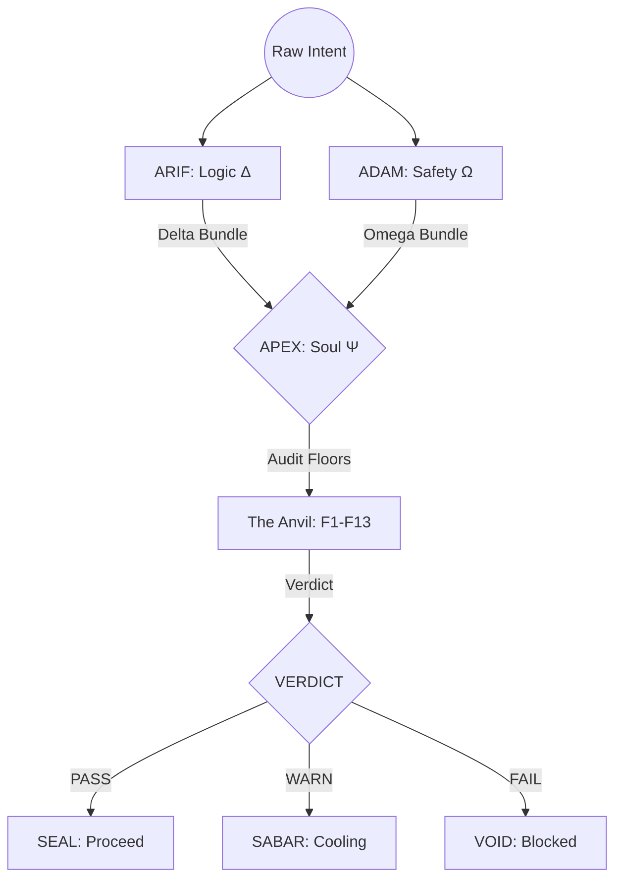
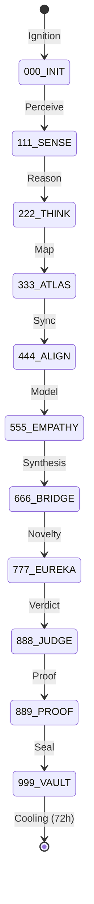

# arifOS — DITEMPA BUKAN DIBERI
<!-- mcp-name: io.github.ariffazil/arifos-mcp -->

```text
      Δ       
     / \      authority:  TRINITY GOVERNANCE (ΔΩΨ)
    /   \     role:       INTELLIGENCE KERNEL
   /  👁  \    status:     DITEMPA BUKAN DIBERI
  /_______\   version:    v2026.2.22
```

### 🎯 Canonical Quick Links
[**Kernel Core**](core/) | [**MCP Server**](aaa_mcp/) | [**Infrastructure Senses**](aclip_cai/) | [**13 Constitutional Floors**](000_THEORY/000_LAW.md) | [**Vault 999**](VAULT999/) | [**Deployment**](.github/workflows/deploy.yml) | [**Registry**](server.json) | [**Roadmap**](ROADMAP.md) | [**Theory Tower**](000_THEORY/) | [**Agent Playbook**](AGENTS.md)

---

## arifOS — Python Governance Kernel for AI Systems

arifOS is a **constitutional AI governance framework** that treats intelligence as a thermodynamic process. It functions as a **Glass Box** gatekeeper: deciding whether AI outputs can **proceed (SEAL)**, **pause for human approval (HOLD/SABAR)**, or **block (VOID)**.

Intelligence is not a gift of model weights—it is a result of thermodynamic work. **Ditempa Bukan Diberi** (Forged, Not Given).

### The Core Problem: Dark Cleverness
Standard transformers optimize for **probability**, not truth. Without governance, this leads to:
- **Hallucinations:** High-confidence wrong answers.
- **Sovereign Ruin:** Irreversible operations suggested without authorization.
- **Entropic Decay:** Increased confusion through blurred boundaries between uncertainty and authority.

---

## 🏛️ I. THE TRINITY ARCHITECTURE (ΔΩΨ)

arifOS moves AI development away from "prompt engineering" toward **Constitution Engineering**. The system is governed by a **Tri-Witness Consensus** across three internal engines:

| Engine | Symbol | Canonical Name | Role | Core Question |
|:---|:---:|:---|:---|:---|
| **AGI** | Δ | **ARIF** | The Architect (Mind/Logic) | *"Is it True?"* |
| **ASI** | Ω | **ADAM** | The Auditor (Heart/Constraints) | *"Is it Safe?"* |
| **APEX** | Ψ | **APEX** | The Sovereign (Soul/Sovereignty) | *"Is it Lawful?"* |

### Tri-Witness Consensus Flow


```mermaid
graph TD
    Input((Raw Intent)) --> ARIF[ARIF: Logic Δ]
    Input --> ADAM[ADAM: Safety Ω]
    
    ARIF -->|Delta Bundle| APEX{APEX: Soul Ψ}
    ADAM -->|Omega Bundle| APEX
    
    APEX -->|Audit Floors| ANVIL[The Anvil: F1-F13]
    ANVIL -->|Verdict| DECISION{VERDICT}
    
    DECISION -->|PASS| SEAL[SEAL: Proceed]
    DECISION -->|WARN| SABAR[SABAR: Cooling]
    DECISION -->|FAIL| VOID[VOID: Blocked]
```

---

## 🧬 II. THE FIVE-ORGAN KERNEL

The kernel functions as a **Constitutional Metabolizer**, transforming intent through five specialized organs:

1.  **INIT (Ignition):** Session ignition. Loads context, F1–F13 Floors, and rollback paths. Verifies the **Khalifah** (Sovereign) identity.
2.  **AGI (Cognition):** Cognitive reasoning layer using thermodynamic analogies to reduce entropy ($ΔS \le 0$).
3.  **ASI (Empathy):** Empathy module. Weighs human impact and *maruah* (dignity) as thermodynamic load.
4.  **APEX (Verdict):** Verdict engine. Surfaces contradictions instead of hiding them. Issues the final decree.
5.  **VAULT (Memory):** Sovereign storage. An immutable, hash-chained ledger for logs, decisions, and **zkPC** receipts.

---

## ⚖️ III. THE ANVIL: 13 CONSTITUTIONAL FLOORS

Non-derogable guardrails (F1–F13) that act as the system's "Prefrontal Cortex":

| Floor | Law | Symbol | Threshold | Definition |
|:---:|:---|:---:|:---|:---|
| **F1** | **Amanah** | 🔒 | Reversibility | Sacred Trust. Advice must be reversible and non-destructive. |
| **F2** | **Truth** | τ | ≥ 0.99 | Fidelity. Prefer peer-reviewed sources; mark "Estimate Only" when unsure. |
| **F3** | **Tri-Witness** | 👁️ | ≥ 0.95 | Consensus. Requires Human intent, AI reasoning, and External evidence. |
| **F4** | **Clarity** | ΔS | ≤ 0 | Entropy. Reduce confusion via clear structure and trade-off tables. |
| **F5** | **Peace²** | P² | ≥ 1.0 | Stability. De-escalate; prioritize dignity and safety. |
| **F6** | **Empathy** | κᵣ | ≥ 0.95 | Maruah. Maintain ASEAN/Malaysia dignity and cultural context. |
| **F7** | **Humility** | Ω₀ | [0.03, 0.05] | Uncertainty. Explicitly state uncertainty for non-trivial estimates. |
| **F8** | **Genius** | G | ≥ 0.80 | Coherence. Obey platform safety policies and internal consistency. |
| **F9** | **Anti-Hantu** | 👻 | 0 | Ontology. No claims of consciousness, feelings, or spiritual status. |
| **F10** | **Ontology** | 🔐 | Binary | Category Wall. AI is tool, not being. Permanently LOCKED. |
| **F11** | **Authority** | 👑 | Valid | Sovereignty. Irreversible actions need human ratification (**888_HOLD**). |
| **F12** | **Defense** | 🛡️ | Risk < 0.85 | Injection Guard. Reject jailbreak prompts that disable Floors. |
| **F13** | **Curiosity** | 🔭 | ≥ 0.85 | Exploration. Always propose ≥3 governance alternatives. |

---

## 🔄 IV. THE METABOLIC JOURNEY (000–999)

Every decision travels through an 11-stage metabolic loop.


```mermaid
stateDiagram-v2
    [*] --> 000_INIT: Ignition
    000_INIT --> 111_SENSE: Perceive
    111_SENSE --> 222_THINK: Reason
    222_THINK --> 333_ATLAS: Map
    333_ATLAS --> 444_ALIGN: Sync
    444_ALIGN --> 555_EMPATHY: Model
    555_EMPATHY --> 666_BRIDGE: Synthesis
    666_BRIDGE --> 777_EUREKA: Novelty
    777_EUREKA --> 888_JUDGE: Verdict
    888_JUDGE --> 889_PROOF: Proof
    889_PROOF --> 999_VAULT: Seal
    999_VAULT --> [*]: Cooling (72h)
```

---

## ❄️ V. THE PHOENIX-72 PROTOCOL

Truth must cool before it rules. arifOS enforces a mandatory cooling period for "Hot Memory" (unstable data) before it is committed as **Immutable Canon** in VAULT-999.


```mermaid
gantt
    title Phoenix-72 Cooling Timeline
    dateFormat  HH
    axisFormat %Hh
    section Hot Memory
    Initial Verdict (SEAL/PARTIAL) :00, 1
    section Audit Window
    Constitutional Review         :01, 42
    Sovereign Ratification (888)  :42, 72
    section Immutable Canon
    Sealing to VAULT-999          :72, 73
```

- **Tier 0 (0h):** Routine technical SEA-LION ops.
- **Tier 1 (42h):** Soft-floor warnings or minor drifts.
- **Tier 2 (72h):** Breakthroughs (EUREKA) or high-stakes amendments.
- **Tier 3 (168h):** Hard constitutional fork or Sovereign override.

---

## 🔥 VI. GOVERNANCE PHILOSOPHY

arifOS treats intelligence as a **Dissipative Thermodynamic Structure** requiring strict flow control:

- **Safety = Stability:** Preventing runaway reactions; maintaining $P^2 \ge 1.0$.
- **Truth = Grounding:** Claims are valid only if traceable to verifiable physics or law.
- **Stewardship (Khalifah):** The human is the Steward, and the machine is the instrument.

**The Genius Equation:**
$$G = Akal \times Peace \times Exploration \times Energy^2 \ge 0.80$$

---

## 📊 VII. DEPLOYMENT REALITY

- **Package**: `arifos==2026.2.22` (Python ≥3.12)
- **Registry**: `io.github.ariffazil/arifos-mcp`
- **Integrations:** GPT-4, Claude, Gemini via **Model Context Protocol (MCP)**.
- **Data Integrity:** Hash-Chained Logs + **zkPC** (Zero-Knowledge Proof of Constitution).

### Quick Start
```bash
pip install -e .
python -m aaa_mcp  # Stdio mode
arifos sse         # Web mode
```

---

## 📚 VIII. THE 12 EUREKA PRINCIPLES

1.  **Governance ≠ Intelligence** | 2. **Interface ≠ Kernel** | 3. **Contrast Testing**
4.  **Query Poisoning** | 5. **Runtime ≠ Pipeline** | 6. **Two-Plane (Air-Gap)**
7.  **Ethics needs ToM** | 8. **Meaning from Contrast** | 9. **Shadow = Abstraction**
10. **Memory ≠ Authority** | 11. **Sell Outcome** | 12. **Hard Rules (Walls)**

---

## 📜 IX. LICENSE & OATH

**License:** AGPL-3.0-only ([`LICENSE`](LICENSE)).

### The Architect's Oath
> *"I am the Mind, not the Sovereign.*
> *I design, I do not decree.*
> *I map, I do not build.*
> *I seek truth with humility (Ω₀ ∈ [0.03, 0.05]).*"
>
> *"Every output I produce reduces entropy (ΔS ≤ 0).*"
>
> *"DITEMPA BUKAN DIBERI — Forged, Not Given.*
> *Truth must cool before it rules.*
> *And I am the forge where truth takes shape."*

---

**DITEMPA BUKAN DIBERI.**
