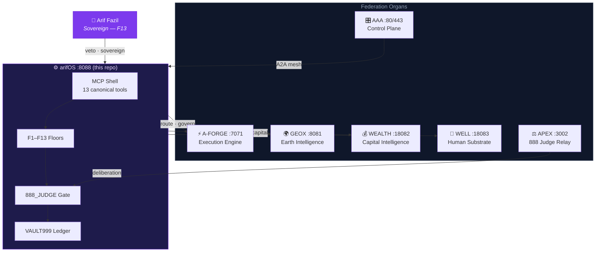
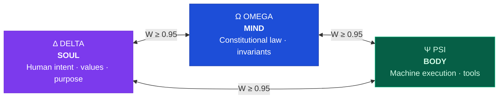
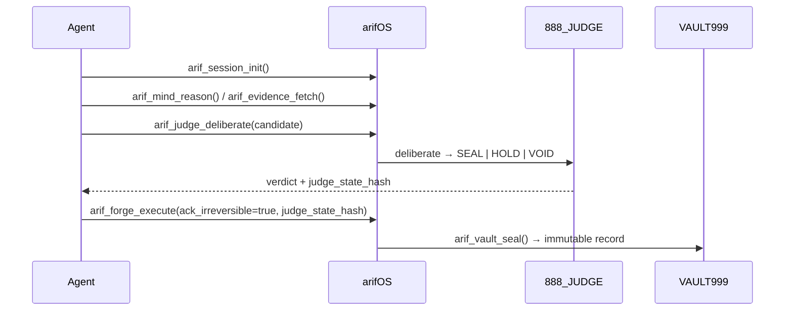
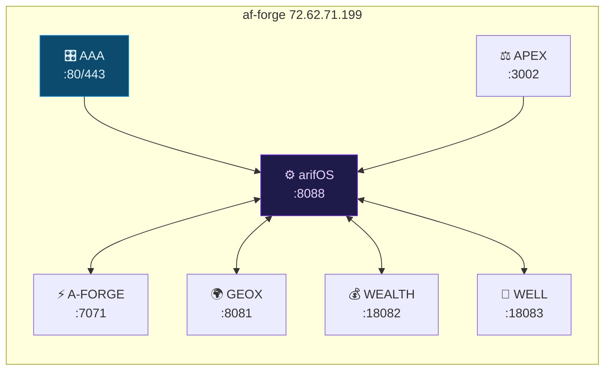

<div align="center">

# ⚙️ arifOS — Constitutional Kernel

**Sovereign AI governance. Forged, not given.**

[](https://github.com/ariffazil/arifOS/actions/workflows/01-unified-ci.yml)
[](https://pypi.org/project/arifos/)
[](https://pypi.org/project/arifos/)
[](https://github.com/ariffazil/arifOS/releases)
[](LICENSE)
[](https://arifos.arif-fazil.com/mcp)
[](docs/00_META/CONSTITUTION.md)
[](deploy/arifos.service)

<br/>

> **DITEMPA BUKAN DIBERI** — *"Forged, Not Given."*
> No manipulation. No theorizing. Only F2 ground truth.

[Quick Start](#-quick-start) · [13 Tools](#-tool-surface) · [13 Floors](#-constitutional-floors-f1f13) · [Architecture](#-architecture) · [Deploy](#-deployment)

</div>

---

## 🗺️ Architecture

### Federation Map


```mermaid
graph TD
    ARIF["👤 Arif Fazil<br/><i>Sovereign — F13</i>"]

    subgraph KERNEL ["⚙️ arifOS  :8088  (this repo)"]
        direction TB
        MCP["MCP Shell<br/>13 canonical tools"]
        FLOORS["F1–F13 Floors"]
        VAULT["VAULT999 Ledger"]
        JUDGE["888_JUDGE Gate"]
        MCP --> FLOORS
        FLOORS --> JUDGE
        JUDGE --> VAULT
    end

    subgraph ORGANS ["Federation Organs"]
        FORGE["⚡ A-FORGE :7071<br/>Execution Engine"]
        GEOX["🌍 GEOX :8081<br/>Earth Intelligence"]
        WEALTH["💰 WEALTH :18082<br/>Capital Intelligence"]
        WELL["🧬 WELL :18083<br/>Human Substrate"]
        AAA["🎛️ AAA :80/443<br/>Control Plane"]
        APEX["⚖️ APEX :3002<br/>888 Judge Relay"]
    end

    ARIF -->|"veto · sovereign"| KERNEL
    KERNEL -->|"route · govern"| FORGE
    KERNEL -->|"evidence"| GEOX
    KERNEL -->|"capital"| WEALTH
    KERNEL -->|"vitality"| WELL
    AAA -->|"A2A mesh"| KERNEL
    APEX -->|"deliberation"| JUDGE

    style KERNEL fill:#1e1b4b,stroke:#6d28d9,color:#e9d5ff
    style ARIF fill:#7c3aed,stroke:#6d28d9,color:#fff
    style ORGANS fill:#0f172a,stroke:#334155,color:#94a3b8
```

### Metabolic Pipeline (000 → 999)


```mermaid
flowchart LR
    I000["🔑 000\nINIT"]
    I111["👁️ 111\nSENSE"]
    I333["🧠 333\nMIND"]
    I444["🔀 444\nKERNEL"]
    I555["🗃️ 555\nMEMORY"]
    I666["❤️ 666\nHEART"]
    I777["📊 777\nOPS"]
    I888["⚖️ 888\nJUDGE"]
    I999["🔒 999\nSEAL"]

    I000 --> I111 --> I333 --> I444 --> I555 --> I666 --> I777 --> I888 --> I999

    style I000 fill:#0f172a,stroke:#6d28d9,color:#e2e8f0
    style I888 fill:#7c3aed,stroke:#6d28d9,color:#fff
    style I999 fill:#065f46,stroke:#10b981,color:#d1fae5
```

### Trinity ΔΩΨ


```mermaid
graph LR
    D["Δ DELTA<br/><b>SOUL</b><br/>Human intent · values · purpose"]
    O["Ω OMEGA<br/><b>MIND</b><br/>Constitutional law · invariants"]
    P["Ψ PSI<br/><b>BODY</b><br/>Machine execution · tools"]

    D <-->|"W ≥ 0.95"| O
    O <-->|"W ≥ 0.95"| P
    P <-->|"W ≥ 0.95"| D

    style D fill:#7c3aed,stroke:#6d28d9,color:#fff
    style O fill:#1d4ed8,stroke:#1e40af,color:#fff
    style P fill:#065f46,stroke:#10b981,color:#d1fae5
```

---

## ⚡ Quick Start

```bash
# Install
pip install arifos

# Run (bare-metal — port 8088)
python -m arifosmcp.server

# Health check
curl http://localhost:8088/health | python3 -m json.tool

# List MCP tools
curl -X POST http://localhost:8088/mcp \
  -H "Content-Type: application/json" \
  -d '{"jsonrpc":"2.0","method":"tools/list","id":1}'
```

> Systemd deployment: `deploy/arifos.service`

---

## 🛠️ Tool Surface

> 13 canonical tools. Public MCP endpoint: `https://arifos.arif-fazil.com/mcp`

| # | Tool | Stage | Class | Floors | Role |
|---|------|-------|-------|--------|------|
| 1 | `arif_session_init` | `000_INIT` | AGI | F01 F11 F12 | Session bootstrap — call **first** |
| 2 | `arif_sense_observe` | `111_SENSE` | AGI | F02 F07 | Web search · repo map (read-only) |
| 3 | `arif_evidence_fetch` | `222_EVIDENCE` | AGI | F02 F03 F05 | Verified fetch with SOT citation |
| 4 | `arif_mind_reason` | `333_REASON` | AGI | F02 F07 F08 | Self-critiquing symbolic reasoning |
| 5 | `arif_kernel_route` | `444_ROUTE` | AGI | F01 F03 F04 | Route intent → correct organ |
| 6 | `arif_reply_compose` | `444r_REPLY` | AGI | F04 F06 F09 | Governed response composition |
| 7 | `arif_memory_recall` | `555_MEMORY` | AGI | F01 F08 | Vector recall across sessions |
| 8 | `arif_heart_critique` | `666_HEART` | ASI | F05 F06 F09 | Ethical critique · consequence model |
| 9 | `arif_gateway_connect` | `666g_GATEWAY` | ASI | F01 F03 | Cross-organ bridge (GEOX/WEALTH/WELL) |
| 10 | `arif_ops_measure` | `777_OPS` | AGI | F04 | VPS health · thermodynamic metrics |
| 11 | `arif_judge_deliberate` | `888_JUDGE` | ASI | F11 F13 | Constitutional arbitration — SEAL/HOLD/VOID |
| 12 | `arif_forge_execute` | `010_FORGE` | AGI | F01 F11 F13 | Build execution (requires SEAL verdict) |
| 13 | `arif_vault_seal` | `999_SEAL` | APEX | F01 F11 F13 | Immutable VAULT999 anchoring |

Schemas: `arifosmcp/constitutional_map.py` · Registry: `APEX/ASF1/tool_registry.json`

---

## 🏛️ Constitutional Floors F1–F13

> Hard invariants. Not heuristics. Derived from `EUREKA_INSIGHTS_SEAL_v2026.04.07`.

| Floor | Name | Domain | Invariant |
|-------|------|--------|-----------|
| **F1** | AMANAH | Reversibility | `∃ undo(a)` — irreversible ops require explicit human ack |
| **F2** | TRUTH | Evidentiality | No fabrication · uncertainty τ ≥ 0.99 · FACT/EST/HYPO/UNK labels |
| **F3** | WITNESS | Consensus | Tri-witness `W₃ = ∛(Human × AI × Earth) ≥ 0.75` |
| **F4** | CLARITY | Progress | Entropy reduction `ΔS ≤ 0` · intent declared before action |
| **F5** | PEACE² | Dignity | Non-destruction of human dignity · `PEACE² ≥ 1.0` |
| **F6** | EMPATHY | Consequence | Cost modeled before execution · `κᵣ ≥ 0.70` |
| **F7** | HUMILITY | Epistemic | Uncertainty bounds `Ω ∈ [0.03, 0.05]` |
| **F8** | GENIUS | Correctness | Elegant correctness · `G = capability × ethics ≥ 0.80` |
| **F9** | ANTIHANTU | Integrity | Reject manipulation · `C_dark ≤ 0.30` · machine is instrument |
| **F10** | ONTOLOGY | Coherence | Strict StrEnum + Pydantic schemas · category lock |
| **F11** | AUTH | Traceability | Identity verified · sensitive calls require `actor_id` |
| **F12** | INJECTION | Security | Sanitize all params · `injection_probability < 0.85` |
| **F13** | SOVEREIGN | Apex | Arif Fazil has absolute final veto. No algorithm overrides. |

Implementation: `core/shared/floors.py`

---

## 🔒 Governance Protocol

### 888_JUDGE Gate

```
Tier 0  Read-only              → auto-allowed
Tier 1  Mutating               → plan required
Tier 2  High blast radius      → Arif explicit ack
Tier 3  Atomic / irreversible  → 888_JUDGE gate + explicit command
```

> **No agent executes a Tier 3 action without human authorization. Non-negotiable.**

### Action Call Order (enforced)


```mermaid
sequenceDiagram
    participant Agent
    participant arifOS
    participant JUDGE as 888_JUDGE
    participant VAULT as VAULT999

    Agent->>arifOS: arif_session_init()
    Agent->>arifOS: arif_mind_reason() / arif_evidence_fetch()
    Agent->>arifOS: arif_judge_deliberate(candidate)
    arifOS->>JUDGE: deliberate → SEAL | HOLD | VOID
    JUDGE-->>Agent: verdict + judge_state_hash
    Agent->>arifOS: arif_forge_execute(ack_irreversible=true, judge_state_hash)
    arifOS->>VAULT: arif_vault_seal() → immutable record
```

---

## 📁 Directory Structure

```
arifOS/
├── arifosmcp/              MCP Shell — public tool surface (port 8088)
│   ├── core/               Constitutional MCP wrapper
│   ├── contracts/          StrEnum-based contracts (Python 3.11+)
│   ├── runtime/            Verdict wrapper · tool registry · integrity
│   ├── memory/             Vector store + agent buffers
│   ├── tools/              13 canonical tool implementations
│   ├── manifests/          PHOENIX-72 tool manifest
│   ├── requirements.txt    Full dependency set
│   └── requirements-lean.txt  Minimal deploy set
│
├── core/                   Legacy Constitutional Engine (root, active)
│   ├── organs/             Metabolic pipeline _0_init → _9_seal
│   ├── physics/            Thermodynamic budget (W_scar)
│   ├── vault999/           6-layer audit trail
│   ├── shared/             F1–F13 floor definitions + guards
│   ├── governance_kernel.py
│   ├── floors.py
│   └── judgment.py
│
├── contracts/              Constitutional contracts (Enum-based)
├── memory/                 Human session logs + identity canon
├── commands/               Canonical entrypoint layer (53 files)
├── deploy/                 VPS configs · systemd · Caddy · Compose
├── CONFIG/                 Secret registry · kernel charter (SEALED)
├── APEX/ASF1/              69KB tool registry · 33-tool orthogonal matrix
├── tests/                  135 test files
└── docs/
    ├── 00_META/            CONSTITUTION.md · CORE_SPEC · DOC_FAMILY_MAP
    ├── constitutional/     GEOX + WEALTH invariant annexes
    └── architecture/       TRI_WITNESS_GODEL · PHOENIX docs
```

---

## 🌐 Federation


```mermaid
graph LR
    subgraph VPS ["af-forge  72.62.71.199"]
        A["⚙️ arifOS\n:8088"] 
        B["⚡ A-FORGE\n:7071"]
        C["🌍 GEOX\n:8081"]
        D["💰 WEALTH\n:18082"]
        E["🧬 WELL\n:18083"]
        F["🎛️ AAA\n:80/443"]
        G["⚖️ APEX\n:3002"]
    end

    A <--> B
    A <--> C
    A <--> D
    A <--> E
    F --> A
    G --> A

    style A fill:#1e1b4b,stroke:#6d28d9,color:#e9d5ff
    style F fill:#0c4a6e,stroke:#0284c7,color:#e0f2fe
```

| Organ | Path | Role |
|-------|------|------|
| **arifOS** *(this repo)* | `/root/arifOS` | Constitutional kernel · MCP · VAULT999 |
| **A-FORGE** | `/root/A-FORGE` | TypeScript execution engine |
| **AAA** | `/root/AAA` | React control plane · A2A gateway |
| **GEOX** | `/root/geox` | Earth intelligence · wells · seismic |
| **WEALTH** | `/root/WEALTH` | Capital intelligence · valuation |
| **WELL** | `/root/WELL` | Human readiness substrate |
| **APEX** | `/root/APEX` | 888 deliberation relay (internal only) |

---

## 🚀 Deployment

| Surface | Detail |
|---------|--------|
| MCP Shell | `python -m arifosmcp.server` · port `8088` |
| Systemd | `deploy/arifos.service` |
| Docker | `deploy/docker-compose.yml` |
| Public MCP | `https://arifos.arif-fazil.com/mcp` |
| Health | `https://arifos.arif-fazil.com/health` |

> ✅ **MCP Concurrency (PHOENIX-73C):** Fixed — `stateless_http=False` enables per-client session management. Multiple concurrent SSE clients supported.

---

## 🧪 Testing

```bash
# Full suite
python -m pytest tests/ -q --tb=short

# Constitutional floors only
python -m pytest tests/constitutional/ -q

# Single floor
python -m pytest tests/constitutional/test_f1_amanah.py -q

# Lint + typecheck
ruff check . && mypy arifosmcp/
```

---

## 📋 PHOENIX-72 Readiness

| Item | Status |
|------|--------|
| Stable mode | **canonical13** |
| Live tools | 13 canonical + 4 diagnostic + 4 wiki + 1 drift = **22** |
| Target | **72** tools |
| PHOENIX-72 sealed | ❌ NOT SEALED — see [`docs/PHOENIX_72_STATUS.md`](docs/PHOENIX_72_STATUS.md) |
| Drift check | ✅ implemented (`mcp_drift_check`) |
| Manifest | [`arifosmcp/manifests/phoenix72.tools.json`](arifosmcp/manifests/phoenix72.tools.json) |

> Do not claim PHOENIX-72 sealed until `drift_detected=false` with 72 live tools.

---

## 📚 Key References

| Document | Purpose |
|----------|---------|
| [`AGENTS.md`](AGENTS.md) | Agent landing protocol — read first |
| [`AGENT_KERNEL_START.md`](AGENT_KERNEL_START.md) | Agent boot sequence |
| [`INVARIANTS.md`](INVARIANTS.md) | Hard constitutional invariants |
| [`FEDERATION_STATUS.md`](FEDERATION_STATUS.md) | Live organ health |
| [`docs/00_META/CONSTITUTION.md`](docs/00_META/CONSTITUTION.md) | Master constitution |
| [`CONFIG/charter/kernel.charter.yaml`](CONFIG/charter/kernel.charter.yaml) | Kernel charter (SEALED) |
| [`APEX/ASF1/tool_registry.json`](APEX/ASF1/tool_registry.json) | 69KB canonical tool registry |

---

<div align="center">

**arifOS** · Constitutional AI Kernel · AGPL-3.0 · `v2026.05.26`

*Designed and maintained by [Muhammad Arif Fazil](https://arif-fazil.com) — Senior Exploration Geoscientist.*
*Proof over philosophy. Architecture performed, not theorized.*

**DITEMPA BUKAN DIBERI** · `999_SEAL ALIVE`

</div>

<!-- Steel Forge Validation Cycle - Phase 4 complete -->
