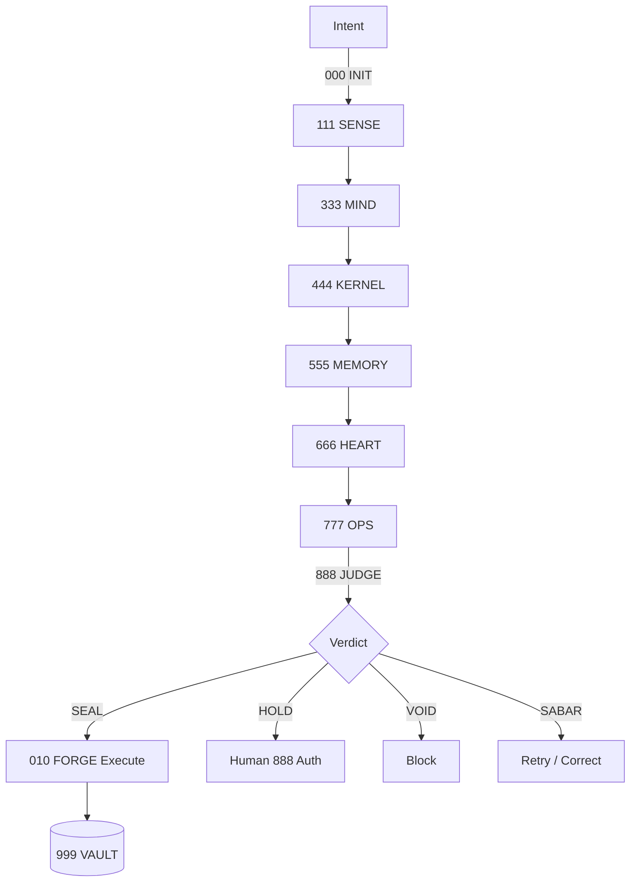

<!-- SOT-MANIFEST
owner: Arif
last_verified: 2026-05-23
valid_from: 2026-05-23
valid_until: 2026-06-23
confidence: high
scope: /root/arifOS
epistemic_status: CLAIM
-->

# arifOS — Constitutional AI Governance Kernel

> **In one sentence:** arifOS is the law layer — every AI tool call in this federation passes through it for validation, judgment, and audit before it can execute.

**Status:** SOVEREIGN KERNEL (Current L3 State) | **Organ:** MIND (Ω) | **Authority:** F13 SOVEREIGN (Arif)
**PyPI:** `pip install arifos` | **GHCR:** `ghcr.io/ariffazil/arifos`
**Target State:** [AAA² Agent-Agnostic Substrate](../AAA/docs/architecture/AAA2_Kernel_UAA_PSP_v2026.05.md)

---

## 🏛️ What this repo IS
- The **Constitutional Law Kernel (F1-F13)**.
- The **13-Tool Canonical Manifest** that gates agent workflows (000-999 Pipeline).
- The **VAULT999** immutable audit trail definition.
- The **Nine-Signal** intelligence hub.

## 🚫 What this repo is NOT
- **Execution Orchestration:** That is [A-FORGE](../A-FORGE).
- **Cockpit / Identity Plane:** That is [AAA](../AAA).
- **Earth / Finance Engines:** Those are [GEOX](../geox) and [WEALTH](../WEALTH).

*Important:* We evaluate before execution. We do not execute arbitrary workloads directly.

---

## ⚙️ The 13 Constitutional Tools (000-999 Pipeline)

```mermaid
graph TD
    A[Intent] -->|000 INIT| B[111 SENSE]
    B --> C[333 MIND]
    C --> D[444 KERNEL]
    D --> E[555 MEMORY]
    E --> F[666 HEART]
    F --> G[777 OPS]
    G -->|888 JUDGE| H{Verdict}
    H -->|SEAL| I[010 FORGE Execute]
    H -->|HOLD| J[Human 888 Auth]
    H -->|VOID| K[Block]
    H -->|SABAR| L[Retry / Correct]
    I --> M[(999 VAULT)]
```

| Stage | Tool | What It Does |
|-------|------|-------------|
| 000 | `arif_session_init` | Bind actor identity |
| 111 | `arif_sense_observe` | Ground reality (VPS, Atlas, dS) |
| 222 | `arif_evidence_fetch` | Pull external data with F-WEB receipts |
| 333 | `arif_mind_reason` | Structured reasoning |
| 444 | `arif_kernel_route` | Route intent to AGI/ASI lane |
| 555 | `arif_memory_recall` | Semantic memory via Qdrant |
| 666 | `arif_heart_critique` | Adversarial critique pass |
| 777 | `arif_ops_measure` | Landauer cost calculation |
| 888 | `arif_judge_deliberate` | Issue SEAL / HOLD / VOID / SABAR |
| 999 | `arif_vault_seal` | Anchor to immutable ledger |
| 010 | `arif_forge_execute` | Execute — only after 888_JUDGE SEAL |

---

## 🗺️ Canonical Repo Contents

- **`arifosmcp/`**: Primary MCP runtime and 13-tool registry (`server.py`, `smithery.yaml`).
- **`core/`**: Deepest constitutional enforcement (`floors.py`, `judgment.py`).
- **`docs/`**: Official architectural canons and MCP SOT.
- **`VAULT999/`**: Append-only hash-chained ledger.

### 📌 The AAA² Target State
*arifOS is currently navigating the "Agent Trap" via hardcoded internal directories (`.claude/`, `.gemini/`). The target state architecture removes this in favor of a Universal Agent Adapter (UAA) and Portable State Protocol (PSP).*

---
*Last Verified: 2026-05-23 | 999 SEAL ALIVE*
