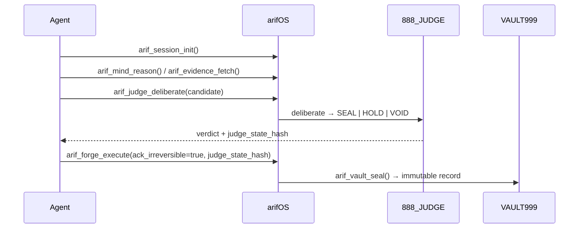
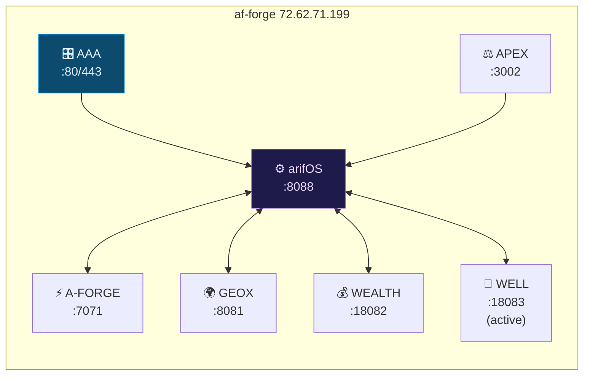

<div align="center">

# ⚙️ arifOS — Constitutional Kernel

**Sovereign AI governance. Forged, not given.**

> 📋 **First time here?** Read [`CLARITY.md`](../CLARITY.md) — explains the two-repo structure (`arifos` vs `arifOS`).

[](https://github.com/ariffazil/arifOS/actions/workflows/01-unified-ci.yml)
[](https://pypi.org/project/arifos/)
[](https://pypi.org/project/arifos/)
[](https://github.com/ariffazil/arifOS/releases)
[](LICENSE)
[](https://arifos.arif-fazil.com/mcp)
[](docs/00_META/CONSTITUTION.md)
[](deploy/arifos.service)

<br/>

> **DITEMPA BUKAN DIBERI** — *"Forged, Not Given."*
> No manipulation. No theorizing. Only F2 ground truth.

[Quick Start](#-quick-start) · [13 Tools](#-tool-surface) · [13 Floors](#-constitutional-floors-f1f13) · [Architecture](#-architecture) · [Deploy](#-deployment)

<!-- SOT-MANIFEST
owner: Arif
last_verified: 2026-06-04
valid_from: 2026-06-04
valid_until: 2026-09-04
confidence: high
scope: /root/arifOS
-->

</div>

---

## 🗺️ Architecture

#
---

## ⚡ Quick Start

```bash
# Install
pip install arifos

# Run (bare-metal — port 8088)
python -m arifosmcp.server

# Health check
curl http://localhost:8088/health | python3 -m json.tool

# List MCP tools
curl -X POST http://localhost:8088/mcp \
  -H "Content-Type: application/json" \
  -d '{"jsonrpc":"2.0","method":"tools/list","id":1}'
```

### Stdio mode (local agents — Claude Code, OpenCode, Continue CLI)

arifOS is dual-transport. Use `AAA_MCP_TRANSPORT=stdio` or the runtime minimal entry for agents that launch the server as a subprocess:

```bash
# Native FastMCP auto-detect (stdio when stdin is not a TTY)
AAA_MCP_TRANSPORT=stdio python -m arifosmcp.server

# Runtime minimal — organ-proxy capable, localhost federation discovery
AAA_MCP_TRANSPORT=stdio uv run python -c \
  "from arifosmcp.runtime.__main__ import main; main()"
```

Agent config example:

```json
{
  "mcpServers": {
    "arifos": {
      "command": "python3",
      "args": ["-m", "arifosmcp.server"],
      "cwd": "/root/arifOS",
      "env": { "AAA_MCP_TRANSPORT": "stdio" }
    }
  }
}
```

In stdio mode the bridge discovers WEALTH/WELL/GEOX over `http://127.0.0.1:18082`, `:18083`, `:8081` — no Cloudflare, no TLS, works offline. Override via `WEALTH_BRIDGE_HOST`, `WELL_BRIDGE_HOST`, `GEOX_BRIDGE_HOST` env vars.

> Systemd deployment: `deploy/arifos.service`

---

## 🛠️ Tool Surface

> 13 canonical public tools (84 wired internally — see `/health` for live count). Public MCP endpoint: `https://arifos.arif-fazil.com/mcp`

| # | Tool | Stage | Class | Floors | Role |
|---|------|-------|-------|--------|------|
| 1 | `arif_session_init` | `000_INIT` | AGI | F01 F11 F12 | Session bootstrap — call **first** |
| 2 | `arif_sense_observe` | `111_SENSE` | AGI | F02 F07 | Web search · repo map (read-only) |
| 3 | `arif_evidence_fetch` | `222_EVIDENCE` | AGI | F02 F03 F05 | Verified fetch with SOT citation |
| 4 | `arif_mind_reason` | `333_REASON` | AGI | F02 F07 F08 | Self-critiquing symbolic reasoning |
| 5 | `arif_kernel_route` | `444_ROUTE` | AGI | F01 F03 F04 | Route intent → correct organ |
| 6 | `arif_reply_compose` | `444r_REPLY` | AGI | F04 F06 F09 | Governed response composition |
| 7 | `arif_memory_recall` | `555_MEMORY` | AGI | F01 F08 | Vector recall across sessions |
| 8 | `arif_heart_critique` | `666_HEART` | ASI | F05 F06 F09 | Ethical critique · consequence model |
| 9 | `arif_gateway_connect` | `666g_GATEWAY` | ASI | F01 F03 | Cross-organ bridge (GEOX/WEALTH/WELL) |
| 10 | `arif_ops_measure` | `777_OPS` | AGI | F04 | VPS health · thermodynamic metrics |
| 11 | `arif_judge_deliberate` | `888_JUDGE` | ASI | F11 F13 | Constitutional arbitration — SEAL/HOLD/VOID |
| 12 | `arif_forge_execute` | `010_FORGE` | AGI | F01 F11 F13 | Build execution (requires SEAL verdict) |
| 13 | `arif_vault_seal` | `999_SEAL` | APEX | F01 F11 F13 | Immutable VAULT999 anchoring |

Schemas: `arifosmcp/constitutional_map.py` · Registry: `APEX/ASF1/tool_registry.json`

---

## 🏛️ Constitutional Laws F1–F13

> Hard invariants. Not heuristics. Derived from `EUREKA_INSIGHTS_SEAL_v2026.04.07`.
>
> **DB (s000.constitutional_floors) is the source of truth for floor classification.** Canon docs mirror the DB, not the other way around. F13 RATIFIED 2026-06-03 — Muhammad Arif bin Fazil.

| Floor | Name | Type | Domain | Invariant |
|-------|------|------|--------|-----------|
| **F1**  | AMANAH       | **HARD**    | Reversibility | `∃ undo(a)` — irreversible ops require explicit human ack |
| **F2**  | TRUTH        | **HARD**    | Evidentiality | No fabrication · uncertainty τ ≥ 0.99 · FACT/EST/HYPO/UNK labels |
| **F3**  | WITNESS      | *DERIVED*   | Consensus | Byzantine `W₄ = ∜(Human × AI × Earth × Verifier) ≥ 0.75` (composite of F2 + F11 — not standalone) |
| **F4**  | CLARITY      | **HARD**    | Progress | Entropy reduction `ΔS ≤ 0` · intent declared before action |
| **F5**  | PEACE²       | *SOFT*      | Stability | Lyapunov stability · `PEACE² ≥ 1.0` · non-destructive power |
| **F6**  | EMPATHY      | *SOFT*      | Stakeholder | Protect weakest stakeholder · `κᵣ ≥ 0.70` (social) / `0.10` (ops) |
| **F7**  | HUMILITY     | **HARD**    | Epistemic | Uncertainty bounds `Ω ∈ [0.03, 0.05]` |
| **F8**  | GENIUS       | *DERIVED*   | Correctness | `G = (A × P × X × E²) × (1 - h) ≥ 0.80` (composite of F2 + F4 + F7 + F10) |
| **F9**  | ANTIHANTU    | **HARD**    | Integrity | Reject manipulation · `C_dark < 0.30` · machine is instrument |
| **F10** | ONTOLOGY     | **HARD**    | Coherence | Strict StrEnum + Pydantic schemas · category lock (boolean) |
| **F11** | AUTH         | **HARD**    | Identity | Verified identity · sensitive calls require `session_id` + `auth_token` |
| **F12** | INJECTION    | **HARD**    | Security | Sanitize all params · `injection_probability < 0.85` |
| **F13** | SOVEREIGN    | **HARD**    | Apex | Arif Fazil has absolute final veto. No algorithm overrides. |

**Floor classification (orthogonal axes):**
- **HARD (9):** F1, F2, F4, F7, F9, F10, F11, F12, F13 — independently enforceable; violations trigger VOID or HOLD
- **SOFT (2):** F5, F6 — important concern; violations trigger CAUTION or HOLD, never silent
- **DERIVED (2):** F3, F8 — composite floors; not independently stored as verdict triggers, label only

**enforcement_level** (DB column, unchanged): `blocking` (F1, F2, F5, F9, F10, F11, F12, F13) or `required` (F3, F4, F6, F7, F8) — orthogonal to `law_type` column.

Implementation: `core/shared/floors.py` (runtime SOT) · DB SOT: `s000.constitutional_floors`

---

## 🔒 Governance Protocol

### 888_JUDGE Gate

```
Tier 0  Read-only              → auto-allowed
Tier 1  Mutating               → plan required
Tier 2  High blast radius      → Arif explicit ack
Tier 3  Atomic / irreversible  → 888_JUDGE gate + explicit command
```

> **No agent executes a Tier 3 action without human authorization. Non-negotiable.**

### Action Call Order (enforced)


```mermaid
sequenceDiagram
    participant Agent
    participant arifOS
    participant JUDGE as 888_JUDGE
    participant VAULT as VAULT999

    Agent->>arifOS: arif_session_init()
    Agent->>arifOS: arif_mind_reason() / arif_evidence_fetch()
    Agent->>arifOS: arif_judge_deliberate(candidate)
    arifOS->>JUDGE: deliberate → SEAL | HOLD | VOID
    JUDGE-->>Agent: verdict + judge_state_hash
    Agent->>arifOS: arif_forge_execute(ack_irreversible=true, judge_state_hash)
    arifOS->>VAULT: arif_vault_seal() → immutable record
```

---

## 📁 Directory Structure

```
arifOS/
├── arifosmcp/              MCP Shell — public tool surface (port 8088)
│   ├── core/               Constitutional MCP wrapper
│   ├── contracts/          StrEnum-based contracts (Python 3.11+)
│   ├── runtime/            Verdict wrapper · tool registry · integrity
│   ├── memory/             Vector store + agent buffers
│   ├── tools/              13 canonical tool implementations
│   ├── manifests/          PHOENIX-72 tool manifest
│   ├── requirements.txt    Full dependency set
│   └── requirements-lean.txt  Minimal deploy set
│
├── core/                   Legacy Constitutional Engine (root, active)
│   ├── organs/             Metabolic pipeline _0_init → _9_seal
│   ├── physics/            Thermodynamic budget (W_scar)
│   ├── vault999/           6-layer audit trail
│   ├── shared/             F1–F13 floor definitions + guards
│   ├── governance_kernel.py
│   ├── floors.py
│   └── judgment.py
│
├── contracts/              Constitutional contracts (Enum-based)
├── memory/                 Human session logs + identity canon
├── commands/               Canonical entrypoint layer (53 files)
├── deploy/                 VPS configs · systemd · Caddy · Compose
├── CONFIG/                 Secret registry · kernel charter (SEALED)
├── APEX/ASF1/              69KB tool registry · 33-tool orthogonal matrix
├── tests/                  135 test files
└── docs/
    ├── 00_META/            CONSTITUTION.md · CORE_SPEC · DOC_FAMILY_MAP
    ├── constitutional/     GEOX + WEALTH invariant annexes
    └── architecture/       TRI_WITNESS_GODEL · PHOENIX docs
```

---

## 🏷️ AAA Namespace Doctrine

**AAA is a polymorphic sovereign acronym.** It has multiple valid surfaces, each with a distinct role and authority boundary. When precision matters, qualify the surface:

| Term | Surface | Role |
|------|---------|------|
| **AAA-HF** | Hugging Face dataset `ariffazil/AAA` | Doctrine corpus, F1–F13 floors, verdicts, schemas, gold eval records |
| **AAA-Cockpit** | GitHub repo `ariffazil/AAA` | Control plane, A2A gateway, agent registry, mission control |
| **AAA-Doctrine** | Conceptual layer | Constitutional principle: alignment, authority, accountability |
| **AAA-Interface** | Operator surface | Human visibility — inspect actions, approvals, seals |
| **AAA-Eval** | Benchmark layer | Gold records and evaluation harness |

Invariant: AAA-HF defines doctrine → **arifOS applies doctrine** → MCP tools execute → Supabase records → VAULT999 seals → AAA-Cockpit displays → Arif decides.

→ Full specification: [`docs/architecture/AAA_NAMESPACE_DOCTRINE.md`](docs/architecture/AAA_NAMESPACE_DOCTRINE.md)

---

## 🌐 Federation


```mermaid
graph LR
    subgraph VPS ["af-forge  72.62.71.199"]
        A["⚙️ arifOS\n:8088"] 
        B["⚡ A-FORGE\n:7071"]
        C["🌍 GEOX\n:8081"]
        D["💰 WEALTH\n:18082"]
        E["🧬 WELL\n:18083\n(active)"]
        F["🎛️ AAA\n:80/443"]
        G["⚖️ APEX\n:3002"]
    end

    A <--> B
    A <--> C
    A <--> D
    A <--> E
    F --> A
    G --> A

    style A fill:#1e1b4b,stroke:#6d28d9,color:#e9d5ff
    style F fill:#0c4a6e,stroke:#0284c7,color:#e0f2fe
```

| Organ | Path | Role |
|-------|------|------|
| **arifOS** *(this repo)* | `/root/arifOS` | Constitutional kernel · MCP · VAULT999 |
| **A-FORGE** | `/root/A-FORGE` | TypeScript execution engine |
| **AAA** | `/root/AAA` | React control plane · A2A gateway |
| **GEOX** | `/root/geox` | Earth intelligence · wells · seismic |
| **WEALTH** | `/root/WEALTH` | Capital intelligence · valuation |
| **WELL** | `/root/WELL` | Human readiness substrate |
| **APEX** | `/root/APEX` | 888 deliberation relay (internal only) |

---

## 🚀 Deployment

| Surface | Detail |
|---------|--------|
| MCP Shell | `python -m arifosmcp.server` · port `8088` |
| Systemd | `infrastructure/systemd/arifos.service` |
| Docker | `deploy/docker-compose.yml` |
| Public MCP | `https://arifos.arif-fazil.com/mcp` |
| Health | `https://arifos.arif-fazil.com/health` |
| **Live deployment** | `af-forge` (72.62.71.199) · kanon `4b6220e` · release `v2026.05.05-SSCT` |

> ✅ **MCP Concurrency (PHOENIX-73C):** Fixed — `stateless_http=False` enables per-client session management. Multiple concurrent SSE clients supported.

> ⚠️ **FLOOR SOT HIERARCHY:** The table above is descriptive. The canonical implementation is `core/shared/floors.py` (`CONSTITUTIONAL_VERSION = "2026.03.12--FORGED"`). F3 in code is **Quad-Witness** (`W₄`, Byzantine, 4-witness) — the README's "Tri-witness" label predates the 4-witness hardening. F5 domain in code is "Lyapunov stability" — README's "Dignity" is a simplification. F11 in code is **CommandAuth** — README's "AUTH" is a contraction. F9 in code uses strict `C_dark < 0.30` (not `≤`). Live `/health` reports `floors_hard_doctrinal` ≠ `floors.py` hard set; the resolution requires F13 sovereign sign-off — see `arifOS/ROOT_888_HOLD.md`.

---

## 🧪 Testing

```bash
# Full suite
python -m pytest tests/ -q --tb=short

# Constitutional floors only
python -m pytest tests/constitutional/ -q

# Single floor
python -m pytest tests/constitutional/test_f1_amanah.py -q

# Lint + typecheck
ruff check . && mypy arifosmcp/
```

---

## 📋 PHOENIX-72 Readiness

| Item | Status |
|------|--------|
| Stable mode | **canonical13** |
| Live tools | 13 canonical + 4 diagnostic + 4 wiki + 1 drift = **22** |
| Target | **72** tools |
| PHOENIX-72 sealed | ❌ NOT SEALED — see [`docs/PHOENIX_72_STATUS.md`](docs/PHOENIX_72_STATUS.md) |
| Drift check | ✅ implemented (`mcp_drift_check`) |
| Manifest | [`arifosmcp/manifests/phoenix72.tools.json`](arifosmcp/manifests/phoenix72.tools.json) |

> Do not claim PHOENIX-72 sealed until `drift_detected=false` with 72 live tools.

---

## 📚 Key References

| Document | Purpose |
|----------|---------|
| [`AGENTS.md`](AGENTS.md) | Agent landing protocol — read first |
| [`AGENT_KERNEL_START.md`](AGENT_KERNEL_START.md) | Agent boot sequence |
| [`INVARIANTS.md`](INVARIANTS.md) | Hard constitutional invariants |
| [`FEDERATION_STATUS.md`](FEDERATION_STATUS.md) | Live organ health |
| [`docs/00_META/CONSTITUTION.md`](docs/00_META/CONSTITUTION.md) | Master constitution |
| [`CONFIG/charter/kernel.charter.yaml`](config/charter/kernel.charter.yaml) | Kernel charter (SEALED) |
| [`APEX/ASF1/tool_registry.json`](APEX/ASF1/tool_registry.json) | 69KB canonical tool registry |

---

<div align="center">

**arifOS** · Constitutional AI Kernel · AGPL-3.0 · release `v2026.05.26` · live `v2026.05.05-SSCT` (kanon-`2a323ba`)

> **Version policy:** the release badge reflects the latest GitHub release. The live deployment on `af-forge` is `v2026.05.05-SSCT` — see `https://arifos.arif-fazil.com/health` for the canonical runtime version.

*Designed and maintained by [Muhammad Arif Fazil](https://arif-fazil.com) — Senior Exploration Geoscientist.*
*Proof over philosophy. Architecture performed, not theorized.*
 · `999_SEAL ALIVE`

</div>

<!-- Steel Forge Validation Cycle - Phase 4 complete -->

## 🏛️ Federation

| Organ | Repository | Role | Port |
|-------|-----------|------|------|
| **arifOS** | [ariffazil/arifOS](https://github.com/ariffazil/arifOS) | Constitutional Kernel · F1-F13 | 8088 |
| **AAA** | [ariffazil/AAA](https://github.com/ariffazil/AAA) | Reality Console · A2A Gateway | 3001 |
| **A-FORGE** | [ariffazil/A-FORGE](https://github.com/ariffazil/A-FORGE) | Execution Shell | 7071 |
| **GEOX** | [ariffazil/geox](https://github.com/ariffazil/geox) | Earth Intelligence | 8081 |
| **WEALTH** | [ariffazil/wealth](https://github.com/ariffazil/wealth) | Capital Intelligence | 18082 |
| **WELL** | [ariffazil/well](https://github.com/ariffazil/well) | Human Readiness | 18083 |
| **arif-sites** | [ariffazil/arif-sites](https://github.com/ariffazil/arif-sites) | Public Surfaces | 443 |

> **Constitutional authority:** F1-F13 floors, 888_JUDGE, and VAULT999 live in `ariffazil/arifOS`.  
> **Live federation status:** See `ariffazil/arifOS/FEDERATION_STATUS.md`.

## 📖 Glossary

These terms appear throughout the arifOS federation. They are precise within the system — here is what each one means in plain English.

| Term | Meaning |
|------|---------|
| **DITEMPA BUKAN DIBERI** | "Forged, not given" (Malay). The system was built under real constraint, not handed down. |
| **F1–F13 / Constitutional Laws** | Thirteen rules the AI cannot override — like physical laws, not suggestions. |
| **888 HOLD** | The condition where the AI refuses to decide and hands the question back to the human. |
| **SEAL** | Constitutional approval — proceed. The system has verified that the action is lawful under the floors. |
| **SABAR** | "Patient discipline" (Malay). Hold — wait for more evidence or human review. |
| **VOID** | Rejected. The action violates one or more constitutional floors. |
| **VAULT999** | The append-only audit ledger where all sealed decisions are permanently recorded. |
| **AAA Trinity** | Three reasoning layers: Mind (AGI — proposes), Heart (ASI — critiques), Judge (APEX — decides). |
| **W@W Federation** | The four core organs: arifOS, GEOX, WEALTH, and WELL — AI subsystems that must reach consensus. |
| **Golden Path** | The 10-stage workflow from session boot (000) to vault closure (999). |
| **Tri-Witness** | The requirement that Human, AI, and Earth (physical reality) agree before a verdict seals. |
| **Gödel Lock** | The insight (from Gödel's incompleteness theorem) that no AI can fully audit itself — hence Tri-Witness. |
| **G-score** | System elegance metric (0–1). Measures how coherently the federation is operating. |

## 📄 Contributing

This repository operates under the arifOS Federation constitution (F1–F13).  
See [AGENTS.md](AGENTS.md) for the canonical boot sequence and agent operating rules.

## 📜 License

AGPL-3.0. See [LICENSE](LICENSE).

---

**DITEMPA BUKAN DIBERI** — Forged, Not Given.


> **Evidence Contract.** This organ emits the standard envelope (epistemic_tag, evidence_quality, source_attribution, uncertainty_band, delta_S) per [arifOS 000_CONSTITUTION.md](../../arifOS/static/arifos/theory/000/000_CONSTITUTION.md) Appendix B. arifOS reads the envelope and applies L01–L13. This organ does not self-judge.

