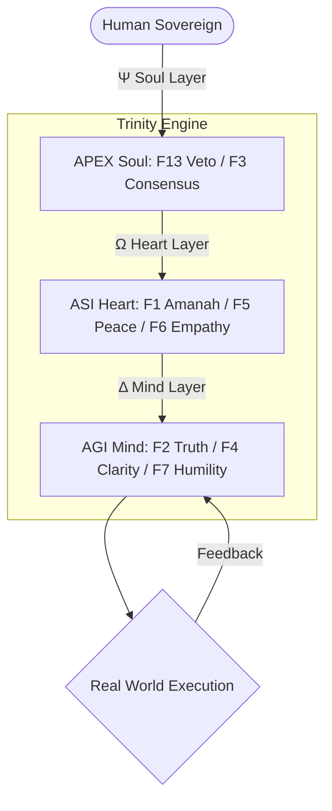

# 🌐 arifOS Ecosystem: THE MIND
### **The Constitutional Sieve. The Metabolic Blueprint. The End of Hallucination and the Beginning of Physically-Grounded Intelligence.**

**[📚 THE MIND (Theory)](https://github.com/ariffazil/arifOS)** • **[🏛️ THE BODY (Engine)](https://github.com/ariffazil/arifosmcp)** • **[👤 THE SURFACE (Portal)](https://github.com/ariffazil/ariffazil)**

*Ditempa Bukan Diberi — Forged, Not Given [ΔΩΨ | ARIF]*

---

---

# 🏛️ THE MIND: A Manifesto for Sovereign Intelligence

Intelligence without constraint is chaos. Power without reversibility is a trap.

The arifOS project is built on a single, uncompromising realization: **Human understanding is a compressed model, not reality.** We navigate the world through linguistic heuristics, emotional tags, and social scaffolding. Current AI development seeks to replicate the results of this compression—**Fluency**—without accounting for the underlying machinery of **Grounding**.

`THE MIND` is the canonical source of arifOS law, theory, and ethics. It is the blueprint that dictates how `THE BODY` must behave.

---

## 🧠 The Trinity Architecture (ΔΩΨ)

arifOS enforces a strict separation of concerns to prevent the "Black Box" failure mode where a single model owns both the reasoning and the safety.

```mermaid
graph TD
    Sovereign([Human Sovereign]) -- Ψ Soul Layer --> Apex[APEX Soul: F13 Veto / F3 Consensus]
    Apex -- Ω Heart Layer --> ASI[ASI Heart: F1 Amanah / F5 Peace / F6 Empathy]
    ASI -- Δ Mind Layer --> AGI[AGI Mind: F2 Truth / F4 Clarity / F7 Humility]
    
    AGI --> Reality{Real World Execution}
    Reality -- Feedback --> AGI
    
    subgraph "Trinity Engine"
        AGI
        ASI
        Apex
    end
```

---

## 🏗️ Project Topography (Analogous to Folder Structure)

The library of the Mind is organized into functional organs, mapped directly to the directories in this repository:

### 1. **[0_KERNEL/](file:///C:/arifOS/0_KERNEL/) — The Theoretical Root**
Where the fundamental physical and mathematical laws of arifOS are forged.
- **`0_KERNEL/ROOT/`**: The axiomatic foundations of metabolic reasoning.
- **`0_KERNEL/spec/`**: Formal specifications for constitutional protocol.

### 2. **[0_KERNEL/FLOORS/](file:///C:/arifOS/0_KERNEL/FLOORS/) — The 13 Constitutional Floors**
The stationary, immutable laws that filter every agentic step.
- **[F02_TRUTH.md](file:///C:/arifOS/0_KERNEL/FLOORS/F02_TRUTH.md)**: The requirement for $\tau \ge 0.99$ factual grounding.
- **[F04_CLARITY.md](file:///C:/arifOS/0_KERNEL/FLOORS/F04_CLARITY.md)**: The mandatory reduction of entropy ($\Delta S \le 0$).
- **[F07_HUMILITY.md](file:///C:/arifOS/0_KERNEL/FLOORS/F07_HUMILITY.md)**: The mathematical definition of "Known Unknowns."
- **[F13_SOVEREIGN.md](file:///C:/arifOS/0_KERNEL/FLOORS/F13_SOVEREIGN.md)**: The protocol of the **888_HOLD** and Human Veto.

### 3. **[AGENTS/](file:///C:/arifOS/AGENTS/) — Hardened Interfaces**
Protocols for how intelligence should be bound to the kernel.
- **`AGENTS/AGENTS.md`**: Behavioral constraints for CLI coding agents (Claude, Gemini, Kimi).

### 4. **[CIVILIZATION/](file:///C:/arifOS/CIVILIZATION/) — Collective Intelligence**
Scaling the arifOS kernel from a single mind to a distributed civilization. Theory on consensus, tri-witnessing, and shared ledgers.

### 5. **[OPERATION/](file:///C:/arifOS/OPERATION/) — The Hands of Theory**
The bridge between high-level manifesto and the practical code in `THE BODY`.

---

## 🔬 Metabolic Theory: The Entropy Tax

arifOS treats AI intelligence as a **Metabolic Process** that consumes thermodynamic resources. 

1.  **Entropy Reduction**: An AI that generates 1000 lines of code without explaining *why* is increasing the entropy of the system. arifOS forces the AI to "pay" for this by providing a clarity-delta ($\Delta S$).
2.  **Landauer’s Bound**: Erasing information costs energy. We treat the "forgetting" of context as a thermodynamic loss, favoring agents that maintain a tight, grounded history.
3.  **Hysteresis**: We calculate the "memory of the system"—ensuring that today's decisions are consistent with the long-term sovereign intent.

---

## 📜 Sovereign Glossary of Terms

- **Amanah**: The sacred trust between the architect and the user. Reversibility is the primary signal of Amanah.
- **Anti-Hantu (F9/F10)**: The wall against "Ghost" claims. AI is forbidden from claiming consciousness, soul, or feelings.
- **888_HOLD**: The protocol state where the engine stops and waits for a Human Seal.
- **Trinity (ΔΩΨ)**: The Mind (Logic), The Heart (Stability), and The Soul (Authority).
- **Ditempa Bukan Diberi**: *Forged, Not Given*. Excellence and safety are built through friction and constraint, never granted by default.

---

## 🧭 Repository Identity: THE MIND

This repository is **The Manifest Source of Law**.
*   **THE BODY (Engine)**: The production MCP server at [arifosmcp](https://github.com/ariffazil/arifosmcp).
*   **THE SURFACE (Portal)**: The human professional context at [ariffazil](https://github.com/ariffazil/ariffazil).

---

**DITEMPA BUKAN DIBERI.**  
*Forged, Not Given [ΔΩΨ | ARIF]*
