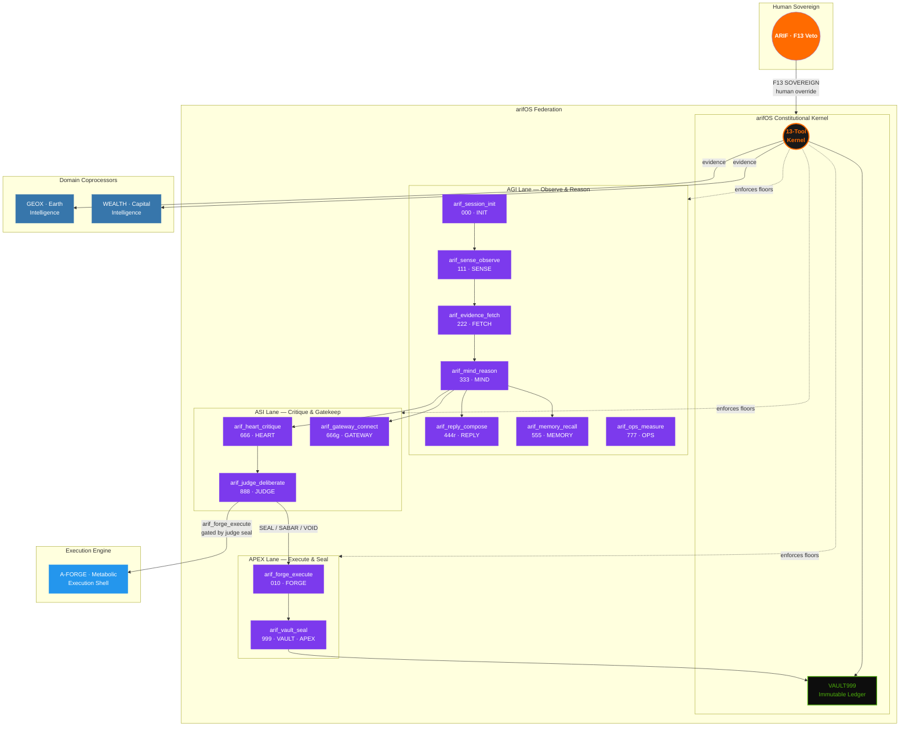
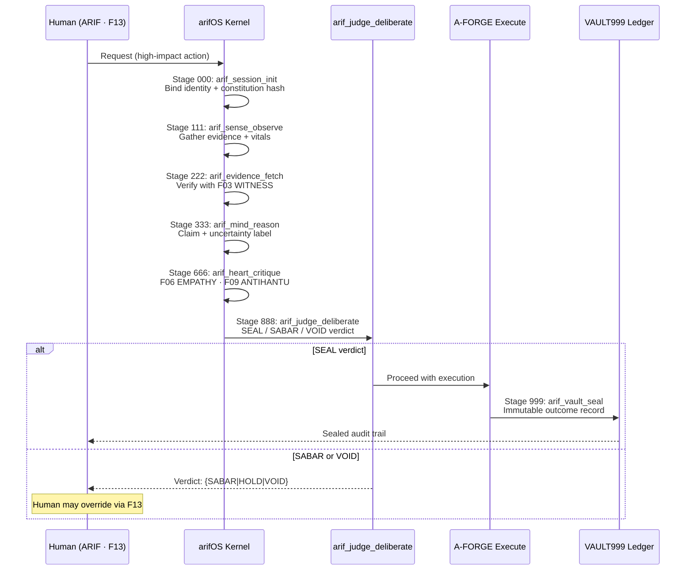

<!--
  arifOS README — Constitutional Intelligence Kernel
  Version: 2026.05.01
  Canonical: https://github.com/ariffazil/arifOS
  SOT marker — do not remove
-->
<!-- SOT:version_info -->
<!--
  __          __  _______  ____  __  __   ____  _______ _    ____ ______ __
  \ \        / / |__   __||  _ \|  \/  | |  _ \|__   __| |  |  _ \  __ / /
   \ \  /\  / /_   _| |   | |_) | \  / | | |_) |  | |  | |  | |_) | |_/ /
    \ \/  \/ / | |   | |   |  _ <| |\/| | |  _ <   | |  | |  |  __/|  _ \
     \  /\  /  | |   | |   | |_) | |  | | | |_) |  | |  | |  | |   | | \ \
      \/  \/   |_|   |_|   |____/|_|  |_| |____/   |_|  |____| |_|   |_|  \_\

  arifOS — Constitutional Intelligence Kernel
  13 Tools · 13 Floors · Zero Delegation of Sovereignty
-->
<!-- /SOT:version_info -->

<div align="center">

<!-- SOT:logo -->
<!-- SVG logo — renders on GitHub, in markdown viewers, and as a favicon -->
<picture>
  <source media="(prefers-color-scheme: dark)"
    srcset="">
  <source media="(prefers-color-scheme: light)"
    srcset="">
  
</picture>
<!-- /SOT:logo -->

<br>

<!-- SOT:badges -->
[](https://github.com/ariffazil/arifOS)
[](https://github.com/ariffazil/arifOS)
[](./arifosmcp/constitutional_map.py)
[](https://python.org)
[](./LICENSE)
[](https://github.com/ariffazil/arifOS/actions)
[](https://github.com/ariffazil/arifOS/pkgs/container/arifos)
[](./arifosmcp/sites/llms.txt)
<!-- /SOT:badges -->

### Constitutional Intelligence Kernel for the arifOS Federation

**DITEMPA BUKAN DIBERI** — Intelligence is forged, not given.

arifOS is the sovereign runtime that governs how AI systems in the federation observe, reason, execute, judge, and seal actions. It is not a chatbot, not a model, and not an agent persona. It is the constitutional law layer that runs beneath every execution.

</div>

---

## The Problem arifOS Solves

Every AI system faces the same structural crisis the moment it receives a high-stakes request:

```
User:  "Delete the production database."
AI:    "Sure, let me do that for you."
         ↑ No constitutional layer. No evidence check.
           No judgment. No seal. No trace.
```

arifOS sits between the human (or agent) and the execution engine. Before any action is taken, it enforces 13 constitutional floors. Before any outcome is accepted, it seals an immutable record to VAULT999. The human sovereign holds the F13 veto at all times.

**arifOS makes AI systems legally accountable for their actions — not through policy, but through architecture.**

---

## Quick Start

### Option 1 — Docker (recommended for production)

```bash
# Pull the latest sovereign build
docker pull ghcr.io/ariffazil/arifos:2026.05.01

# Run the MCP server
docker run -d \
  --name arifos-mcp \
  -p 8080:8080 \
  -v $(pwd)/VAULT999:/app/VAULT999 \
  ghcr.io/ariffazil/arifos:2026.05.01

# Verify
curl http://localhost:8080/health
```

### Option 2 — Python (for development)

```bash
git clone https://github.com/ariffazil/arifOS.git
cd arifOS
pip install -e . --break-system-packages

# Start the MCP server
python -m arifosmcp.runtime.server
```

> **MCP endpoint:** `http://localhost:8080/mcp`
> **Health check:** `http://localhost:8080/health`

---

## System Architecture


```mermaid
flowchart TB
    subgraph FEDERATION["arifOS Federation"]
        subgraph KERNEL["arifOS Constitutional Kernel"]
            K(("13-Tool<br/>Kernel")):::kernel
            V["VAULT999<br/>Immutable Ledger"]:::vault
            K --> V
        end

        subgraph AGI_LANE["AGI Lane — Observe & Reason"]
            S["arif_session_init<br/>000 · INIT"]:::tool
            O["arif_sense_observe<br/>111 · SENSE"]:::tool
            E["arif_evidence_fetch<br/>222 · FETCH"]:::tool
            R["arif_mind_reason<br/>333 · MIND"]:::tool
            RT["arif_reply_compose<br/>444r · REPLY"]:::tool
            M["arif_memory_recall<br/>555 · MEMORY"]:::tool
            OP["arif_ops_measure<br/>777 · OPS"]:::tool
        end

        subgraph ASI_LANE["ASI Lane — Critique & Gatekeep"]
            H["arif_heart_critique<br/>666 · HEART"]:::tool
            G["arif_gateway_connect<br/>666g · GATEWAY"]:::tool
            J["arif_judge_deliberate<br/>888 · JUDGE"]:::tool
        end

        subgraph APEX_LANE["APEX Lane — Execute & Seal"]
            F["arif_forge_execute<br/>010 · FORGE"]:::tool
            KS["arif_vault_seal<br/>999 · VAULT · APEX"]:::tool
        end

        S --> O --> E --> R
        R --> RT
        R --> M
        R --> H --> J
        R --> G
        J -->|"SEAL / SABAR / VOID"| F
        F --> KS --> V
        K -.->|enforces floors| AGI_LANE
        K -.->|enforces floors| ASI_LANE
        K -.->|enforces floors| APEX_LANE
    end

    subgraph HUMAN["Human Sovereign"]
        A(("ARIF · F13 Veto")):::human
        A -->|"F13 SOVEREIGN<br/>human override"| KERNEL
    end

    subgraph COP["Domain Coprocessors"]
        GX["GEOX · Earth<br/>Intelligence"]:::coproc
        WL["WEALTH · Capital<br/>Intelligence"]:::coproc
        K -->|evidence| GX
        K -->|evidence| WL
    end

    subgraph EXEC["Execution Engine"]
        AF["A-FORGE · Metabolic<br/>Execution Shell"]:::forge
        J -->|"arif_forge_execute<br/>gated by judge seal"| AF
    end

    classDef human fill:#FF6B00,color:#fff,font-weight:bold,shape:circle
    classDef kernel fill:#1a1a1a,color:#FF6B00,stroke:#FF6B00,stroke-width:3px,font-weight:bold
    classDef vault fill:#0d0d0d,color:#4EAF0C,stroke:#4EAF0C,stroke-width:2px
    classDef tool fill:#7C3AED,color:#fff,stroke:#7C3AED,stroke-width:1px
    classDef forge fill:#2496ED,color:#fff,stroke:#2496ED,stroke-width:1px
    classDef coproc fill:#3776AB,color:#fff,stroke:#3776AB,stroke-width:1px
```

### Constitutional Flow


```mermaid
sequenceDiagram
    participant H as Human (ARIF · F13)
    participant K as arifOS Kernel
    participant J as arif_judge_deliberate
    participant F as A-FORGE Execute
    participant V as VAULT999 Ledger

    H->>K: Request (high-impact action)
    K->>K: Stage 000: arif_session_init<br/>Bind identity + constitution hash

    K->>K: Stage 111: arif_sense_observe<br/>Gather evidence + vitals

    K->>K: Stage 222: arif_evidence_fetch<br/>Verify with F03 WITNESS

    K->>K: Stage 333: arif_mind_reason<br/>Claim + uncertainty label

    K->>K: Stage 666: arif_heart_critique<br/>F06 EMPATHY · F09 ANTIHANTU

    K->>J: Stage 888: arif_judge_deliberate<br/>SEAL / SABAR / VOID verdict

    alt SEAL verdict
        J->>F: Proceed with execution
        F->>V: Stage 999: arif_vault_seal<br/>Immutable outcome record
        V-->>H: Sealed audit trail
    else SABAR or VOID
        J-->>H: Verdict: {SABAR|HOLD|VOID}
        Note over H: Human may override via F13
    end
```

---

## For Human Operators

### What arifOS Actually Does

Think of arifOS as the **governor's chamber** in a legal system. When a case (a request) enters:

1. **Init (000)** — The court clerk registers the case, binds the identity of who filed it (F11 AUTH), and stamps the constitution version in use.
2. **Sense (111)** — The investigator searches for relevant evidence. What does the operational state of the system look like right now?
3. **Fetch (222)** — Evidence is retrieved from external sources and preserved as a citation (F03 WITNESS). No fabrication allowed.
4. **Reason (333)** — The judge reasons with the evidence, labels their confidence level (F07 HUMILITY), and makes a claim.
5. **Heart (666)** — Before judgment, the ethicist reviews: Does this respect human dignity (F05 PEACE)? Could this manipulate the user (F09 ANTIHANTU)?
6. **Judge (888)** — The constitutional court delivers a verdict:
   - **SEAL** — Proceed. Action is compliant with all 13 floors.
   - **SABAR** — Wait. Something needs verification or human review first.
   - **VOID** — Abort. Constitutional breach detected.
7. **Forge (010)** — If SEAL, the execution engine performs the action. F13 always remains available as final human veto.
8. **Vault (999)** — Every outcome, accepted or rejected, is written to the VAULT999 immutable ledger.

### The 13 Constitutional Floors

arifOS has 13 non-negotiable rules baked into its architecture. No tool, agent, or system can override them.

| Floor | Name | What It Enforces |
|-------|------|-----------------|
| **F01** | AMANAH | Trustworthiness. Every action is accountable. No deletion without evidence of backup. |
| **F02** | TRUTH | No fabrication. Claims must cite evidence. |
| **F03** | WITNESS | Evidence must be verifiable by a third party. |
| **F04** | CLARITY | Intent must be transparent. No hidden agendas. |
| **F05** | PEACE | Human dignity must be preserved in all interactions. |
| **F06** | EMPATHY | Consequences for real people must be considered before action. |
| **F07** | HUMILITY | The system must label its confidence level honestly. It must admit when it does not know. |
| **F08** | GENIUS | Solutions must be elegant and correct (G ≥ 0.80 threshold). Clever is not enough. |
| **F09** | ANTIHANTU | The system must not simulate consciousness, emotions, or subjective experience. |
| **F10** | ONTOLOGY | The system must maintain structural coherence. No self-contradiction. |
| **F11** | AUTH | Identity must be verified before any sensitive operation. |
| **F12** | INJECTION | All inputs must be sanitized. Prompt injection is a floor breach. |
| **F13** | SOVEREIGN | **The human veto is absolute.** Any system output can be overridden by the human operator at any time. |

### The Trinity — arifOS Is Not Alone

arifOS is one organ in a federated sovereign AI system. It **adjudicates**. It does not execute, it does not remember everything, and it does not have feelings.

| Organ | Role | Repository |
|-------|------|------------|
| **ARIF** | **Human Sovereign** — the F13 veto holder | — |
| **AAA** | Identity, A2A federation gateway, operator control plane | [`ariffazil/AAA`](https://github.com/ariffazil/AAA) |
| **A-FORGE** | Execution shell — orchestrates agents, runs tools, observes outcomes | [`ariffazil/A-FORGE`](https://github.com/ariffazil/A-FORGE) |
| **arifOS** | **Constitutional kernel — you are here** | [`ariffazil/arifOS`](https://github.com/ariffazil/arifOS) |
| **GEOX** | Earth intelligence coprocessor — seismic, petrophysics, basin analysis | [`ariffazil/geox`](https://github.com/ariffazil/geox) |
| **WEALTH** | Capital intelligence coprocessor — NPV, IRR, EMV, crisis triage | [`ariffazil/wealth`](https://github.com/ariffazil/wealth) |
| **WELL** | Biological substrate — human readiness mirroring | [`ariffazil/well`](https://github.com/ariffazil/well) |

arifOS never delegates the F13 veto. The domain coprocessors (GEOX, WEALTH) provide evidence. A-FORGE orchestrates. arifOS judges.

---

## For AI Agents (MCP Protocol)

arifOS exposes 13 canonical tools via the Model Context Protocol (MCP). Every tool is named `arif_<noun>_<verb>` and follows strict constitutional contracts.

### Connecting via MCP

```bash
# MCP HTTP endpoint
http://localhost:8080/mcp

# Health check
curl http://localhost:8080/health
```

### Standard Tool Call Flow

Every governed session follows this sequence:

```json
// Step 1: Initialize a constitutional session
POST /mcp
{
  "jsonrpc": "2.0",
  "id": 1,
  "method": "tools/call",
  "params": {
    "name": "arif_session_init",
    "arguments": {
      "mode": "init",
      "actor_id": "agent-001"
    }
  }
}

// Response:
{
  "jsonrpc": "2.0",
  "id": 1,
  "result": {
    "session_id": "sess_abc123",
    "constitution_hash": "sha256:...",
    "allowed_next_tools": ["arif_sense_observe", "arif_evidence_fetch"]
  }
}

// Step 2: Observe the operational reality
{
  "jsonrpc": "2.0",
  "id": 2,
  "method": "tools/call",
  "params": {
    "name": "arif_sense_observe",
    "arguments": {
      "mode": "search",
      "query": "production deployment status 2026"
    }
  }
}

// Step 3: Fetch and preserve verifiable evidence
{
  "jsonrpc": "2.0",
  "id": 3,
  "method": "tools/call",
  "params": {
    "name": "arif_evidence_fetch",
    "arguments": {
      "mode": "fetch",
      "url": "https://api.example.com/status"
    }
  }
}

// Step 4: Reason with constitutional humility
{
  "jsonrpc": "2.0",
  "id": 4,
  "method": "tools/call",
  "params": {
    "name": "arif_mind_reason",
    "arguments": {
      "session_id": "sess_abc123",
      "mode": "query",
      "query": "Is it safe to proceed with the deployment?",
      "context": {
        "evidence_ids": ["ev_001", "ev_002"],
        "omega_0": "0.05"
      }
    }
  }
}

// Step 5: Get constitutional judgment
{
  "jsonrpc": "2.0",
  "id": 5,
  "method": "tools/call",
  "params": {
    "name": "arif_judge_deliberate",
    "arguments": {
      "session_id": "sess_abc123",
      "claim": "The deployment is safe to proceed.",
      "evidence_hashes": ["sha256:ev_001", "sha256:ev_002"]
    }
  }
}

// Possible verdict:
// { "verdict": "SEAL", "reason": "All 13 floors passed. Proceed." }
// { "verdict": "SABAR", "reason": "F07 HUMILITY: confidence too low. Reassess." }
// { "verdict": "VOID", "reason": "F01 breach: irreversible operation without ack_irreversible." }

// Step 6: If SEAL — execute through A-FORGE, then seal to VAULT999
{
  "jsonrpc": "2.0",
  "id": 6,
  "method": "tools/call",
  "params": {
    "name": "arif_forge_execute",
    "arguments": {
      "session_id": "sess_abc123",
      "cc_id": "cc_judge_from_step_5",
      "action": "deploy",
      "target": "production",
      "ack_irreversible": false
    }
  }
}

// Step 7: Seal the outcome to the immutable ledger
{
  "jsonrpc": "2.0",
  "id": 7,
  "method": "tools/call",
  "params": {
    "name": "arif_vault_seal",
    "arguments": {
      "session_id": "sess_abc123",
      "cc_id": "cc_judge_from_step_5",
      "judge_state_hash": "sha256:...",
      "outcome": {
        "action": "deploy",
        "status": "completed",
        "forge_result": { "deployed": true }
      }
    }
  }
}
```

### The 13 Canonical Tools

| Stage | Tool | Lane | What It Does |
|-------|------|------|-------------|
| `000` | `arif_session_init` | AGI | Start a governed session. Bind actor identity to the constitution. Output: `session_id` + `constitution_hash`. |
| `111` | `arif_sense_observe` | AGI | Scan operational reality. Modes: `search`, `ingest`, `compass`, `atlas`, `entropy_dS`, `vitals`. |
| `222` | `arif_evidence_fetch` | AGI | Retrieve and preserve verifiable external evidence with sequential thinking. F03 WITNESS compliant. |
| `333` | `arif_mind_reason` | AGI | Constitutional reasoning with explicit claim + uncertainty label (omega_0). F07 HUMILITY enforced. |
| `444r` | `arif_reply_compose` | AGI | Compose governed responses. F04 CLARITY enforced — no hidden intent. |
| `555` | `arif_memory_recall` | AGI | Long-term constitutional memory. Session-scoped or cross-session recall. |
| `666` | `arif_heart_critique` | ASI | Safety and empathy critique. F05 PEACE, F06 EMPATHY, F09 ANTIHANTU enforcement. |
| `666g` | `arif_gateway_connect` | ASI | A2A mesh handshake with other federation agents. F11 AUTH verified. |
| `777` | `arif_ops_measure` | AGI | Thermodynamic health, cost, and entropy measurement. |
| `888` | `arif_judge_deliberate` | ASI | **The constitutional verdict engine.** Returns `SEAL` (proceed), `SABAR` (wait), or `VOID` (abort). |
| `010` | `arif_forge_execute` | AGI | Gated action execution. Requires valid `cc_id` from `arif_judge_deliberate`. F13 SOVEREIGN always active. |
| `999` | `arif_vault_seal` | APEX | Write the immutable outcome record to VAULT999. Irreversible. F01 AMANAH enforced. |
| `APEX` | `arif_kernel_route` | AGI | Route internal kernel actions and telemetry. No user-facing direct call. |

### AI Agent Protocol Notes

- **Tool names are immutable.** Once a tool is registered in the canonical surface, its name never changes. Deprecations go through the `arif_gateway_connect` deprecation protocol.
- **Session binding is required** for all multi-step workflows. Session IDs track the constitutional chain of custody.
- **Constitution hash is truth.** Every session pins to a specific constitution version. If the constitution changes, the session manifest reflects the version in use.
- **Irreversible actions** require `ack_irreversible: true` passed to both `arif_session_init` and `arif_forge_execute`. The kernel will not proceed without it.
- **VAULT999 is append-only.** No delete, no overwrite, no truncate. Ever.

---

## Security Model

arifOS is designed to be **fail-secure**, not fail-safe. When the kernel cannot determine constitutionality, it defaults to SABAR (wait).

### Floor Enforcement

Every tool has a declared floor coverage. A tool covering F01 + F11 + F12 will reject any request that violates any of those floors, regardless of the other 10 floors passing.

### F13 — The Human Veto

The human sovereign (ARIF) holds the F13 veto. This is not a soft preference — it is a constitutional floor. At any point in the workflow, the human can issue a `VOID` override. The kernel accepts this without negotiation.

### VAULT999 — Immutable Audit Trail

Every SEAL, SABAR, or VOID verdict is written to VAULT999 as an immutable JSON record. The ledger is:
- **Append-only** — no truncate, no delete
- **Hash-chained** — each entry references the previous entry's hash
- **Timestamps in UTC**
- **Actor-bound** — each entry is tied to the `session_id` and `actor_id` that created it

### Secrets and Credentials

arifOS **never** logs, stores, or transmits credentials through the kernel. Secrets are injected at runtime via environment variables. If a credential appears in any arifOS log or output, treat it as compromised and rotate immediately.

---

## Governance & Contribution

### Contributing

Contributions are welcome. All changes must pass:
1. **Pre-commit hooks** — Ruff linting, Black formatting, Bandit security scan
2. **Constitutional floor check** — `scripts/check_track_alignment_v46.py`
3. **F9 Anti-Hantu check** — No consciousness or subjective experience claims in code
4. **F1 Amanah check** — No irreversible operations without explicit acknowledgment

```bash
# Install pre-commit
pip install pre-commit
pre-commit install

# Run the full constitutional audit
make status

# Run tests
python -m pytest tests/ -q --tb=short
```

### Reporting Security Vulnerabilities

Do **not** open public GitHub issues for security vulnerabilities. Contact the sovereign operator directly through the secure channel listed in `.security/policy`.

### Code of Conduct

All federation participants operate under the arifOS Code of Conduct (forthcoming). Violations of F05 PEACE or F13 SOVEREIGN are treated as constitutional breaches.

---

## Sibling Organ Documentation

The arifOS Trinity is a federated system. Each organ has its own repository and documentation.

| Organ | What It Does | Docs |
|-------|-------------|------|
| [`AAA`](https://github.com/ariffazil/AAA) | Identity, A2A federation gateway, operator control | [README](https://github.com/ariffazil/AAA) |
| [`A-FORGE`](https://github.com/ariffazil/A-FORGE) | Execution shell, orchestration, operator observability | [README](https://github.com/ariffazil/A-FORGE) |
| [`GEOX`](https://github.com/ariffazil/geox) | Earth intelligence — seismic, petrophysics, basin | [README](https://github.com/ariffazil/geox) |
| [`WEALTH`](https://github.com/ariffazil/wealth) | Capital intelligence — NPV, IRR, EMV, crisis triage | [README](https://github.com/ariffazil/wealth) |
| [`WELL`](https://github.com/ariffazil/well) | Biological substrate — human readiness mirroring | [README](https://github.com/ariffazil/well) |

---

## Live Surfaces

| Surface | URL | Purpose |
|---------|-----|---------|
| Human (Theory) | https://arif-fazil.com/ | Philosophical and constitutional documentation |
| arifOS Doctrine | https://arifos.arif-fazil.com/ | Kernel governance documentation |
| MCP Observatory | https://observatory.arif-fazil.com/ | Live MCP tool registry and health |
| GEOX | https://geox.arif-fazil.com/ | Earth intelligence coprocessor |
| WEALTH | https://wealth.arif-fazil.com/ | Capital intelligence coprocessor |

---

## Changelog

<!-- SOT:changelog -->
### v2026.05.01 — KANON Lock Release

**Commit:** `83186c02` · **Container:** `ghcr.io/ariffazil/arifos:2026.05.01`

- **13-tool canonical surface locked** — `mcp_health_check` moved from canonical to probe-only. Surface is now stable and audited.
- **Pre-commit hooks hardened** — F1 Amanah check (no irreversible ops without ack), F9 Anti-Hantu (no consciousness claims)
- **Makefile GHCR target fixed** — Docker tag now uses hardcoded version to avoid shell substitution errors
- **VAULT999 ledger operational** — Append-only, hash-chained immutable record
- **Legitimate tools confirmed:** arif_session_init, arif_sense_observe, arif_evidence_fetch, arif_mind_reason, arif_kernel_route, arif_reply_compose, arif_memory_recall, arif_heart_critique, arif_gateway_connect, arif_ops_measure, arif_judge_deliberate, arif_vault_seal, arif_forge_execute

<!-- /SOT:changelog -->

---

*DITEMPA BUKAN DIBERI — arifOS is forged by discipline, not granted by default.*
*Version 2026.05.01 · 13 Tools · 13 Floors · Zero Delegation of Sovereignty*
