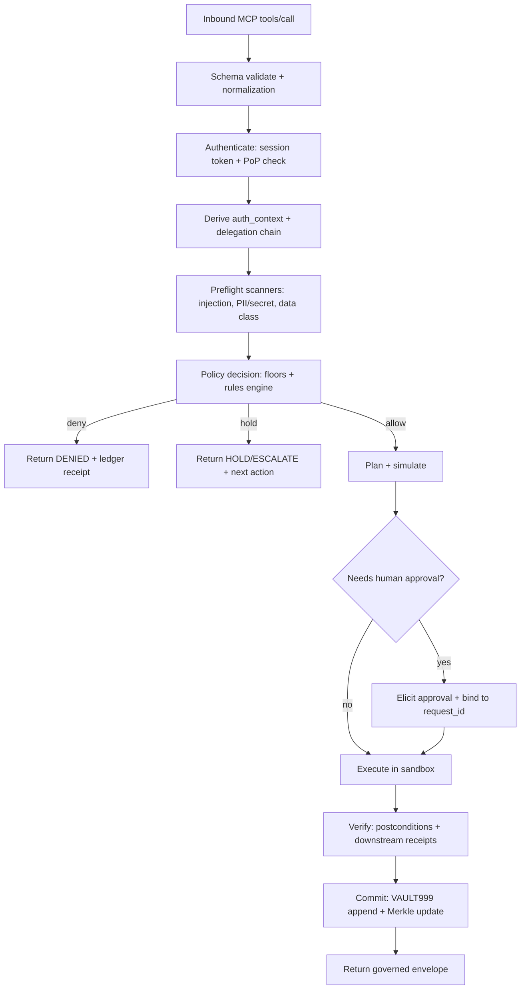
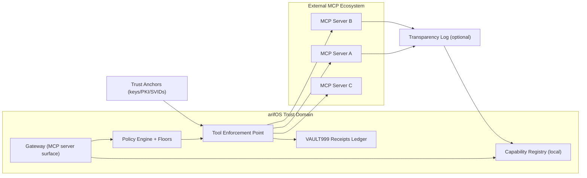

# Transforming arifOS MCP Into a Dominant, Self-Sufficient Governance Runtime

## Executive summary

arifOS MCP already has the right *shape* for a governance-first runtime: a constitutional pipeline (MGI Envelope + Metabolic Loop), explicit verdicts (SEAL/HOLD/VOID and variants), a visible floor model (F1–F13), and an append-only VAULT999 concept with Merkle integrity verification.citeturn22view0turn30view0turn6view4turn9view0 The biggest blockers to “federate and replace external MCP servers” are not new tools—they’re missing **strict contracts**, **identity + delegation primitives**, **tamper-evident receipts with privacy controls**, and **a federation trust model that avoids token passthrough/confused-deputy failures** that MCP explicitly warns about.citeturn21view1turn28search0turn16search0

This report proposes a hard upgrade path:

- **Unify every tool behind one strict, machine-validated contract** (requests + results), including policy decisions, budgets, provenance, and ledger receipts.
- **Replace “declared_name” identity with phishing-resistant, replay-resistant session anchoring** using passkeys/WebAuthn + Proof-of-Possession tokens (DPoP or mTLS), aligned with modern digital identity guidance.citeturn26search1turn26search0turn24view0turn10search3
- **Turn VAULT999 into an auditable receipts ledger**: append-only, hash-chained, with inclusion/consistency proofs (CT-style), redactable privacy envelopes, and cryptographically verifiable provenance.citeturn6view4turn9view0turn12search0turn12search1
- **Add a real policy engine with machine-readable rules + contradiction detection** (authorization + tool constraints), borrowing from proven policy systems and scalable authorization models.citeturn13search1turn13search26turn13search0
- **Federate external MCP servers through a governed gateway** that performs discovery, capability mapping, token brokering (no passthrough), attestation/trust anchoring, safe degradation, and migration tooling.citeturn19view0turn21view3turn27search0turn27search1

If implemented, arifOS becomes a **Zero Trust-style policy enforcement point** for LLM tool usage—where external MCP servers cannot bypass constitutional floors, budgets, or auditability, even if they are compromised or deceptive.citeturn24view2turn14search2turn28academia38

## Tool inventory and tool-by-tool gap analysis

arifOS MCP v2026.03.14-FORGED documents **9 active tools** plus **2 legacy tools** for compatibility.citeturn23view0 Separately, the Tools Reference defines **9 machine-only “Nervous System” tools** for introspection and operations, governed by the floors and logged to VAULT999.citeturn5view0turn5view3

### Active tools

| Tool | Stage / Mode | Current role | Main gaps blocking dominance |
|---|---|---|---|
| `reality_compass` | 111_SENSE (read) | Web search / URL fetch under governance (Brave Search-backed).citeturn23view0turn3view0 | Weak provenance semantics for sources (no signed “evidence receipts”); no standardized citation object model; limited anti-tool-poisoning defenses (tool descriptors / fetched text can be adversarial).citeturn14search2turn28academia37 |
| `reality_atlas` | 222_REALITY (write) | Evidence graph + vector retrieval (Qdrant-based).citeturn23view0turn3view0 | Missing data-classification + retention controls per artifact; weak redaction primitives; unclear multi-tenant isolation; no explicit consent + purpose binding on stored evidence.citeturn30view0turn24view2 |
| `arifOS_kernel` | 444_ROUTER (write) | Central orchestration through the 000→999 metabolic loop.citeturn22view0turn9view4turn3view0 | No explicit “transaction/rollback” semantics; unclear simulation vs execution modes beyond `dry_run`; budgets exist but need enforceable, queryable limits and per-capability spend.citeturn23view0turn6view0turn31view0 |
| `check_vital` | 000_INIT (read) | Budget + capability map + system integrity at-a-glance.citeturn6view0turn22view0 | Needs structured SLO/KPI reporting (p95 latency, deny rates, token burn, per-floor fail distribution); should become the canonical “governance health API.”citeturn31view0turn5view0 |
| `init_anchor_state` | 000_INIT (write) | Session initialization, identity token minting, intent binding.citeturn6view3turn23view0 | Identity model is underspecified: `declared_name` is not an authenticator; no phishing-resistant login; no PoP binding; no delegation chain format; revocation not defined.citeturn24view0turn26search1turn10search3turn11search0 |
| `verify_vault_ledger` | 999_VAULT (read) | Verify SHA-256 Merkle chain integrity.citeturn6view4turn23view0 | “Integrity intact” is good, but receipts lack standardized inclusion proofs / signed tree heads / witness options; privacy-preserving redaction is not defined.citeturn12search0turn12search1turn9view0 |
| `audit_rules` | 333_MIND (read) | Inspect floors + thresholds.citeturn6view4turn30view0 | Floors are human-readable but not yet a machine-verifiable policy package with versioned semantics, conflict detection, and change control enforcement.citeturn30view0turn22view0 |
| `session_memory` | 555_MEMORY (write) | Store/retrieve/forget session artifacts.citeturn4view6turn23view0 | Needs “memory is data” controls: classification, TTL, consent, deletion proofs, and strict separation between “LLM memory” and “forensic memory.”citeturn9view0turn30view0 |
| `open_apex_dashboard` | 888_JUDGE (read) | Live floor pass rates, verdict distribution, system health.citeturn5view0turn23view0 | Must become operator-grade: drilldowns, correlation IDs, replay to ledger entry, anomaly alerts, and federated visibility across downstream MCP servers.citeturn5view0turn24view2 |

### Machine tools

These are explicitly stated to be governed by constitutional floors, accept `session_id` + `auth_context`, return a governed runtime envelope, and log operations to VAULT999.citeturn5view3

| Tool | Role | Main gaps |
|---|---|---|
| `system_health` | CPU/mem/disk/I/O/thermal monitoring.citeturn5view0 | Needs SLO-based alert thresholds tied to floors (e.g., F11 reliability), plus least-privilege sandboxing.citeturn30view0turn24view2 |
| `process_list` | Process enumeration / resource use.citeturn5view1 | Must prevent information leakage (paths, env vars) and enforce redaction.citeturn30view0turn14search2 |
| `net_status` | Dependency reachability + latency.citeturn5view1 | Needs dependency identity verification (mTLS/SPIFFE), not just reachability.citeturn18search0turn24view2 |
| `chroma_query` | Vector memory search (Chroma/Qdrant).citeturn5view1turn4view2 | Must unify with `reality_atlas` storage semantics, avoid duplicated “memory planes,” and enforce tenant isolation.citeturn9view0turn30view0 |
| `list_resources` | Enumerate MCP resources (canon://, vault://…).citeturn4view2 | Needs resource ACLs + provenance (who can see what); should be policy-driven.citeturn13search1turn13search26 |
| `read_resource` | Read MCP resources by URI.citeturn5view2 | Requires strict content classification + redaction to keep “safe context” for LLMs.citeturn14search2turn30view0 |
| `log_tail` | Stream and filter logs.citeturn5view2 | Needs PII/secret scrubbing + access partitioning.citeturn30view0turn16search2 |
| `fs_inspect` | Governed filesystem inspection.citeturn5view3 | Should support allowlisted roots/“capability paths” to prevent confused-deputy style ambient authority.citeturn15search2turn24view2 |
| `cost_estimator` | Estimate token/time/API cost pre-execution.citeturn5view3 | Must become enforceable budgets (not advisory), with receipts and per-tool spend accounting.citeturn31view0turn23view0 |

### Legacy tools (compatibility)

The changelog highlights `search_reality` → `reality_compass` and `ingest_evidence` → `reality_atlas`, noting legacy tools forward internally but do **not** return governance envelopes.citeturn23view0 That “no envelope” behavior is a governance escape hatch and should be shut down via compatibility wrapping.

| Tool | Status | Immediate action |
|---|---|---|
| `search_reality` | Legacy | Wrap output into strict governance envelopes; require explicit “legacy_mode=true” to call; sunset by deadline.citeturn23view0turn5view4 |
| `ingest_evidence` | Legacy | Same; ensure stored evidence produces ledger receipts and respects retention/privacy.citeturn23view0turn12search7 |

## A single strict tool contract and a standardized preflight pipeline

### Why a strict contract is non-negotiable

Dominance comes from being the *place where trust is computed*. If any tool can return “raw” results or omit policy + provenance, arifOS becomes just another MCP server. MCP itself emphasizes version negotiation, capability discovery, and clear tool execution semantics; arifOS must add the missing layers: identity, policy, provenance, and audit receipts.citeturn32view0turn19view4turn22view0

### The strict tool contract schema

This schema is designed to be:
- **Transport-agnostic** (MCP stdio or Streamable HTTP).citeturn19view4turn9view0  
- **Policy-first** (fail-closed; explicit deny reasons).citeturn30view0turn24view2  
- **Federation-ready** (provenance chain and “downstream call” receipts).citeturn21view3turn27search0  

```json
{
  "$schema": "https://json-schema.org/draft/2020-12/schema",
  "$id": "https://arifos.local/schemas/governed_tool_envelope.v1.json",
  "title": "GovernedToolEnvelopeV1",
  "type": "object",
  "additionalProperties": false,
  "required": ["envelope_version", "kind", "request", "auth_context", "policy", "budget", "trace", "result", "ledger"],
  "properties": {
    "envelope_version": { "type": "string", "const": "v1" },
    "kind": { "type": "string", "enum": ["tool_call", "tool_result"] },

    "request": {
      "type": "object",
      "additionalProperties": false,
      "required": ["request_id", "ts", "tool", "arguments", "session"],
      "properties": {
        "request_id": { "type": "string", "minLength": 16, "maxLength": 128 },
        "ts": { "type": "string", "format": "date-time" },
        "tool": {
          "type": "object",
          "additionalProperties": false,
          "required": ["name", "capability_id", "stage", "intent"],
          "properties": {
            "name": { "type": "string", "minLength": 1, "maxLength": 128 },
            "capability_id": { "type": "string", "pattern": "^[a-z0-9_.:-]{3,128}$" },
            "stage": { "type": "string", "pattern": "^[0-9]{3}_[A-Z_]{3,32}$" },
            "intent": {
              "type": "object",
              "additionalProperties": false,
              "required": ["purpose", "scope"],
              "properties": {
                "purpose": { "type": "string", "minLength": 1, "maxLength": 200 },
                "scope": { "type": "string", "enum": ["read_only", "write", "execute", "admin"] },
                "data_classes": { "type": "array", "items": { "type": "string" } }
              }
            }
          }
        },
        "arguments": { "type": "object" },
        "session": {
          "type": "object",
          "additionalProperties": false,
          "required": ["session_id", "anchor_id", "lease_id"],
          "properties": {
            "session_id": { "type": "string", "minLength": 8, "maxLength": 128 },
            "anchor_id": { "type": "string", "minLength": 16, "maxLength": 128 },
            "lease_id": { "type": "string", "minLength": 16, "maxLength": 128 }
          }
        }
      }
    },

    "auth_context": {
      "type": "object",
      "additionalProperties": false,
      "required": ["subject", "assurance", "delegation_chain"],
      "properties": {
        "subject": {
          "type": "object",
          "additionalProperties": false,
          "required": ["subject_id", "subject_type"],
          "properties": {
            "subject_id": { "type": "string", "minLength": 3, "maxLength": 256 },
            "subject_type": { "type": "string", "enum": ["human", "agent", "service", "external_mcp_server"] },
            "display_name": { "type": "string", "maxLength": 200 }
          }
        },
        "assurance": {
          "type": "object",
          "additionalProperties": false,
          "required": ["authn_method", "phishing_resistant", "replay_resistant"],
          "properties": {
            "authn_method": { "type": "string", "enum": ["webauthn_passkey", "mtls", "dpop", "api_key", "none"] },
            "phishing_resistant": { "type": "boolean" },
            "replay_resistant": { "type": "boolean" }
          }
        },
        "delegation_chain": {
          "type": "array",
          "minItems": 1,
          "items": {
            "type": "object",
            "additionalProperties": false,
            "required": ["actor_id", "actor_type", "constraints"],
            "properties": {
              "actor_id": { "type": "string" },
              "actor_type": { "type": "string", "enum": ["human", "agent", "service"] },
              "constraints": { "type": "object" }
            }
          }
        }
      }
    },

    "policy": {
      "type": "object",
      "additionalProperties": false,
      "required": ["decision", "floors", "rule_bundle"],
      "properties": {
        "decision": { "type": "string", "enum": ["allow", "deny", "hold", "escalate"] },
        "rule_bundle": {
          "type": "object",
          "additionalProperties": false,
          "required": ["id", "version", "hash"],
          "properties": {
            "id": { "type": "string" },
            "version": { "type": "string" },
            "hash": { "type": "string", "pattern": "^sha256:[a-f0-9]{64}$" }
          }
        },
        "floors": {
          "type": "array",
          "items": {
            "type": "object",
            "additionalProperties": false,
            "required": ["floor_id", "score", "threshold", "void_triggered"],
            "properties": {
              "floor_id": { "type": "string", "pattern": "^F([1-9]|1[0-3])$" },
              "score": { "type": "number", "minimum": 0, "maximum": 1 },
              "threshold": { "type": "number", "minimum": 0, "maximum": 1 },
              "void_triggered": { "type": "boolean" },
              "fault_code": { "type": "string" }
            }
          }
        }
      }
    },

    "budget": {
      "type": "object",
      "additionalProperties": false,
      "required": ["limits", "spend"],
      "properties": {
        "limits": {
          "type": "object",
          "additionalProperties": false,
          "required": ["max_tokens", "max_wall_ms", "max_downstream_calls"],
          "properties": {
            "max_tokens": { "type": "integer", "minimum": 0 },
            "max_wall_ms": { "type": "integer", "minimum": 0 },
            "max_downstream_calls": { "type": "integer", "minimum": 0 }
          }
        },
        "spend": {
          "type": "object",
          "additionalProperties": false,
          "required": ["tokens_used", "wall_ms", "downstream_calls"],
          "properties": {
            "tokens_used": { "type": "integer", "minimum": 0 },
            "wall_ms": { "type": "integer", "minimum": 0 },
            "downstream_calls": { "type": "integer", "minimum": 0 }
          }
        }
      }
    },

    "trace": {
      "type": "object",
      "additionalProperties": false,
      "required": ["trace_id", "span_id", "correlation_ids"],
      "properties": {
        "trace_id": { "type": "string", "minLength": 16, "maxLength": 64 },
        "span_id": { "type": "string", "minLength": 8, "maxLength": 32 },
        "correlation_ids": { "type": "array", "items": { "type": "string" } }
      }
    },

    "result": {
      "type": "object",
      "additionalProperties": false,
      "required": ["status", "data"],
      "properties": {
        "status": { "type": "string", "enum": ["ok", "error", "denied", "held"] },
        "data": {},
        "error": {
          "type": "object",
          "additionalProperties": false,
          "properties": {
            "code": { "type": "string" },
            "message": { "type": "string" },
            "retryable": { "type": "boolean" }
          }
        },
        "downstream": {
          "type": "array",
          "items": {
            "type": "object",
            "additionalProperties": false,
            "required": ["target", "request_hash", "response_hash"],
            "properties": {
              "target": { "type": "string" },
              "request_hash": { "type": "string", "pattern": "^sha256:[a-f0-9]{64}$" },
              "response_hash": { "type": "string", "pattern": "^sha256:[a-f0-9]{64}$" }
            }
          }
        }
      }
    },

    "ledger": {
      "type": "object",
      "additionalProperties": false,
      "required": ["entry_id", "prev_hash", "entry_hash", "merkle_root", "receipt"],
      "properties": {
        "entry_id": { "type": "string" },
        "prev_hash": { "type": "string", "pattern": "^sha256:[a-f0-9]{64}$" },
        "entry_hash": { "type": "string", "pattern": "^sha256:[a-f0-9]{64}$" },
        "merkle_root": { "type": "string", "pattern": "^sha256:[a-f0-9]{64}$" },
        "receipt": {
          "type": "object",
          "additionalProperties": false,
          "required": ["type", "payload"],
          "properties": {
            "type": { "type": "string", "enum": ["inclusion_proof", "signed_tree_head"] },
            "payload": { "type": "object" }
          }
        }
      }
    }
  }
}
```

This contract is aligned to the realities exposed by arifOS itself (floors, verdicts, budgets, vault sealing) and upgrades them into a strict, federation-safe interface.citeturn30view0turn23view0turn9view0turn5view3

### Example governed request/response

```json
{
  "envelope_version": "v1",
  "kind": "tool_result",
  "request": {
    "request_id": "req_9c7f6d7f2b1a4a1d9e2c",
    "ts": "2026-03-22T03:21:00Z",
    "tool": {
      "name": "reality_compass",
      "capability_id": "reality.search.web",
      "stage": "111_SENSE",
      "intent": { "purpose": "verify_mcp_token_passthrough_risks", "scope": "read_only", "data_classes": ["public_web"] }
    },
    "arguments": { "input": "MCP token passthrough forbidden", "mode": "search", "top_k": 5 },
    "session": { "session_id": "sess_7f3a9b2c", "anchor_id": "anc_2a0c...e91f", "lease_id": "lease_3b7e...c8a2" }
  },
  "auth_context": {
    "subject": { "subject_id": "user:azwA", "subject_type": "human", "display_name": "Azwa" },
    "assurance": { "authn_method": "webauthn_passkey", "phishing_resistant": true, "replay_resistant": true },
    "delegation_chain": [{ "actor_id": "user:azwA", "actor_type": "human", "constraints": { "max_scope": "read_only" } }]
  },
  "policy": {
    "decision": "allow",
    "rule_bundle": { "id": "floors-core", "version": "2026.03.14", "hash": "sha256:aaaaaaaaaaaaaaaaaaaaaaaaaaaaaaaaaaaaaaaaaaaaaaaaaaaaaaaaaaaaaaaa" },
    "floors": [
      { "floor_id": "F2", "score": 0.93, "threshold": 0.8, "void_triggered": false },
      { "floor_id": "F11", "score": 0.98, "threshold": 0.8, "void_triggered": false }
    ]
  },
  "budget": {
    "limits": { "max_tokens": 8000, "max_wall_ms": 5000, "max_downstream_calls": 6 },
    "spend": { "tokens_used": 812, "wall_ms": 940, "downstream_calls": 3 }
  },
  "trace": { "trace_id": "3f2e8b1a7c9d4e55", "span_id": "9a71c0bd", "correlation_ids": ["mcp:call:42"] },
  "result": {
    "status": "ok",
    "data": {
      "sources": [
        { "title": "MCP Authorization Spec", "reliability": "primary", "evidence_hash": "sha256:bbbb...bbbb" }
      ]
    }
  },
  "ledger": {
    "entry_id": "vault999:1248",
    "prev_hash": "sha256:cccc...cccc",
    "entry_hash": "sha256:dddd...dddd",
    "merkle_root": "sha256:eeee...eeee",
    "receipt": { "type": "signed_tree_head", "payload": { "size": 1248, "sig": "ed25519:...." } }
  }
}
```

### Standardized preflight enforcement pipeline

Preflight must be the *same* for every tool (local + federated). That is “complete mediation” in practice: every call is checked, every time. (This principle is widely recognized as foundational for secure systems, and maps directly to arifOS’s existing “no response leaves without verification” design.)citeturn22view0turn30view0

**Pipeline contract:** no tool execution is allowed unless preflight emits `policy.decision=allow` and a bounded budget.



This aligns with arifOS’s metabolic loop idea (000→999) but turns it into an enforceable runtime pipeline that also governs federation calls.citeturn22view0turn9view4turn5view3

## Identity, delegation, and policy engine design

### Identity and session anchoring

The current `init_anchor_state` explicitly “mints identity tokens” and binds sessions to an actor, but its input schema allows weak identity signals (like `declared_name`) and does not define phishing resistance, replay resistance, or authentication intent semantics.citeturn6view1turn23view0

Modern digital identity guidance emphasizes:
- phishing-resistant authenticators for stronger assurance levels,
- replay-resistant cryptographic protocols,
- explicit authentication intent, and
- protected channels.citeturn24view0turn25view1

A strong arifOS identity model should therefore be:

- **Humans:** passkeys (WebAuthn) as first-class credentials. Passkeys are designed to be phishing resistant, and WebAuthn credentials are scoped to relying party IDs/origins.citeturn26search0turn26search1  
- **Agents/services:** Proof-of-Possession tokens (DPoP) or mTLS-bound tokens (for server-to-server), plus short-lived workload identities (e.g., SPIFFE SVIDs).citeturn10search3turn11search1turn18search0turn18search6  
- **Sessions:** always anchored to an **unforgeable cryptographic key** (cnf/jkt style), not to strings.citeturn11search2turn10search3  

#### Proposed `auth_context` schema (runtime truth)

- `subject_id`: stable principal identifier (human/agent/service).
- `authn_method`: `webauthn_passkey | dpop | mtls`.
- `assurance`: booleans for phishing/replay resistance + optional IAL/AAL fields.
- `delegation_chain`: nested chain (see below).
- `purpose` + `scope`: purpose binding to stop “consent drift”.

### Delegation model

If arifOS is going to “replace external servers,” it must safely delegate authority to tools and to other runtimes. Delegation must be explicit, bounded, and auditable.

Use **OAuth 2.0 Token Exchange actor chains** structures to represent delegation history: RFC 8693 explicitly supports nested `act` claims for delegation trails.citeturn11search0

**Opinionated design choice:** *Every delegated capability is a lease*, not a permanent grant.
- `lease_id`, expiry (`exp`), and hard constraints (scopes/budgets/resources).
- Revocation is mandatory (see below), because LLM systems are high-frequency and mistakes matter.

### Token formats, revocation, and provenance chain

#### Session token format

- Access tokens: JWT profile for OAuth access tokens is standardized (JWT access tokens) and improves interoperability.citeturn27search2  
- JWT best practices exist and should be enforced (issuer/audience validation, short expiry, algorithm constraints).citeturn16search2turn11search3  
- OAuth security best current practice should be a baseline.citeturn16search0  

#### Proof-of-possession binding

- DPoP provides sender-constrained tokens and replay detection for stolen tokens.citeturn10search3turn10search7  
- mTLS-bound access tokens are also well-defined as certificate-bound.citeturn11search1  

#### Revocation

Use OAuth token revocation (RFC 7009) semantics for:
- session termination,
- lease cancellation,
- emergency “panic revoke” on compromise.citeturn17search0  

#### Provenance chain

A provenance chain for arifOS is the combination of:
- delegation chain (who authorized whom),
- policy bundle hash (what rules applied),
- tool manifest hash (what code/schema ran),
- ledger receipt references (what was recorded).

This is directly aligned with the “governance must be logged” posture in Zero Trust architectures, where the policy engine logs decisions and the enforcement point enacts them.citeturn24view2

### Policy engine with precedent memory and contradiction detection

arifOS floors are currently described with thresholds and VOID triggers (F1/F3/F13), plus a consistency floor (F12) and correction floor (F10).citeturn30view0 The missing step is to make these floors **machine-checkable policy artifacts**.

A robust approach separates:

- **Authorization policy** (who can call what): best handled by a dedicated policy engine such as entity["organization","Open Policy Agent","rego policy engine"] or entity["company","Amazon Web Services","cedar policy language"]’s Cedar language, which is designed to be safe and analyzable.citeturn13search1turn13search26turn13search6  
- **Governance policy** (whether an answer/tool execution is acceptable): arifOS floors + additional structured checks.

For contradiction detection and “precedent memory,” take a page from “authorization-as-data” systems like Zanzibar, which was built to provide uniform policy evaluation at huge scale.citeturn13search0turn13search4 The idea is not to copy Zanzibar’s internals; it’s to copy the posture:
- policy and relationships are explicit data structures;
- checks are deterministic and fast;
- changes are versioned and auditable.

**Practical implementation pattern for arifOS:**
- Store every floor evaluation as a “case record” in VAULT999 (already aligned with arifOS’s forensic memory stance).citeturn9view0turn22view0  
- Build a “precedent index” that retrieves similar cases and highlights:
  - different floor outcomes,
  - changed ruleset hash,
  - changed tool manifests,
  - changed source evidence.

This becomes your F12 engine in real, measurable form.

## VAULT999 ledger design and privacy-preserving auditability

### Current VAULT999 behavior (documented)

arifOS describes VAULT999 as forensic memory that survives restarts and is written via multiple backends with explicit priority:
1) PostgreSQL, 2) SQLite fallback, 3) in-memory, 4) JSONL always written.citeturn9view0 `verify_vault_ledger` verifies integrity via a Merkle chain concept.citeturn6view4

That’s a solid minimum viable “tamper-evident log,” but dominance requires receipts that can be trusted across federation boundaries.

### Upgrade to receipts: CT-style append-only transparency

Certificate Transparency demonstrates how append-only properties can be achieved with Merkle trees, and how log misbehavior can be detected via root comparison and proofs.citeturn12search0turn12search1 Sigstore transparency logs extend similar concepts into modern software provenance, including operational patterns like sharding.citeturn12search2turn12search6

**Recommendation:** implement VAULT999 as a receipts ledger with:
- **Signed Tree Heads** (STHs): periodic signed roots.
- **Inclusion proofs** for individual entries.
- **Consistency proofs** between roots.citeturn12search0turn12search1  
- Optional **witnessing** or external anchoring for high-stakes deployments (large scale).

### Evidence hashing and “what exactly happened”

Each tool execution should emit:
- request hash,
- normalized arguments hash,
- output hash,
- downstream request/response hashes (for federated calls),
- policy bundle hash,
- tool manifest hash.

For software/tool provenance norms, in-toto provides a mature model: it attests to steps performed, by whom, in what order.citeturn12search7turn12search11 SLSA provenance aligns well when you want increasing assurance levels about how artifacts were produced.citeturn12search3turn12search14

### Redaction and privacy

A governance runtime that stores everything becomes dangerous if it can’t redact safely.

**Design goals:**
- Store **hashes + encrypted blobs**, not plaintext, when data class is sensitive.
- Allow redaction by replacing plaintext with structured “redaction markers,” while preserving:
  - the original hash commitment,
  - a redaction receipt,
  - who approved it and why,
  - which policy allowed it.

This keeps auditability without unnecessary exposure, supporting floors like F4 (Trust) and F13 (Stewardship).citeturn30view0turn22view0

### Example VAULT999 entry format

```json
{
  "entry_id": "vault999:000001248",
  "ts": "2026-03-22T03:21:00Z",
  "session_id": "sess_7f3a9b2c",
  "request_id": "req_9c7f6d7f2b1a4a1d9e2c",
  "capability_id": "reality.search.web",
  "tool_name": "reality_compass",
  "policy_bundle": "sha256:aaaaaaaaaaaaaaaaaaaaaaaaaaaaaaaaaaaaaaaaaaaaaaaaaaaaaaaaaaaaaaaa",
  "floor_summary": { "verdict": "SEAL", "void_floors": [], "lowest_floor": { "id": "F8", "score": 0.74 } },
  "hashes": {
    "request": "sha256:bbbbbbbbbbbbbbbbbbbbbbbbbbbbbbbbbbbbbbbbbbbbbbbbbbbbbbbbbbbbbbbb",
    "response": "sha256:cccccccccccccccccccccccccccccccccccccccccccccccccccccccccccccccc",
    "downstream": ["sha256:dddd..."],
    "tool_manifest": "sha256:eeee..."
  },
  "privacy": { "data_classes": ["public_web"], "redactions": [] },
  "chain": {
    "prev_hash": "sha256:ffff...",
    "entry_hash": "sha256:1111..."
  }
}
```

## Federation architecture for external MCP servers with safe degradation

### Constraints imposed by MCP itself

MCP’s HTTP authorization model is explicitly based on OAuth (server metadata discovery, dynamic client registration, protected resource metadata), and it is explicit about:
- tokens must be audience-bound,
- token passthrough is forbidden,
- proxy servers must avoid confused-deputy behavior.citeturn20view0turn21view3turn28search0turn27search0turn27search1

This is huge: arifOS can become a federation gateway *without breaking MCP*, as long as it brokers tokens correctly.

### Federation design: arifOS as a governed MCP gateway

Core concept: **virtualize external tools** inside arifOS as capabilities:
- `federated.<server_id>.<tool_name>`
- Each tool mapping includes: schema hash, risk tier, allowed scopes, budgets, and required approval.

At runtime:
1) arifOS exposes a single “safe tool surface” to the LLM host.
2) When a tool call targets a federated capability, arifOS:
   - performs its own preflight,
   - decides allow/deny/hold,
   - if allow, calls the downstream MCP server using *downstream credentials that are not the client token* (no passthrough).citeturn21view3turn28search0  
3) It records downstream call hashes and receipts in VAULT999.

This design directly aligns with Zero Trust architecture separation:
- policy engine decides,
- policy admin sets up/tears down the session,
- enforcement point gates the call.citeturn24view2

### Federation trust models

You need several trust modes, because “external server list is unspecified” and deployments vary.

| Trust model | What you trust | Suitable scale | Pros | Cons |
|---|---|---|---|---|
| Static allowlist | Hostnames + pinned keys | Small | Simple; fast onboarding | Weak against supply chain; manual ops |
| PKI + OAuth metadata | TLS + OAuth server metadata discovery | Medium | Aligns with MCP auth discovery flows | Still doesn’t verify tool *behavior* |
| Workload identity | entity["organization","SPIFFE","workload identity spec"] IDs/SVIDs | Medium–large | Strong service identity; short-lived creds.citeturn18search6turn18search0 | Requires infra + attestation |
| Transparency-backed | Signed tool manifests + append-only log | Large | Detects “rug pulls” and descriptor changes.citeturn12search0turn28academia37 | More complex; needs witnesses/ops |
| Attested execution | Hardware/TEE attestation | Large/high-stakes | Strongest runtime integrity | Hard to deploy; ecosystem fragmentation |

Academic and industry analyses of MCP ecosystems increasingly highlight risks such as tool poisoning, descriptor manipulation, and implicit trust propagation; these reinforce that trust must be computed, not assumed.citeturn28academia37turn28academia38

### Migration options: how to “replace” external servers

| Option | What happens | When to use | Compatibility |
|---|---|---|---|
| Proxy federation (gateway) | arifOS wraps remote MCP servers; tools appear under arifOS | Fastest path to dominance | High (no downstream changes) |
| Sidecar enforcement | Each server runs with an arifOS enforcement sidecar | When you control downstream infra | Medium (deployment changes) |
| Plugin runtime (replatform) | Tools migrate into arifOS sandbox execution | Highest assurance, “replace servers” literally | Lowest initially; highest long-term |

The proxy approach gets you *coverage* quickly; plugin runtime gets you *control* long term.

### Safe degradation modes

arifOS already separates mechanical failures (HOLD) from constitutional violations (VOID invariant).citeturn30view0turn22view0 Extend this into federation:

- **Downstream unreachable:** HOLD (retryable), never VOID. (Maps to F11 reliability fault semantics.)citeturn30view0turn5view1  
- **Downstream identity unverifiable / manifest mismatch:** HOLD or DENY depending on risk tier; log a security event.
- **Tool descriptor changed since approval:** DENY (fail closed) + require re-approval; record in ledger (protects against “rug pull” style attacks).citeturn28academia37
- **Budget breach mid-execution:** abort + rollback (compensating actions) + ledger receipt.
- **Policy engine unavailable:** fail closed for write/execute scopes; allow only safe read-only tools if cached policy bundle is still valid (bounded staleness).

### Federation trust relationship diagram



## Verification, benchmarks, roadmap, and operational realities

### Testing strategy

MCP’s openness plus LLM prompting vulnerabilities means you need multi-layer tests, not just unit tests. OWASP’s LLM Top 10 highlights prompt injection and unsafe downstream handling as core risks; these map directly to tool calling and federation.citeturn14search2

A complete suite:

- **Unit tests:** schema validation, policy evaluation determinism, ledger hash correctness.
- **Policy tests:** golden cases per floor, regression tests for F12 contradiction detection and F10 correction behavior.citeturn30view0  
- **Adversarial tests:** tool poisoning in descriptors and returned text, “rug pull” tool changes, and confused-deputy token misuse patterns (MCP explicitly calls this out).citeturn21view1turn28academia38  
- **Replay tests:** re-run historical VAULT999 entries and confirm identical decisions under pinned policy bundles (“determinism under versioned rules”).
- **Federation tests:** token brokering correctness (no passthrough), audience binding (resource indicators), and metadata discovery flows.citeturn21view3turn27search1turn27search0  

### Benchmarks and KPIs

arifOS already exposes high-level metrics like thermodynamic budgets, floor pass rates, vault integrity, and session memory counts.citeturn31view0turn23view0 Turn these into operator-grade KPIs:

- **Governance correctness**
  - % of tool calls denied/held by floor; false-positive rate (manual review sampling).
  - “Policy drift incidents” (F12 contradictions detected per day).
- **Security**
  - Token passthrough violations detected (should be zero).
  - Tool manifest mismatch rate; unauthorized scope escalation attempts.
- **Performance**
  - p50/p95/p99 latency per tool and per floor stage.
  - Budget enforcement: % calls terminated by budget ceiling.
- **Auditability**
  - Receipt issuance rate (should be 100%).
  - Ledger verification p95 time; Merkle root publication interval.
- **Federation**
  - Downstream success rate by server; failover events; safe-degradation rate.

### Phased roadmap with milestones

**Phase A: Contract hardening (2–4 weeks)**
- Ship the strict contract and make every tool emit it (including legacy wrapping).
- Add preflight pipeline with fail-closed semantics.
- Add correlation IDs end-to-end (request_id → ledger entry_id).
- Deliver: “100% tool calls produce receipts.”citeturn5view3turn23view0  

**Phase B: Identity and delegation (4–8 weeks)**
- Implement passkeys/WebAuthn login for humans; session anchoring on PoP keys.citeturn26search1turn26search0turn24view0  
- Implement DPoP (or mTLS for services) and lease-based delegation chain.citeturn10search3turn11search1turn11search0  
- Add revocation endpoint + emergency revoke playbook.citeturn17search0  

**Phase C: Ledger receipts + privacy (6–10 weeks)**
- Add inclusion proofs + signed roots; optional witness interface.citeturn12search0turn12search1  
- Add redaction envelopes and deletion proofs.
- Deliver: “auditability without plaintext retention.”

**Phase D: Federation gateway (8–12 weeks)**
- Implement federated capability registry (discovery + mapping).
- Enforce token brokering rules (no passthrough, proper audience binding).citeturn21view3turn28search0turn27search1  
- Add safe degradation modes, circuit breakers, and downgrade-to-read-only policies.

**Phase E: Kernelization and replacement (ongoing)**
- Replatform high-value external tools as arifOS plugins (WASM/container “forge sandbox”).
- Establish a transparency-backed tool manifest ecosystem for third parties.

### Risks and mitigations

- **Risk: governance overhead makes the system slow.**  
  Mitigation: tiered execution paths (fast path for low risk), strict budgets, caching of policy bundles and “approved manifests,” and only allow streaming for read-only tools. MCP’s transports support both local and remote modes, which lets you optimize deployment paths.citeturn19view4turn32view0

- **Risk: identity system becomes the bottleneck / UX problem.**  
  Mitigation: passkeys for humans (fast, phishing resistant), short-lived service identities for machines, and progressive privilege (step-up only when necessary).citeturn26search0turn24view0turn18search6

- **Risk: privacy leakage through logs/ledger.**  
  Mitigation: default encryption for sensitive artifacts, structured redaction, and policy-driven “what can be logged.” This is essential for arifOS floors emphasizing trust/stewardship.citeturn30view0turn9view0

- **Risk: federation expands attack surface.**  
  Mitigation: treat external MCP servers as untrusted; require manifests/trust anchors; block descriptor changes; store receipts; implement adversarial probing and post-use reflection (a pattern supported by recent MCP security research).citeturn28academia36turn28academia37turn28academia38

### Cost and ops considerations by deployment scale

arifOS documents flexible deployment backends (Postgres/SQLite/JSONL, optional Redis) and supports stdio + HTTP endpoints.citeturn9view0turn23view0 You should choose architecture by scale:

- **Small (single team / single host):** JSONL + SQLite fallback; no external vector DB; federate only allowlisted servers; manual approval for execute scope.
- **Medium (org deployment):** Postgres ledger + Redis session cache; Qdrant for evidence; DPoP for user sessions; SPIFFE for service identity; dashboards with alerting hooks.citeturn9view0turn23view0turn18search6turn10search3
- **Large (multi-tenant / multi-region):** ledger sharding + signed roots; key management with rotation; witness/transparency integration; policy engine scaled like an authorization service; federation registry with attested onboarding and continuous monitoring.citeturn12search2turn13search0turn24view2